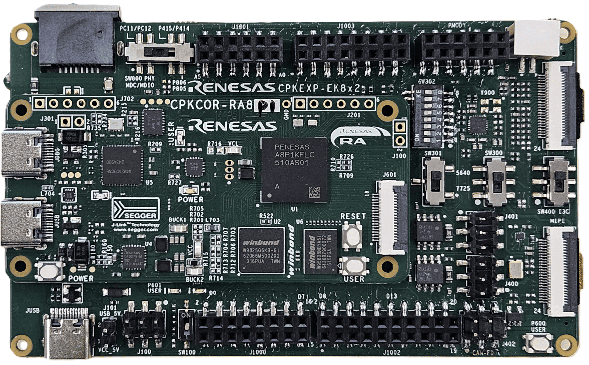

:scripts: cjk

== CPK-RA8P1开发套件

CPK-RA8P1开发套件由核心板CPKCOR-RA8P1 + 扩展板CPKEXP-EK8x2组合而成，这也是RA8P1开发板的缺省配置。

本目录下仅存放适用于该开发套件的样例代码和link:../cpk_ra8p1/docs/31_overview.adoc[使用手册]。

如果您需要查看可在CPKCOR-RA8P1核心板上独立运行的样例代码及文档，请跳转至 link:../cpkcor_ra8p1/[CPKCOR-RA8P1]。

如果您需要使用其他核心板配合CPKEXP-EK8x2扩展板使用，请参考本代码仓库下对应的目录（核心板名称_ek8x2）。本开发套件的部分样例代码可以在修改后用于其他开发板组合，详见样例程序的Readme文件。

各个样例程序所需的软硬件配置也请查看对应样例程序目录下的Readme文件。

以下例程使用的硬件配置和系统设置与本开发套件类似，可将将这些例程移植到本开发套件上运行：

* 暂无

Ver. 202608xx

