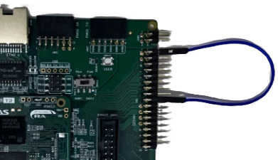

**该示例工程由 瑞萨电子-冉庆领 提供，2026年8月31日**

### 工程概述

- 该示例工程演示了基于瑞萨FSP的瑞萨RA MCU上 DAC 驱动程序的基本功能。
- 本目录下也存放了已经编译好的程序镜像文件（hex/srec/mot等格式），可以直接烧录到开发板上的MCU中运行，查看演示结果。
  - 有关如何烧录编译好的镜像文件，请参考[RA8 MCU的程序烧录](../../docs/ra8_nvm_programming.adoc)。  
- 如果您没有同步代码库及版本控制的需求，也可以[直接下载样例程序的ZIP压缩包](../_ep_archive/dac_cpk_ra8t2_ep_rafsp6.5.0.zip)，其中包含了文档和代码。
  
### 支持的开发板 / 开发套件 / 演示板：

- CPK-RA8T2 开发套件
  - 开发套件由 CPKNET-RA8T2 核心板 + CPKEXP-ECSMCB 扩展板组合而成
   
### 硬件要求：

- 1块 Renesas RA8T2 开发套件：CPK-RA8T2 
- 1根USB Type A->Type C或Type-C->Type C线 （支持Type-C 2.0即可）
- 1根杜邦线

### 硬件连接：

- 通过 USB Type-C 线连接 CPKNET-RA8T2  板上的 USB 调试端口和调试用主机。
- 采用杜邦线连接CN1-1和CN1-17引脚，如下图：

### 硬件设置注意事项：

- 样例程序的主要运行参数： CPU0 - 600MHz, CPU1 - 不使用, ICLK 200MHz
- 该运行参数是模拟 Tj=125 摄氏度规格的 RA8T2 MCU，核心板上实装的 RA8T2 MCU 为 Tj=95 摄氏度规格的产品，可支持的最快运行速度为 1G/250M/250M。您可以根据您的目标使用环境进行调整。

### 软件开发环境：
   
- FSP版本
  - FSP 6.5.0
- 集成开发环境和编译器：
  - e2studio v2026-04.2 + LLVM v21.1.1

### 第三方软件
- 无 
	   

**详细的样例程序配置和使用，请参考下面的文件。**

[dac_cpk_ra8t2_ep_readme](dac_cpk_ra8t2_ep_readme.md)

----

### 在其他开发板上使用本样例程序

- 以下开发套件上，样例程序所需要使用的硬件和本开发套件配置基本一致，修改设置后即可运行：
  - [CPKCOR-RA8T2 + CPKEXP-ECSMCB 套件](../cpkcor_ra8t2_ecsmcb/)
  - [CPKHMI-RA8P1 + CPKEXP-ECSMCB 套件](../cpkhmi_ra8p1_ecsmcb/)
  - [CPKCOR-RA8P1 + CPKEXP-ECSMCB 套件](../cpkcor_ra8p1_ecsmcb/)