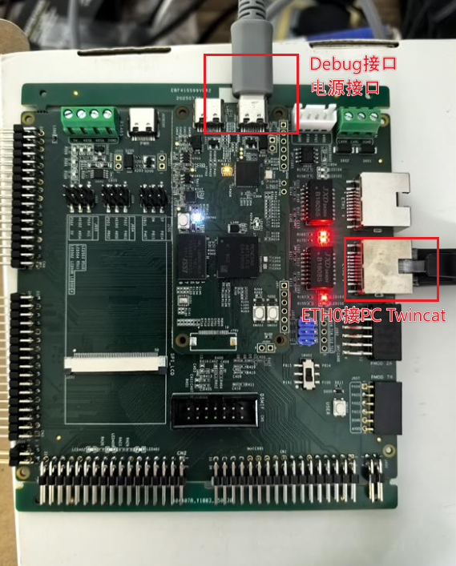
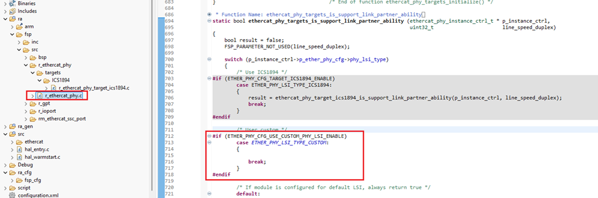

# 1. 参考例程概述

该示例工程演示了基于瑞萨 FSP 的 RA8T2 MCU 的 EtherCAT 功能，实现简单的 CiA402 应用。

# 2. 支持的开发板/演示板

- CPKEXP-RA8T2

# 3. 硬件要求

- 1 块 Renesas RA8 开发板：CPK-RA8T2
- 1 根 USB Type A->Type C 或 Type-C->Type-C 线（支持 Type-C 2.0 即可）
- 1 根网线
- 1 台安装了 Twincat 的工控机

# 4. 硬件连接
  
- 通过 USB Type-C 线连接调试电脑和 CPK-RA8T2 板上的 USB 调试端口
- 网线连接开发板的 ETH0 和 Twincat 工控机

# 5. FSP 配置
    5.1 添加 EtherCAT driver，时钟， EtherCAT driver 属性， bsp 堆栈， pin 引脚详细参数配置见参考例程。

     5.2 配置后生成 FSP 代码，需要修改 PHY 驱动才能适配到 YT8512。

# 6. 主站测试
    6.1 对应的 ESI 文件是 Renesas EtherCAT RA8T2 CiA402.xml
    6.2 以测试 CSP 模式为例，通过写 controlword，先写 7，再写 15，可以看到 statusword 发生变化，然后对 target position 写值，比如 10000，可以看到 actual position 累加到 10000
    
