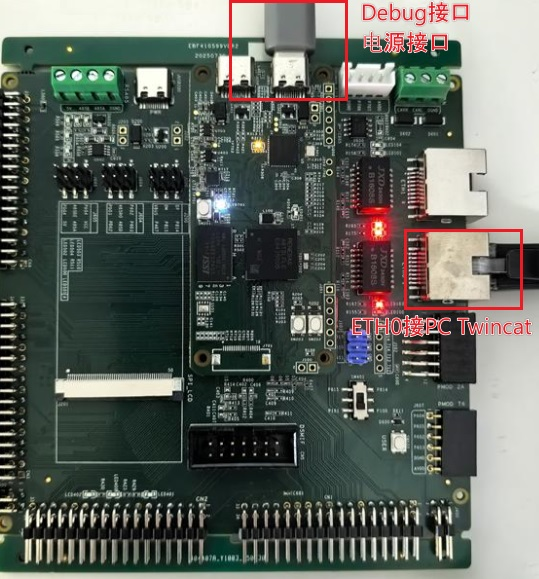

**该示例工程由 瑞萨电子-陈海焕 提供，2026年6月22日**

### 工程概述

- 该示例工程演示了基于瑞萨 FSP 的 RA8T2 MCU 的 EtherCAT 功能，实现简单的 CiA402 应用。
- 如果您没有同步代码库及版本控制的需求，也可以[直接下载样例程序的ZIP压缩包](../_ep_archive/ethercat_cpk_ra8t2_ep_rafsp6.5.0.zip)，其中包含了文档和代码。

### 支持的开发板 / 开发套件 / 演示板：

- CPK-RA8T2 开发套件
  - 开发套件由 CPKNET-RA8T2 核心板 + CPKEXP-ECSMCB 扩展板组合而成
   
### 硬件要求：

- 1块 Renesas RA8T2 开发套件：CPK-RA8T2 
- 1根 USB Type A->Type C 或 Type-C->Type C 线 （支持 Type-C 2.0 即可）
- 1 台安装了 Twincat 的电脑
- 1 根网线

### 硬件连接

- 通过 USB Type-C 线连接调试主机和 CPKNET-RA8T2 板上的 USB 调试端口 JDBG
- 网线连接扩展板的 ETH0 和 Twincat 主机

### 硬件设置注意事项：

- 样例程序的主要运行参数： CPU0 - 600MHz, CPU1 - 不使用, ICLK 200MHz
- 该运行参数是模拟 Tj=125 摄氏度规格的 RA8T2 MCU，核心板上实装的 RA8T2 MCU 为 Tj=95 摄氏度规格的产品，可支持的最快运行速度为 1G/250M/250M。您可以根据您的目标使用环境进行调整。

### 软件开发环境：
   
- FSP版本
  - FSP 6.5.0
- 集成开发环境和编译器：
  - e2studio v2026-04.2 + LLVM v21.1.1

### 第三方软件
无

### 在其他开发板上使用本样例程序

- 以下开发套件上有类似或相似的硬件功能，可将本样例程序移植到这些开发套件上运行：
  - [CPKCOR-RA8T2 + CPKEXP-ECSMCB](../cpkcor_ra8t2_ecsmcb/)

**示例工程详细的配置和使用方法，请参考应用笔记。**

[CPK-RA8T2 EtherCAT CiA402 演示程序应用笔记](cpk_ra8t2_ethercat_cia402_an_20260813.pdf)

