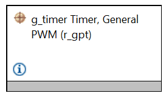
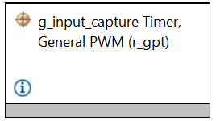

## 1.参考例程概述
该示例项目演示了基于瑞萨 FSP 的瑞萨 RA MCU 上 GPT-capture 驱动程序的基本功能。

本实例配置设置GPT3为输入捕获功能 ； GPT5用作pwm输出，周期500ms。GPT5输出用作GPT3的输入捕获信号。
### 1.1 创建新工程
如需了解工程的详细创建及配置流程，请参考工程：perf_counter_cpknet_ra8t2_ep
### 1.2 添加GPT外设：Stack中添加“Timers - Timer Genera PWM（r_gpt）”.

#### 1.2.1 GPT 属性配置.
选择GPT5为周期模式，详细设置参考工程FSP配置。
### 1.3 添加GPT外设：Stack中添加“Timers - Timer Genera PWM（r_gpt）”.

#### 1.3.1  GPT 配置：
选择GPT3为输入捕获模式，详细设置参考工程FSP配置。

### 1.4 Debug 模式测试
#### 1.4.1 工程切换为debug模式，编译工程。

#### 1.4.2 查看map文件，搜索_SEGGER_RTT 地址，重新编译后，该地址可能会改变。

#### 1.4.3 debug时，打开J-Link RTT Viewer 输入_SEGGER_RTT 地址0X22000078

#### 1.4.4 进入仿真界面，J-Link RTT Viewer 观察log输出。

### 1.5 Release 模式测试
#### 1.5.1 工程切换为Release模式，编译工程。
#### 1.5.2 打开PuTTY 设置对应串口，波特率2000000。
#### 1.5.3 用Renesas Flash Programmer下载release文件夹下生成的代码，PuTTY中观察log输出。

