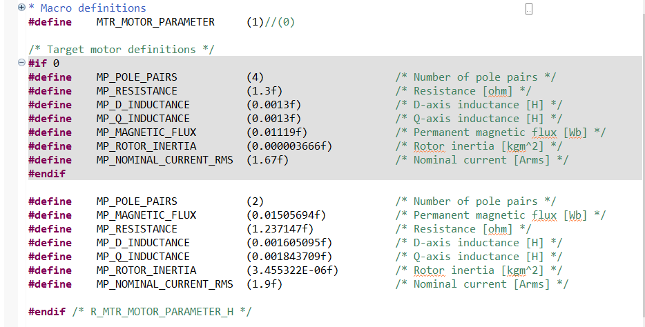
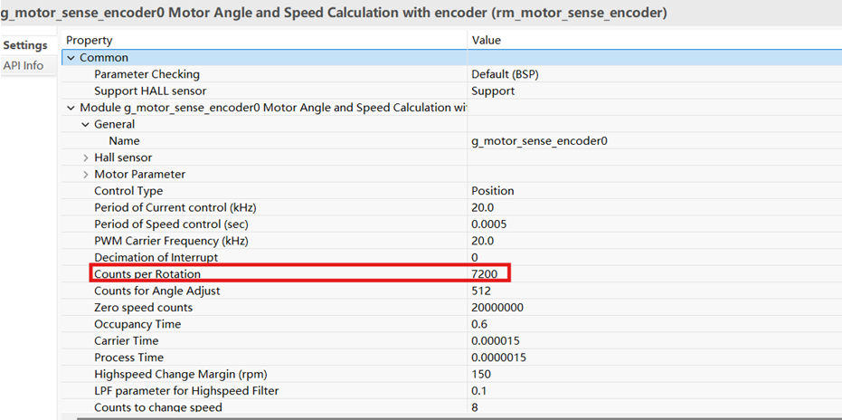
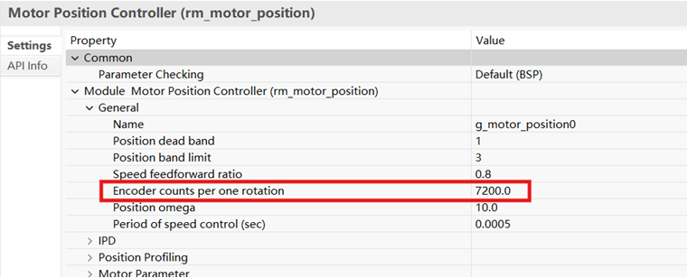
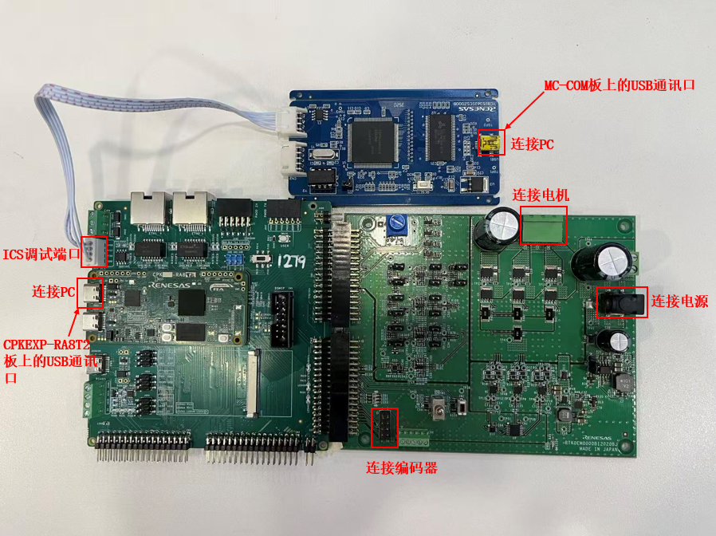

# 1. 参考例程概述
该示例工程演示了基于瑞萨 FSP 的 RA8T2 MCU控制增量型 encoder 样例 motor 的一般运转功能。系统可以控制 motor 进行简单的速度运转和位置运转。

    1.1 此为一般应用样例工程，需调用多个 ip 和瑞萨电机库，新创建过程较复杂，建议直接导入样例工程，然后根据自己的具体应用状态相应修改。

    1.2 在使用自己电机时，请打开工程根目录 /src/application/main/r_mtr_motor_parameter.h 文件。修改 motor 参数，并将宏 MTR_MOTOR_PARAMETER 设定为"1"，如下图所示：

    1.3 如使用自己的编码器，分辨率不同，请调整FSP如下两处：

    1.4 参考 readme 完成系统联接后，推荐使用瑞萨电机调试 GUI 工具 workbench 进行电机系统调试。Workbench 下载地址和应用 APN 资料，请登录瑞萨官网下载 
   
[Renesas Motor Workbench | Renesas 瑞萨电子](https://www.renesas.cn/zh/software-tool/renesas-motor-workbench)

# 2. 支持的开发板/演示板

- CPKEXP -RA8T2

# 3. 硬件要求

- 1 块 Renesas RA8 开发板：CPK-RA8T2
- 1 块 Renesas 低压驱动板：MCI-LV-1
- 1 块 Renesas 电机 ics 通讯板：MC-COM
- 1 个 24V 便携电源（ 3A 以上输出）
- 1 台 24V 可驱动的 PMSM 电机 + 增量型 encoder，推荐 R42BL40S02+GTS06OCRAG1800
- 1 根 4P XH2.54 联接线
- 2 根 USB Type A->Type C 或 Type-C->Type-C 线（支持 Type-C 2.0 即可）

# 4. 硬件连接
  
- 将 CPKEXP -RA8T2 的 CN1、CN2 和低压驱动板 MCI-LV-1 相应接口（参照图例）对插
- 将 24V 可驱动 PMSM 电机联接到低压驱动板 CN2 （请按旁边丝印 U, V, W 线序提示联接）
- 将编码器线束联接到低压驱动板 CN5 （5V 接 CN5.2, GND 接 CN5.10, A 相接 CN5.6, B 相接 CN5.8）
- 用联接线 4P XH2.54 联接 CPK-RA8T2 和 ics 通讯板 MC-COM（AVDD 接 CN1.1, P707 接 CN1.2， P706 接 CN1.3， DGND 接 CN1.4）
- 通过 USB Type-C 线连接调试主机和 CPK-RA8T2 板上的 USB 调试端口
- 通过 USB Type-C 线连接调试主机和 MC-COM 板上的 USB 通讯口
- 用 24V 便携电源给低压驱动板 MCI-LV-1 供电（可使用 J1 圆接头，或者 CN1.1 接高电平， CN1.2 接低电平）

