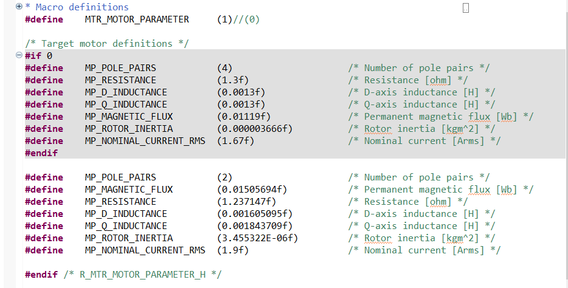
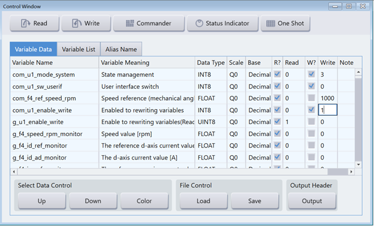
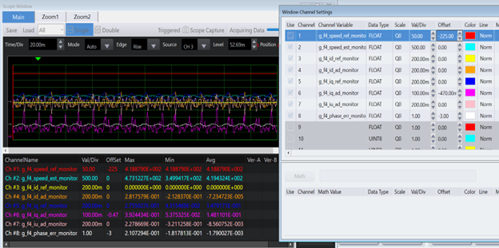

### 1. 参考例程概述
    该示例工程演示了基于瑞萨 FSP 的 RA8T2 MCU 控制 sensorless 样例 motor 的一般运转功能。系统可以控制 motor 进行简单的速度运转。

    1.1 此为一般应用样例工程，需调用多个 ip 和瑞萨电机库，新创建过程较复杂，建议直接导入样例工程，然后根据自己的具体应用状态相应修改。

    1.2 在使用自己电机时，请打开工程根目录 /src/application/main/r_mtr_motor_parameter.h 文件。修改 motor 参数，并将宏 MTR_MOTOR_PARAMETER 设定为"1"，如下图所示：

    1.3 参考 readme 完成系统联接后，推荐使用瑞萨电机调试 GUI 工具 workbench 进行电机系统调试。Workbench 下载地址和应用 APN 资料，请登录瑞萨官网下载 
   
 [Renesas Motor Workbench | Renesas 瑞萨电子](https://www.renesas.cn/zh/software-tool/renesas-motor-workbench)

 

