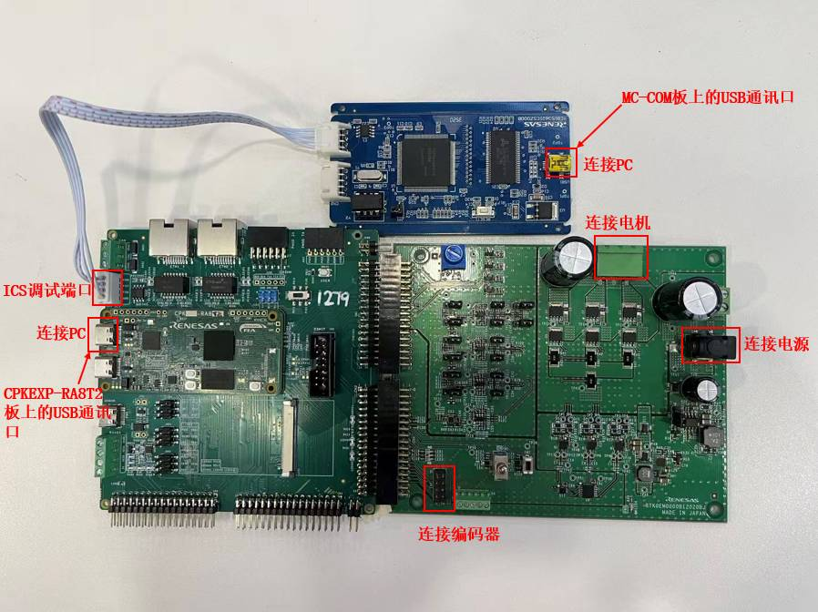

**该示例工程由 瑞萨电子-徐海龙 提供，2026年9月3日**

### 工程概述

- 该示例工程演示了基于瑞萨 FSP 的 RA8T2 MCU 控制 sensorless 样例 motor 的一般运转功能。
- 如果您没有同步代码库及版本控制的需求，也可以[直接下载样例程序的ZIP压缩包](../_ep_archive/motor_sensorless_cpk_ra8t2_ep_rafsp6.4.0.zip)，其中包含了文档和代码。

- CPK-RA8T2 开发套件
  - 开发套件由 CPKNET-RA8T2 核心板 + CPKEXP-ECSMCB 扩展板组合而成
   
### 硬件要求：

- 1 块 Renesas RA8 开发板：CPK-RA8T2
- 1 块 Renesas 低压驱动板：MCI-LV-1
- 1 块 Renesas 电机 ics 通讯板：MC-COM
- 1 个 24V 便携电源（ 3A 以上输出）
- 1 台 24V 可驱动的 PMSM 电机 + 增量型 encoder，推荐 R42BL40S02+GTS06OCRAG1800
- 1 根 4P XH2.54 联接线
- 2 根 USB Type A->Type C 或 Type-C->Type-C 线（支持 Type-C 2.0 即可）

### 硬件连接：

- 将 CPK-RA8T2 的 CN1、CN2 和低压驱动板 MCI-LV-1 相应接口（参照图例）对插
- 将 24V 可驱动 PMSM 电机联接到低压驱动板 CN2 （请按旁边丝印 U, V, W 线序提示联接）
- 用联接线 4P XH2.54 联接 CPK-RA8T2 和 ics 通讯板 MC-COM（AVDD 接 CN1.1, P707 接 CN1.2， P706 接 CN1.3， DGND 接 CN1.4）
- 通过 USB Type-C 线连接调试主机和 CPK-RA8T2 板上的 USB 调试端口
- 通过 USB Type-C 线连接调试主机和 MC-COM 板上的 USB 通讯口
- 用 24V 便携电源给低压驱动板 MCI-LV-1 供电（可使用 J1 圆接头，或者 CN1.1 接高电平， CN1.2 接低电平）

### 硬件设置注意事项：

- 请最后再联接电源，务必确认连接无误后，再供电
- 样例程序的主要运行参数： CPU0 - 600MHz, CPU1 - 不使用, ICLK 200MHz
- 该运行参数是模拟 Tj=125 摄氏度规格的 RA8T2 MCU，核心板上实装的 RA8T2 MCU 为 Tj=95 摄氏度规格的产品，可支持的最快运行速度为 1G/250M/250M。您可以根据您的目标使用环境进行调整。

### 软件开发环境：

- FSP版本
  - FSP 6.4.0
- 集成开发环境和编译器：
  - e2studio v2025-12 + GCC 13.2.1

### 第三方软件：

无

**详细的样例程序配置和使用，请参考下面的说明文件。**

[motor_sensorless_cpk_ra8t2_ep](motor_sensorless_cpk_ra8t2_ep.md)

----

### 在其他开发板上使用本样例程序

- 以下开发套件上，有类似或相似的硬件功能，可将本样例程序移植到这些开发套件上运行：
  - [CPKCOR-RA8T2 + CPKEXP-ECSMCB 套件](../cpkcor_ra8t2_ecsmcb/)
  - [CPKHMI-RA8P1 + CPKEXP-ECSMCB 套件](../cpkhmi_ra8p1_ecsmcb/)
  - [CPKCOR-RA8P1 + CPKEXP-ECSMCB 套件](../cpkcor_ra8p1_ecsmcb/)

