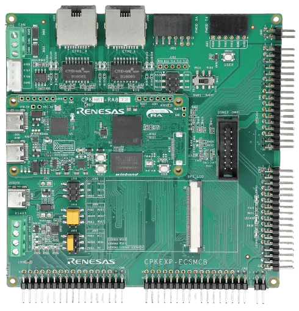

:scripts: cjk

== CPK-RA8T2开发套件

CPK-RA8T2开发套件由核心板CPKNET-RA8T2 + 扩展板CPKEXP-ECSMCB组合而成，这也是RA8T2开发板的缺省配置。

本目录下仅存放适用于该开发套件的样例代码和link:../cpk_ra8t2/docs/21_overview.adoc[使用手册]。

如果您需要查看可在CPKNET-RA8T2核心板上独立运行的样例代码及文档，请跳转至 link:../cpknet_ra8t2/[CPKNET-RA8T2]。

如果您需要使用其他核心板配合CPKEXP-ECSMCB扩展板使用，请参考本代码仓库下对应的目录（核心板名称_ecsmcb）。本开发套件的部分样例代码可以在修改后用于其他组合，详见样例程序的Readme文件。

各个样例程序所需的软硬件配置也请查看对应样例程序目录下的Readme文件。

. link:../cpk_ra8t2/ecat_402_cpk_ra8t2_cpu0_ep/[RA8T2 EtherCAT实现简单的CiA402应用]
. link:../cpk_ra8t2/ecat_io_cpk_ra8t2_cpu0_ep/[RA8T2 EtherCAT实现简单的I/O应用]
. link:../cpk_ra8t2/motor_encoder_cpk_ra8t2_ep/[RA8T2 增量型编码器电机控制样例]
. link:../cpk_ra8t2/motor_sensorless_cpk_ra8t2_ep/[RA8T2 无位置传感器电机控制样例]
. link:../cpk_ra8t2/rpmsg_lite_rtos_cpk_ra8t2_ep/[RA8T2 通过核间通信中间组件RPMsg-lite实现了双核通信]
. link:../cpk_ra8t2/spi_screen_cpk_ra8t2_ep/[RA8T2 MCU 使用SPI接口的TFT彩屏（CPU0 CM85）]
. link:../cpk_ra8t2/spi_screen_console_cpk_ra8t2_ep/[RA8T2使用ARM-2D将标准输出流重定向到SPI TFT LCD]

以下例程使用的硬件配置和系统设置与本开发套件类似，可将将这些例程移植到本开发套件上运行：

* 暂无

Ver. 202608xx

