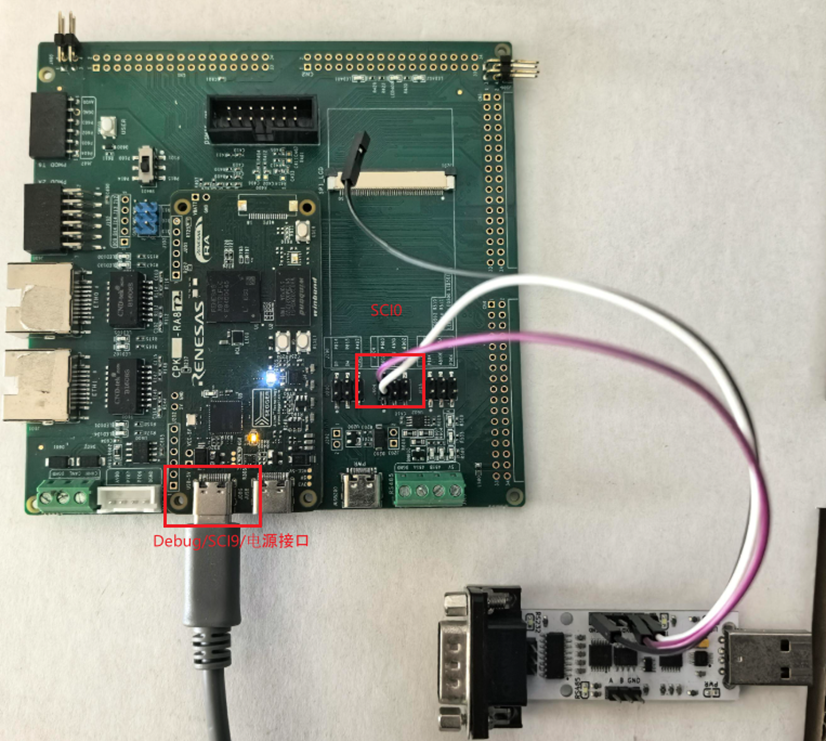

该示例工程由 瑞萨电子-Heaven 提供，2026年1月26日

# 工程概述

该示例工程基于瑞萨 FSP 的 IPC 核间通信的驱动模块，移植了核间通信中间组件 RPMsg-lite，实现了 CM85 和 CM33 的通信，双核都运行了 FreeRTOS 系统。

# 支持的开发板/演示板：
CPKEXP-RA8T2

# 硬件要求

- 1 块 Renesas RA8T2 开发板：CPK-RA8T2
- 1 根 USB Type A->Type C 或 Type-C->Type-C 线（支持 Type-C 2.0 即可）
- 1 根 USB 转 UART 数据线

# 硬件连接

- 通过 USB Type-C 线连接调试电脑和 CPK-RA8T2 板上的 USB 调试端口
- USB 转 UART 数据线连接底板的的 J604 中的 P602/RXD， P603/TXD，USB 口连接电脑

# 软件开发环境

- FSP 版本：FSP 6.2.0
- 集成开发环境和编译器：e2studio v2025-07 + LLVM Embedded Toolchain for Arm 18.1.3

# 第三方软件
无

#### 示例工程详细的配置和使用方法，请参考下面的说明文件。
[rpmsg_lite_rtos_cpk_ra8t2_llvm](rpmsg_lite_rtos_cpk_ra8t2_llvm.md)

