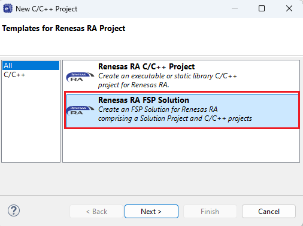
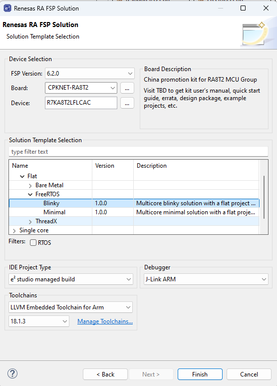
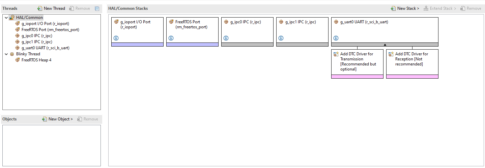
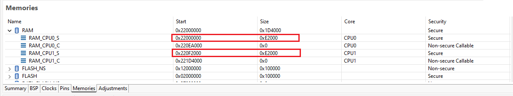
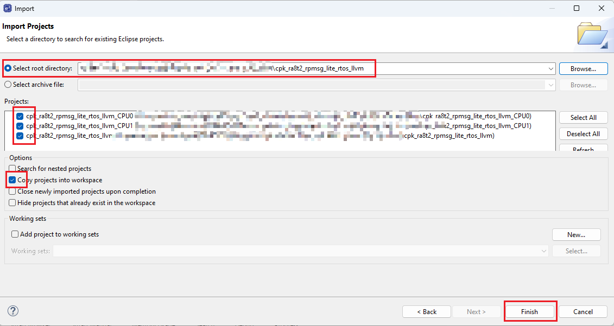
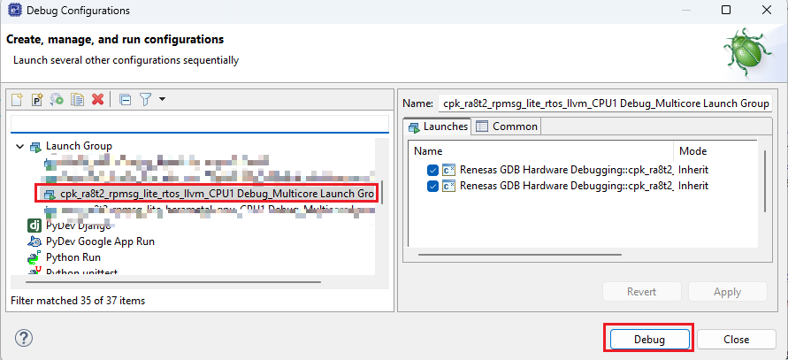
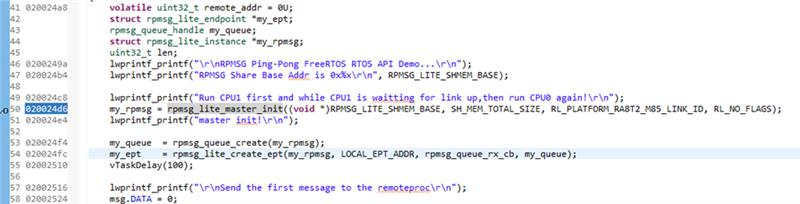
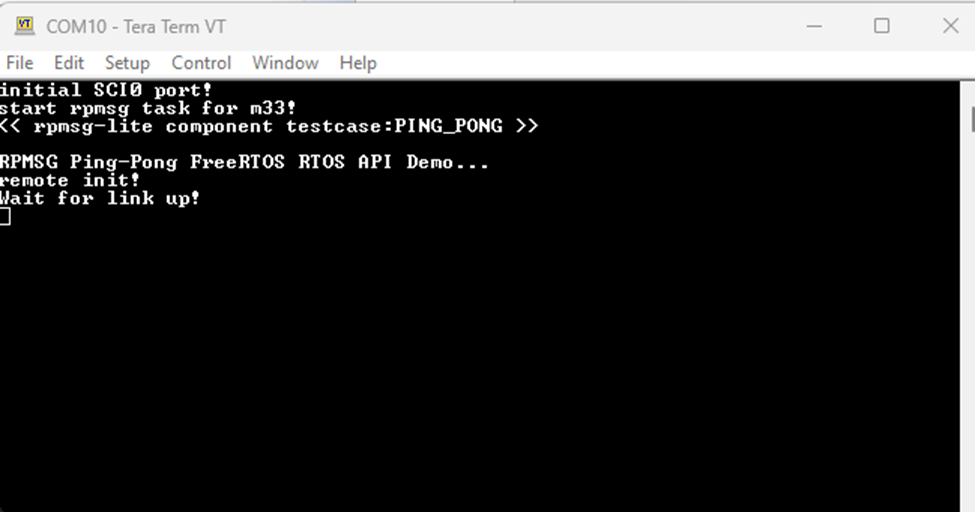
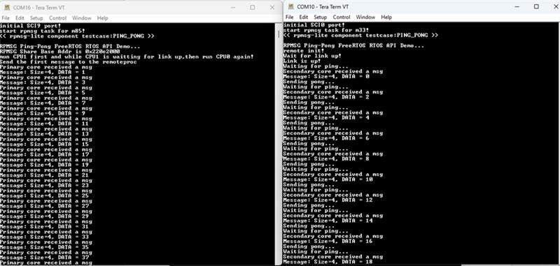

# 1. 参考例程概述

该示例工程基于瑞萨 FSP 的 IPC 核间通信的驱动模块，移植了核间通信中间组件 RPMsg-lite，实现了 CM85 和 CM33 的通信，双核都运行了 FreeRTOS 系统。

# 2. 支持的开发板/演示板：

- CPK-RA8T2

# 3. 硬件要求

- 1 块 Renesas RA8T2 开发板：CPK-RA8T2
- 1 根 USB Type A->Type C 或 Type-C->Type-C 线（支持 Type-C 2.0 即可）
- 1 根 USB 转 UART 数据线

# 4. 硬件连接
  
- 通过 USB Type-C 线连接调试电脑和 CPK-RA8T2 板上的 USB 调试端口
- USB 转 UART 数据线连接底板的的 J604 中的 P602/RXD， P603/TXD，USB 口连接电脑

# 5. FSP 配置
    5.1	e2studio 使用 solution 方式创建双核 RTOS blinky 工程，选择 CPK-RA8T2 板级支持包

     
    5.2 CPU0 工程，添加 IPC drive，配置 IPC0 为接收，IPC1 为发送，添加 UART driver，详细属性参数配置见参考例程

    5.3 CPU1 工程，添加 IPC drive，配置 IPC0 为发送，IPC1 为接收，添加 UART driver，详细属性参数配置见参考例程

    5.4 配置 solution 工程，使 0x220E2000~0x220F2000 为共享内存区

    5.5 其他 BSP 的配置，包括 RTOS 设置，堆栈大小等参考示例代码

# 6. 测试
    6.1 导入示例工程代码到 e2studio，编译 solution 工程，CPU0 工程和 CPU1 工程依次编译成功

    6.2 Launch Group 下，选择对应的工程文件

    6.3 打开两个 tera 软件，分别连接 CPU0 的 SCI9 和 CPU1 的 SCI0，波特率为 115200，其他为默认设置

    6.4 进入 debug 界面，调试 CPU0 工程，在 rpmsg_lite_master_init 函数前设置断点，点击两次 Resume，运行到断点处，此时 CPU1 工程进入 Reset handler

    6.5 调试 CPU1 工程，点击 Resume，此时 CPU1 打印，表示 CPU1 等待与 CPU0 link up 连接

    6.6 继续调试 CPU0 工程，点击 Resume，此时 CPU0 和 CPU1 正常运行，功能就是 CPU0 首先给 CPU1 发送数据 0， CPU1 收到数据累加 1 回传给 CPU0， CPU0 收到数据后继续累加 1 回传，如此 ping-pong 实验直到数据超多100

