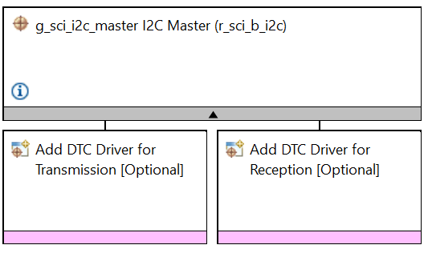
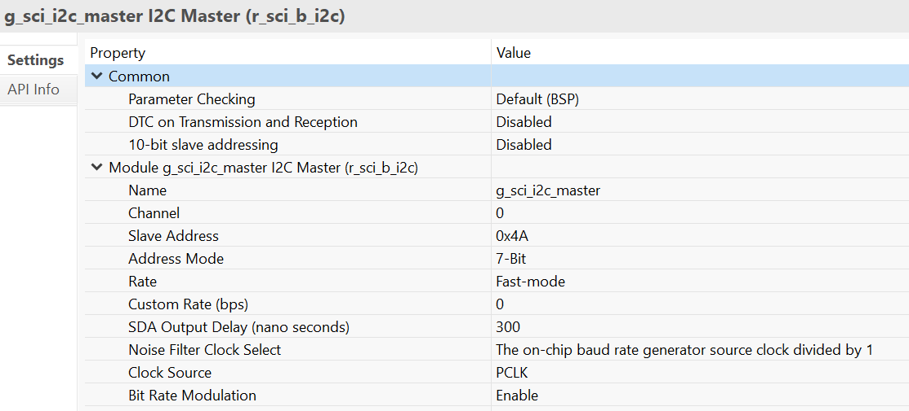
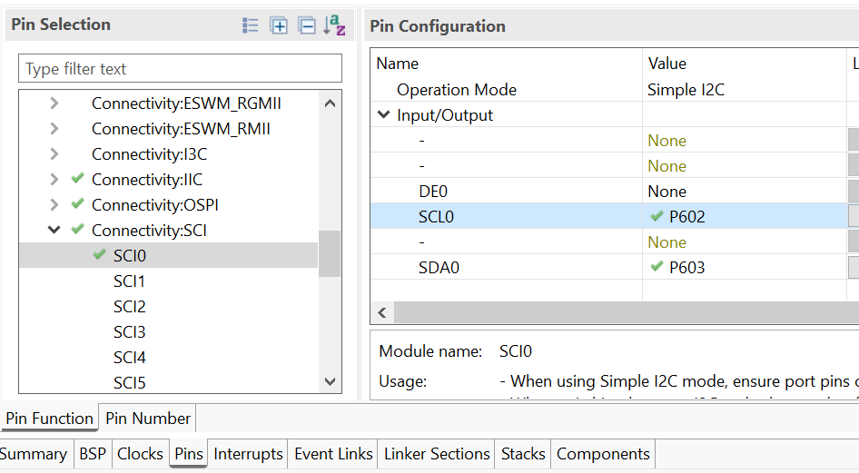
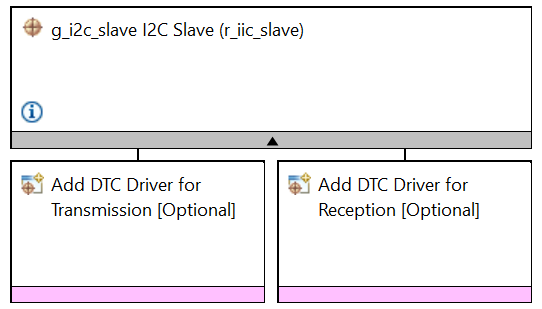
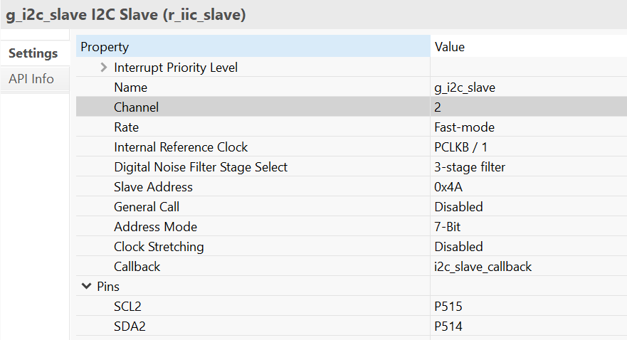
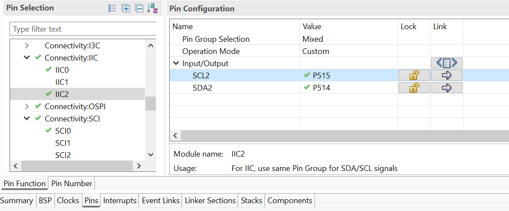
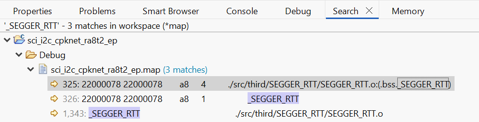

## 1.参考例程概述
该示例项目演示了基于瑞萨 FSP 的瑞萨 RA MCU 上 SCI-I2C 驱动程序的基本功能。

本实例配置sci0为i2c master ； i2c2配置为 slave 模式，二者进行通讯测试。
### 1.1 创建新工程
如需了解工程的详细创建及配置流程，请参考工程：perf_counter_cpknet_ra8t2_ep
### 1.2 添加SCI-I2C外设：Stack中添加“Connectivity - I2C master（r_sci_b_i2c）”.

#### 1.2.1 SCI-I2C 属性配置.

#### 1.2.2 SCI-I2C 引脚配置.

### 1.3 添加I2C外设：Stack中添加“Connectivity - I2C Slave（r_iic_slave）”.

#### 1.3.1 I2C 配置：

#### 1.3.2 I2C 引脚配置：

### 1.4 Debug 模式测试
#### 1.4.1 工程切换为debug模式，编译工程。

#### 1.4.2 查看map文件，搜索_SEGGER_RTT 地址，重新编译后，该地址可能会改变。

#### 1.4.3 debug时，打开J-Link RTT Viewer 输入_SEGGER_RTT 地址0X22000078

#### 1.4.4 进入仿真界面，J-Link RTT Viewer 观察log输出。

### 1.5 Release 模式测试
#### 1.5.1 工程切换为Release模式，编译工程。
#### 1.5.2 打开PuTTY 设置对应串口，波特率2000000。
#### 1.5.3 用Renesas Flash Programmer下载release文件夹下生成的代码，PuTTY中观察log输出。

