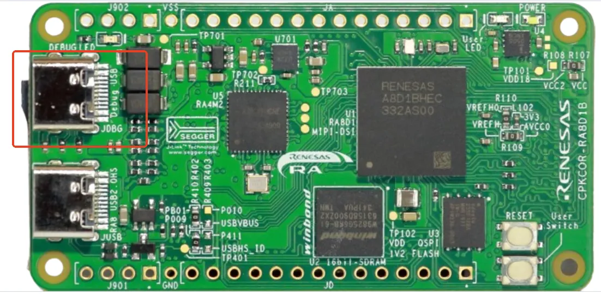
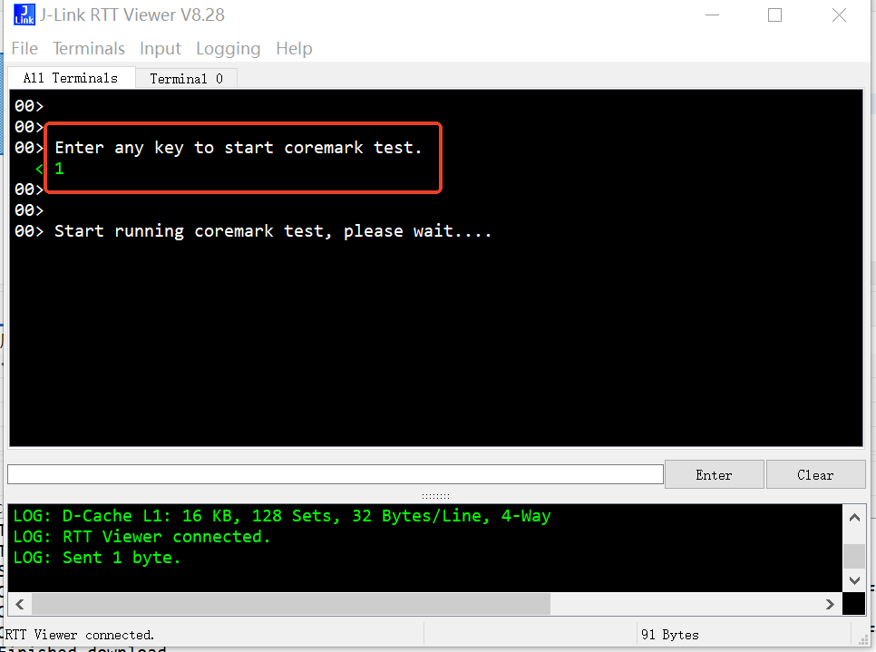
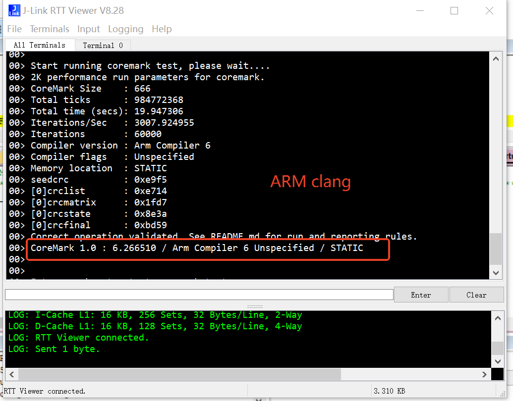
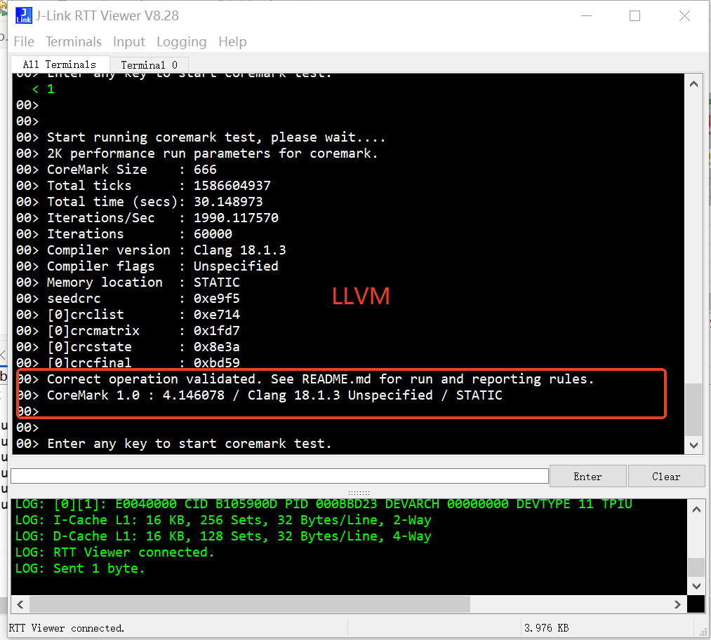

# Coremark测试用例

本例程演示coremark在cpkcor上的测试方法及步骤。coremark测试通常需要把代码放置在ITCM，同时数据放置在DTCM，以获得最佳性能。

## 1. 编译测试环境配置

| 工具      | 版本    |
| --------- | ------- |
| e2-studio | 2025-10 |
| fsp       | 6.2.0   |
| llvm      | 18.1.3  |
| armclang  | 6.23    |

开发板使用一个Typc数据线连接JLINK debug USB口至PC，如下图：

## 2. 编译测试用例

本测试用例分别提供e2studio和mdk版本，其中e2studio使用的编译器为llvm 18.1.3，mdk中使用的编译器为armclang 6。armclang编译优化支持-Omax，跑分要比使用llvm的版本要高。测试用例的编译按照e2studio和mdk常规编译方法即可。

## 3. 运行测试用例

image加载至开发板后，通过segger Jlinkviewer连接至开发板，可以看到如下提示：

通过jlink随意输入一个字符，coremark程序就开始运行了。

