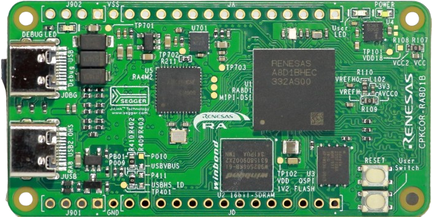
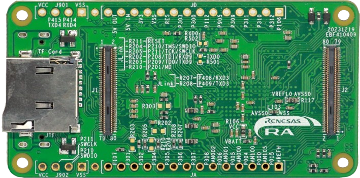

## CPKCOR-RA8D1B 用户手册

CPKCOR-RA8D1B核心板
是瑞萨电子为中国市场设计的模块化开发板，
使用瑞萨RA8D1MCU，支持MIPI-DSI显示输出接口。
核心板上已经搭载了RA8 MCU支持的较为有特色的外设接口和器件，可以直接使用核心板进行学习，评估和应用开发。
配合扩展底板一起使用，可以实现快速产品原型开发和验证。

1. [简介](#cpkcor-ra8d1b简介)
2. [开箱使用](02_unbox.md)
3. [硬件配置](03_hardware.md)
4. [通孔扩展接口](04_th_expansion.md)
5. [板对板扩展接口](05_btb_expansion.md)
6. [RA8的调试和烧录接口](06_debug.md)
7. [RA8 USB 2.0 高速接口](07_usbhs.md)
8. [RA8的外接存储扩展](08_storage.md)
9. [CPKCOR-RA8D1B的电源设计](09_powerdesign.md)

CPKCOR-RA8D1B的原理图[在此下载](CPKCOR_RA8x1x_V2_schmatic_release.pdf)，可以在瑞萨官网下载。

### CPKCOR-RA8D1B简介

CPKCOR-RA8D1B板上使用224BGA封装的RA8D1 MCU（U1），支持MIPI-DSI显示输出接口。
板上除了实现RA8D1最小系统外，还搭载了实用的外设功能，包括：

- 16位SDRAM（U2），32M字节容量
- QSPI Flash（U3），16M字节容量
- USB 2.0高速主机/设备，JUSB Type-C 2.0接口，支持主/从功能自动切换
- 板载Segger Jlink调试器，同时支持一路虚拟串口，JDBG Type-C 2.0 设备接口
  - Jlink工作指示LED（橙色）
- 电源LED（白色），用户LED-PA01（绿色），复位按键和用户按键-P008
- 2.54mm间距的通孔扩展接口
  - J901 串行口扩展
  - J902 外接调试器接口
  - JA，JD通用扩展接口

在开发板的底面，预留了丰富的扩展接口，包括：

- TF卡槽，支持3.3V信号电平（DS和HS速度模式）
- J1，J2 两个80管脚的高密度板对板连接器
  - HRS [DF40C-80DP-0.4V(51)](https://item.szlcsc.com/279578.html)
  - 对应的扩展板用接插件有多种合高选择，1.5/2.0/3.0/3.5/4.0mm
  

CPKCOR-RA8D1B有两个硬件版本，零售版本都是V2版，也有一些V1版硬件在推广过程中发送给用户。硬件版本的区别请参考[此文档](CPKCOR_RA8D1B_Version_Diff.md)。

[下一篇：开始使用CPKCOR-RA8D1B核心板](02_unbox.md)