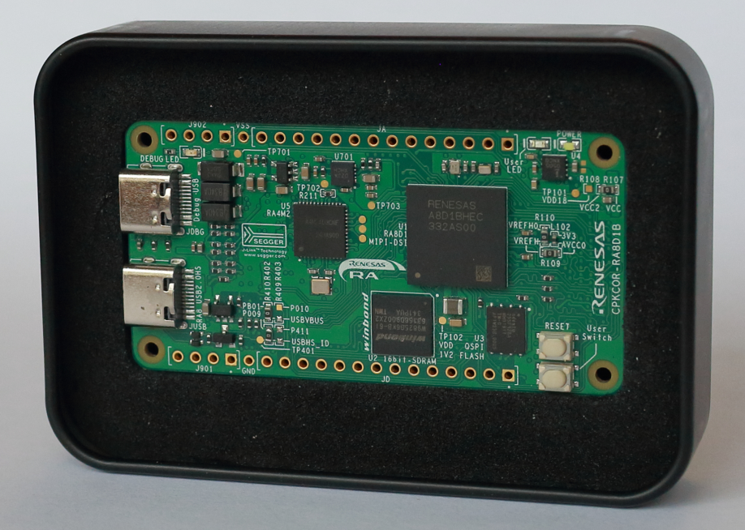
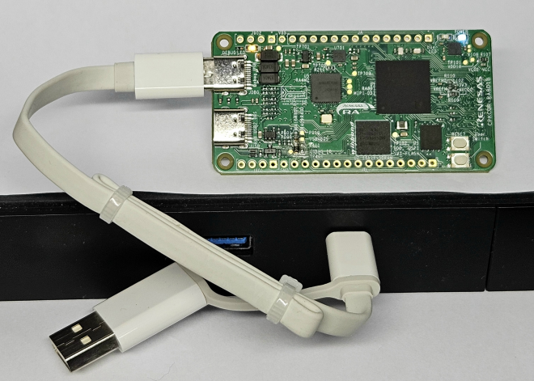
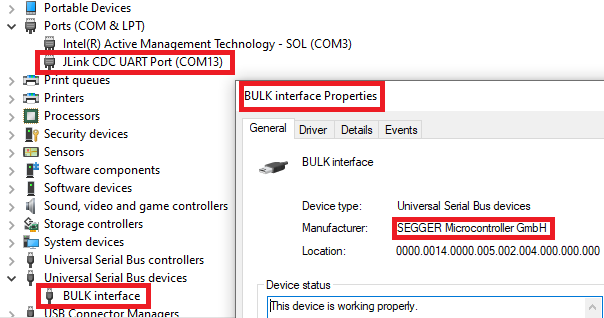
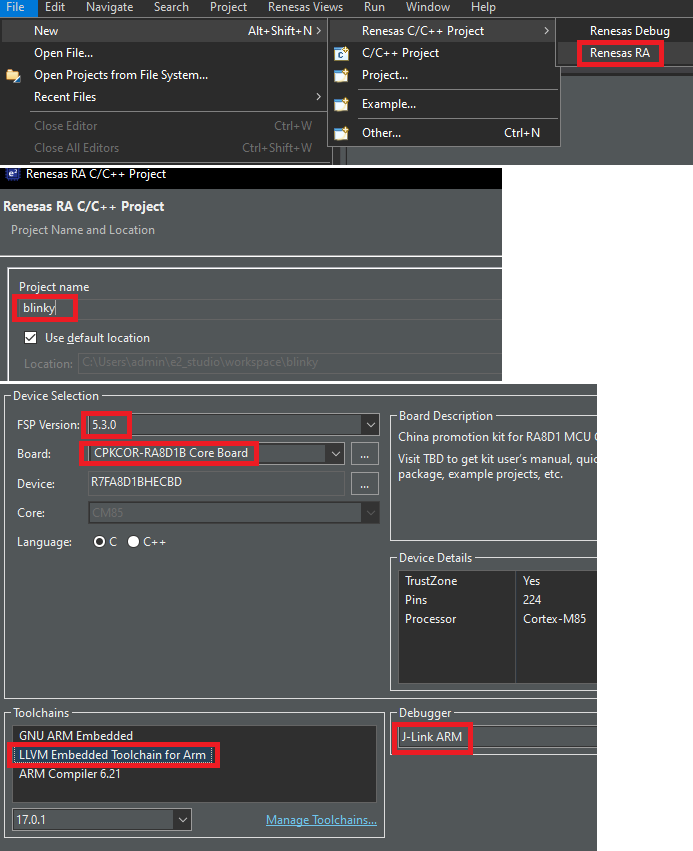
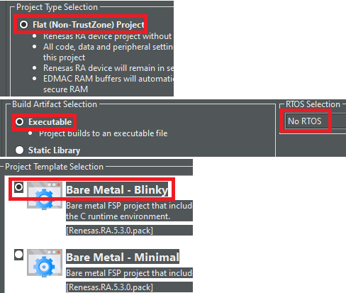

## 开始使用CPKCOR-RA8D1B核心板

核心板使用开窗铁盒包装，购买时不附带线缆，需要自备USB-TypeC线。

### 下载和安装开发环境

开始连接开发板前，请先根据您的开发主机的操作系统下载并安装开发环境。瑞萨通过Flexible Software Package - FSP软件包来支持RA MCU的开发。

如果您使用瑞萨的集成开发环境e2studio, 最简单的方式就是直接下载包含了e2studio的FSP安装包，当然您也可以单独下载e2studio和FSP软件包后分别安装。瑞萨的e2studio集成开发环境可以支持：
- Windows 10 及 Windows 11
- Linux
- MacOS (仅支持Apple芯片)

如果您使用Keil/MDK或IAR Embedded Workbench for ARM，瑞萨也提供可以适用于这些第三方开发环境的配置工具RA Smart Configurator （RASC），可以通过RASC进行芯片管脚和软件协议栈配置等工作，并自动生成对应开发环境的项目工程。RASC可以支持
- Windows 10 及 Windows 11
- Linux
  

[下载地址](https://github.com/renesas/fsp/releases)

本手册内容基于 Windows 10 + e2studio 2024-04集成环境 + FSP 5.3.0。

Windows环境下双击`setup_fsp_v5_3_0_e2s_v2024-04.exe`即可，如果您不需要指定安装位置，那一直下一步就可以了。安装过程中会添加MCU调试器的驱动程序，需要您选择信任这些驱动。

### 硬件连接和确认

使用USB Type-C线将调试USB口（JDBG）连接到安装好开发环境的电脑，确认白色的电源LED灯点亮。如果电脑上的Jlink驱动安装正确，那橙色的调试LED会常亮。如果橙色LED在闪烁，则表示核心板上的Jlink无法和电脑通信，请查看电脑端的设置。

打开Windows设备管理器，确认有一个`JlinK CDC UART Port`，即Jlink自带的USB转串口。此外还有一个`BULK interface`，这个就是Jlink调试器。调试器和串口可以同时使用。

### 安装CPKCOR-RA8D1B的BSP，自动生成Blinky工程

为了方便大家使用核心板上的各种功能，我们提供一个基础的BSP包，按照板载硬件（存储器、按键、LED等）的连接设置好了对应的I/O口，您可以直接开始使用板上的各种设备。

[BSP下载地址](./Renesas.RA_board_ra8d1_cpkcor.5.1.0.pack)

[e2studio BSP安装教程](https://github.com/renesas/cpk_examples/docs/r01an7244cc0110-ra.pdf)

打开e2studio, 使用BSP模版创建Blinky工程。

- RA8 MCU使用ARM Cortex-M85内核，集成了Helium矢量加速单元。目前ARM AC6编译器和ARM LLVM编译器可以支持代码自动向量化功能，在新建项目时，请选择LLVM编译器（缺省是GCC）。

编译、连接调试器后开始运行，确认绿色用户LED开始闪烁。

瑞萨为CPKCOR-RA8d1B核心板提供多种[样例代码](https://github.com/renesas/cpk_examples/tree/main/cpkcor_ra8d1b)，您可以根据需要选择查看。

[返回目录](01_overview.md)             [下一篇：核心板硬件概述](03_hardware.md)

