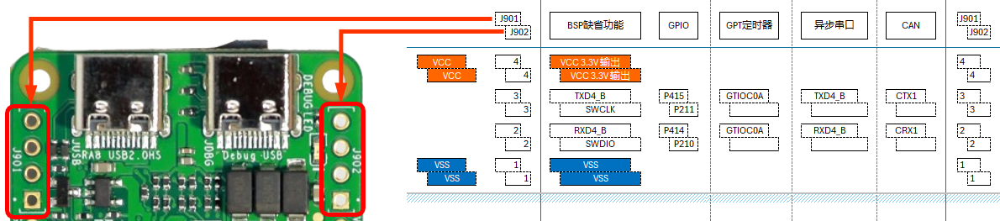
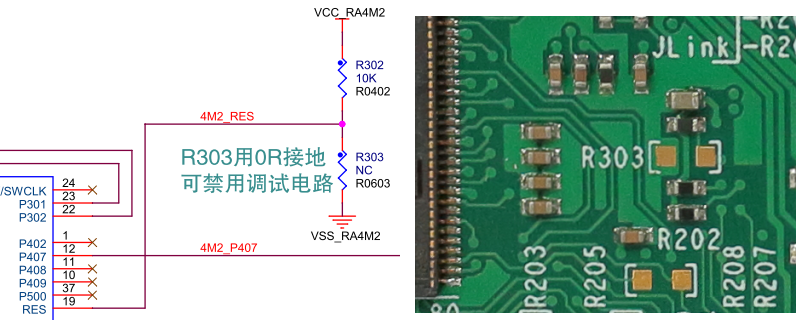
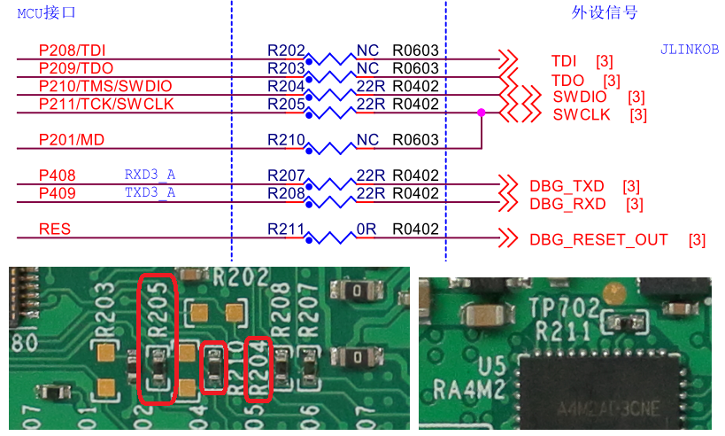
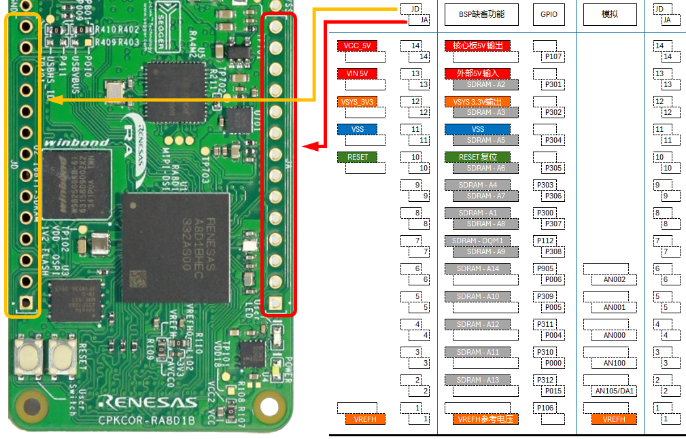
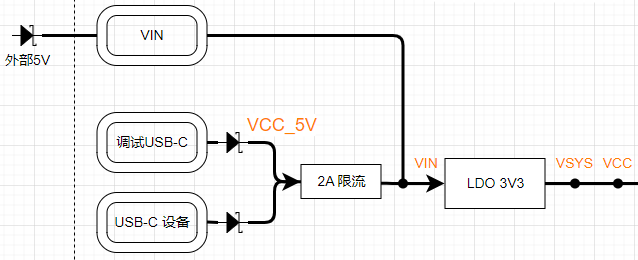
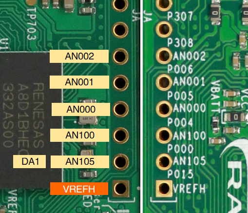
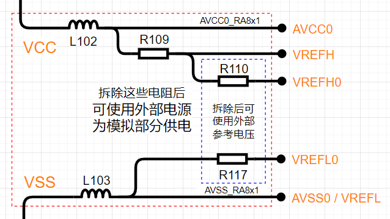

## 2.54mm间距的通孔扩展接口

在所有的CPK核心板都配备了一些通孔扩展接口。在CPKCOR-RA8D1B上，预留了两种类型的扩展口

### 4针的通信调试扩展口-J901和J902。

两个4针的扩展接口，主要实现调试口和串口的扩展。

J901主要是实现通信功能扩展，在缺省的BSP配置中配置为UART，如需使用其他功能，请在FSP配置中进行修改。

| J901 | GPIO |    UART    |  I2C   | CAN-FD | GPT Timer |
| :--: | :--: | :--------: | :----: | :----: | :-------: |
|  1   | VSS  |            |        |        |           |
|  2   | P414 | **RXD4_B** | SCL4_B |  CRX1  |  GTIOC0B  |
|  3   | P415 | **TXD4_B** | SDA4_B |  CTX1  |  GTIOC0A  |
|  4   | VCC  |            |        |        |           |

P414、P415管脚使用VCC供电，如果需要为其他设备提供电源，请确认使用VCC以保证信号电平的一致性。参考地电平使用VSS（在CPKCOR-RA8D1B上直连GND）。

如需评估CAN-FD，需要外接CAN-FD收发器。如果CAN-FD收发器需要从核心板获取5V供电，JD的14脚可以提供VCC_5V电源（无过流保护），或者使用JD的13脚上的VIN_5V电源（2A限流保护）。

J902为外接调试接口，RA8 MCU复位后，P210和P211端口会被自动设置成SWD调试接口。

| J902 | GPIO |   Debug   |
| :--: | :--: | :-------: |
|  1   | VSS  |           |
|  2   | P210 | **SWDIO** |
|  3   | P211 | **SWCLK** |
|  4   | VCC  |           |

CPKCOR-RA8D1B板载Jlink-OB，在用户有需要外接调试器时，可以使用J902。使用外接调试器时，需要禁用板载Jlink-OB的调试功能，有以下两种方法可以实现。

- 禁用RA4M2 Jlink-OB主控MCU，R303贴装0欧姆电阻可将RA4M2保持在复位状态，端口均为高阻状态，不影响外部调试器的连接。R303在PCB底面中间偏左位置，0603封装（1.6mm x 0.8mm）。此时Jlink-OB的USB转串口功能也无法使用。
  
 

 - 将Jlink-OB的调试信号与RA8 MCU断开，取下板上的R204，R205（位于PCB底面JA上方）和R211（位于PCB顶面RA4M2 MCU上方）。此时如果调试PC连接JDBG，Jlink-OB的USB转串口功能仍可以使用（连接RA8的串口3）。
  
  

**不建议**使用以下方式来禁用Jlink-OB调试功能

- JDBG接口仅供电，不使用USB通信功能（例如仅使用USB电源转换器供电）
- 仅使用JDBG接口以外的电源输入供电，如JUSB接口或JD接口

Jlink-OB的主控MCU RA4M2使用板上的3.3V电源供电，即使没有USB通信，RA4M2也在运行中（等待通信建立或其他状态），RA4M2和RA8 MCU连接的端口可能对外接的其他调试器造成影响。

更具体的调试相关内容请查看[RA8的调试接口](06_debug.md)章节。

### JA和JD多功能扩展接口 (V2版上再加上J903)

JA和JD两个扩展口可以分为三个部分。

#### 供电及系统控制

JD接口的10~14脚（丝印在PCB底面）分别提供了RESET信号，地，3.3V，5V输入和5V输出。
- 各个电源的关系如下图所示，VCC_5V和VIN 5V都可以作为电源输入或输出使用。
- 作为输出时，需注意VCC_5V是没有限流的，如果外接设备功耗较大，请谨慎使用。VIN 5V有2A限流，扣除核心板本身的功耗，可以为外接设备提供至少1A的电流。
- 作为电源输入时，请根据外部电源的实际情况选择使用哪个电源管脚。
- VSYS_3V3只建议作为电源输出给外部设备供电，核心板上3.3V LDO的输出能力是2A，可以为外部设备提供至少1A的电流。一般不建议3.3V输入到核心板，请用上一条的5V输入。

- 本核心板上VSS和GND直连，作为参考地。
- RESET信号RA8的RESET，可以双向工作。核心板上有RESET按键，可以产生RESET信号给外部设备，也可以通过这个管脚接收外部RESET信号。
  - 注意：RA8 MCU有片内上电复位功能，RESET脚通过10K电阻（R209）直接上拉，核心板上没有外部上电复位电路。在系统上电时，无法在这个RESET脚上产生延时的复位信号。外部电路如果需要上电复位信号的，请注意这一点。
  
#### 模拟功能管脚
JA的1~6脚提供了GPIO和模拟功能。

本核心板的模拟电源缺省设置如下

- 使用GPIO功能时，P0端口由AVCC供电，如有必要，VREFH可以作为外部电路的参考供电。
- 使用模拟输入（ADC）功能时，ADC单元0（AN0xx）使用VREFH0/L0作为参考电平，ADC单元1（AN1xx）使用VREFH/L作为参考电平。核心板上缺省这些电平都连接到AVCC0，必要时VREFH可以作为外部模拟电路的参考电源。
  - 详见RA8D1硬件参考手册第45章-12位AD转换器，Table 45.1 ADC12 specifications。
- 使用模拟输出（DAC）功能时，DA1使用VREFH/L作为参考电平
  - 详见RA8D1硬件参考手册第46章-12位DA转换器，Figure 46.1 DAC12 block diagram。

如果核心板的模拟电源设置无法满足评估和使用需求，需要外接模拟电源和/或参考电源时，不建议使用JA上的这些模拟输入输出接口。请通过板对板连接器（J1，J2）扩展外部电源和模拟输入/输出通道进行评估。

#### 外设功能扩展 

外设功能扩展部分通过JA和JD组合实现，但这部分扩展功能的管脚和SDRAM的地址信号脚复用。CPKCOR-RA8D1B在缺省情况下，使用板载的16位SDRAM，无法使用这些外设扩展功能。

禁用SDRAM后（SDRAM CS信号保持高电平），或者在没有安装SDRAM芯片的核心板上，可以使用这部分外设扩展实现下表所列功能。

|      | Pin  |   GPIO   |  SDRAM   |  串口和以太网  |   SPI   | I2C CAN-FD/SDIO | GPT 定时器 | 电机控制 I/O |
| ---: | :--- | :------: | :------: | :------------: | :-----: | :----------------: | :-----------: | :-------------: |
|   JD | 1    | **P106** |          |                |         |                    |    GTIOC8B    |     GTOWLO      |
|   JD | 2    |   P312   | **A13**  | CTS_RTS3_B/DE3 |  SS3_B  |        CTX0        |               |     GTADSM0     |
|   JD | 3    |   P310   | **A11**  |     TXD3_B     | MOSI3_B |       SDA3_B       |               |                 |
|   JD | 4    |   P311   | **A12**  |   SCK3_B/DE3   | SCK3_B  |        CRX0        |               |     GTADSM1     |
|   JD | 5    |   P309   | **A10**  |     RXD3_B     | MISO3_B |       SCL3_B       |               |                 |
|   JD | 6    |   P905   | **A14**  |     CTS3_B     |         |                    |               |                 |
|   JD | 7    |   P112   | **DQM1** | RMII0_CRS_DV_A |         |                    |    GTIOC3B    |                 |
|   JD | 8    |   P300   |  **A1**  | RMII0_RX_ER_A  |         |                    |    GTIOC3A    |                 |
|   JD | 9    |   P303   |  **A4**  |   REF50CK0_A   |         |     SD0DAT1_B      |    GTIOC7B    |                 |
|      |      |          |          |                |         |                    |               |                 |
|   JA | 7    |   P308   |  **A9**  |    ET0_MDC     |         |      SD0CLK_B      |               |      GTIU       |
|   JA | 8    |   P307   |  **A8**  |    ET0_MDIO    |         |      SD0CMD_B      |               |      GTIV       |
|   JA | 9    |   P306   |  **A7**  | RMII0_TXD_EN_A |         |       SD0CD        |               |      GTIW       |
|   JA | 10   |   P305   |  **A6**  |  RMII0_TXD1_A  |         |       SD0WP        |               |     GTOVUP      |
|   JA | 11   |   P304   |  **A5**  |  RMII0_TXD0_A  |         |     SD0DAT0_B      |    GTIOC7A    |     GTOVLO      |
|   JA | 12   |   P302   |  **A3**  |  RMII0_RXD0_A  |         |     SD0DAT2_B      |    GTIOC4A    |     GTOUUP      |
|   JA | 13   |   P301   |  **A2**  |  RMII0_RXD1_A  |         |     SD0DAT3_B      |    GTIOC4B    |     GTOULO      |
|   JA | 14   | **P107** |          |                |         |                    |    GTIOC8A    |     GTOWUP      |
|      |      |          |          |                |         |                    |               |                 |
| J903 | J903 | **P401** |          |                |         |                    |    GTETRGA    |                 |

- 可以扩展出RA8 MCU SCI3的完整功能，包括：
  - UART异步串口，同步串口，带流控的异步和同步串口，RS485
  - SPI接口（8位数据格式）
  - I2C接口（最高400Kbps）
- CAN-FD通道0
  - CAN-FD需要外接收发器，请参考前面J901部分的说明。
- 以太网RMII接口
  - RA8 MCU 以太网RMII接口的GPIO复用有两个位置，一个就是这里和SDRAM复用，另一个位置与CEU复用。
  - 需要同时使用CEU和以太网时，需要从这里扩展以太网接口。
- SDIO接口通道0（VCC电源供电）
  - 如果只需要评估SD卡功能，那核心板上已经有TF接口，使用的是SDIO通道1（VCC2电源供电）。
  - 此SDIO可以用来评估其他功能，如Wi-Fi通信模块等。
- GPT定时器I/O和电机控制I/O，这部分在电机控制用核心板文档中由详细说明。

最后再强调一下，在使用核心板直接扩展外部电路时，请先评估一下电流需求。RA8 MCU在不同工作条件下对电流的需求不同，核心板可能需要500mA甚至更大电流。核心板的VIN 5V和VSYS_3V3限流都是2A。如果使用VCC_5V，留意这个电源没有限流控制。

[返回目录](01_overview.md)             [下一篇：CPKCOR-RA8D1B 板对板扩展接口](05_btb_expansion.md)
