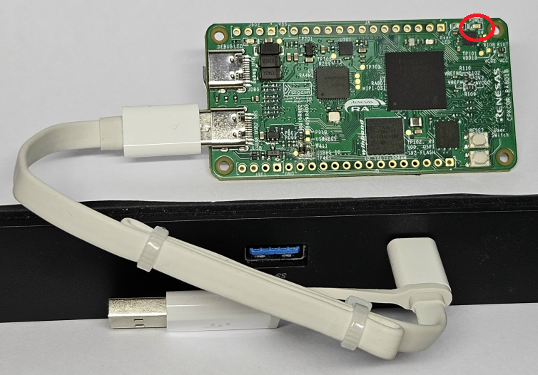
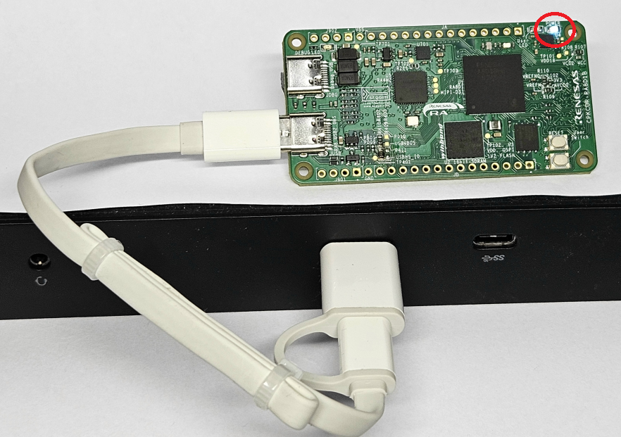

## RA8 USB 2.0 高速接口

RA8D1 MCU支持一路高速USB 2.0和一路全速USB，核心板上只使用了高速USB 2.0接口，如果要使用全速USB接口，请自行设计扩展板，从J1，J2引出全速USB。

RA8D1的高速USB 2.0支持主机和设备模式，核心板上使用了USB 2.0 Type-C 接口，通过外接电路**部分**实现了DRP双角色端口功能，可以自动识别并切换DFP（USB Host）和UFP（USB Device）功能。
- DFP：Downstream-Facing Port，即USB主机端口，连接下游的设别
- UFP：Upstream-Facing Port，即USB设备端口，连接上游的主机
- DRP：Dual-Role Port，即双角色端口，可以在DFP和UFP间切换功能。

Type-C接口本身需要通过USB电源和CC1和CC2信号的组合来判断当前USB口的状态，如果要实现DRP，需要定时切换主（DFP）从（UFP）状态，并通过软件来判断当前的角色，这个一般可以使用外部的CC协议控制芯片来实现。目前的USB-C协议控制芯片很多都集成了USB-PD等复杂的功能，可以实现大功率供电控制。

作为UFP时，RA8 MCU核心板所需供电不会超过5V/3A （板载2A限流芯片，并使用2A输出电流的LDO）；作为DFP时，核心板能为USB HS端口提供的电流不超过5V/2A（USB HS 对外供电端有2A限流芯片）。所以在USB HS端口的设计上尽量做了简化，使用简单的数字逻辑（不使用专门的CC协议芯片）来实现UFP/DFP切换和DFP供电。

该简化电路的限制是，在作为UFP使用时，无法从标准的USB-C DFP端（例如USB-C电源，电脑的USB-C口）获取供电。

需要在DFP端使用USB-C转USB-A接口，或者使用USB-A的主机接口，通过USB-A到USB-C线缆连接主机或供电电源。

### USB 2.0 HS作为设备使用（UFP）

当核心板使用USB-A到USB-C线缆连接到USB主机时，如电路图所示，JUSB口向电路板提供5V供电，此时USBHS_ID为高电平，U402不工作。

USBHS_VBUS检测到3.3V，软件识别该状态后将USB模块设置成Device模式。

### USB 2.0 HS作为主机使用（UFP）

当USB Type-C设备连到JUSB接口时，插入的设备端的CC1/CC2上会有一个下拉电阻到地，USBHS_ID变为低电平，U402导通为USB Type-C口提供5V供电，限流2A。此时软件可将RA8的USB-HS模块设置成Host模式。

设备有不同的电流需求时，设别端的下拉电阻阻值不同。在完整的USB-C供电系统中，主机端需要读取CC脚上的电平，以决定需要提供多大电流（或无法提供设备端所需的电流），或通过PD协议与设备协商供电条件。

在核心板的简化设计中，RA8作为USB主机（DFP）时，并不去判断设备的电压电流需求，只是提供一个5V限流2A的电源。

### 硬件跳线设定

参考RA8D1的硬件手册，可以看到USB 2.0 HS模块本身有预先分配的ID引脚（用于判断主/从，在核心板上预留的是P411）和VBUS引脚（仅在设备模式使用，用于判断USB口是否接入主机，核心板上预留的是PB01）。RA8 MCU的不同外设之间会共享一些引脚，造成某些功能冲突，在核心板的设计上做了可以硬件跳线的设计。

- USBHS_ID功能可以连接到两个管脚脚， 分别是P411和P009，缺省连接P009。
  - P411试USBHS_ID的功能管脚，但复用功能较多，和SPI模块以及定时器I/O复用，从更多兼容性考虑，缺省不用这个管脚。
  - P009可以作为IRQ13-DS使用，通过软件设置中断处理，可以识别USB设备接入。
- USBHS_VBUS用能可以连接到PB01和P010两个管脚，缺省连接PB01
  - PB01是USBHS_VBUS的功能管脚，缺省使用这个脚。但PB01和RGB接口的D18复用，如果需要使用RGB888接口，则无法使用USBHS_VBUS功能。
  - P010可以作为IRQ14，配合修改USB Device的驱动程序，即可实现接入USB主机时的判断功能

### 设计注意事项

USB 2.0 高速模块的数据速率最高可以达到480Mbps，在设计时需要进行阻抗匹配。

RA8D1的USB 2.0 高速模块需要四个时钟源，PCLKA，USBCLK（48MHz），USB60CLK（60MHz）和USBMCLK（给PHY用的时钟）。前三个时钟都可以在时钟发生电路中灵活配置，但最后一个PHY的时钟有一些限制，如果要实现高速模式通信，智能使用外部主晶振，且频率限制在12/20/24/48MHz四个频点上。详见RA8D1硬件手册30.3章节。

设计时请务必留意以上注意事项。

[返回目录](01_overview.md)             [下一篇：RA8外接存储器](08_storage.md)
