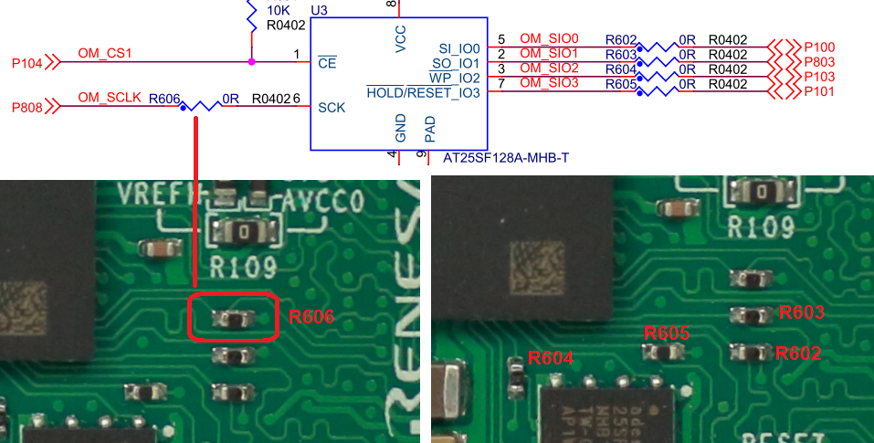
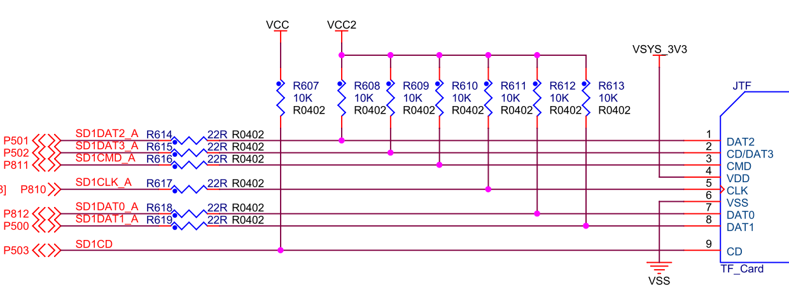

## RA8的外接存储扩展

RA8x1 MCU片内集成大容量Flash和SRAM，具体分配如下
- 最大2M字节的片内Flash（RA8D1有1M字节和2M字节Flash两个版本）
- 12KB的Data Flash （64字节擦除块大小，至少保证125000次擦写周期，85度以下30年数据存储寿命）
- 1M字节的SRAM，包含
  - 64KB ITCM + 64K DTCM （480MHz;支持ECC SEC-DED, ITCM 64+8位, DTCM 32+7位）
  - 384KB ECC RAM （SRAM0；120MHz以下零等待；SEC-DED单比特纠错，双比特检错, 64+8位）
  - 512KB 带校验的RAM（SRAM1；120MHz以下零等待；偶校验，8位数据+1位校验）
  - 1KB 待机用SRAM （120MHz以下零等待；在深度软件待机模式1(DSTBY1)下可以保持数据；偶校验，8位数据+1位校验）

RA8x1的Cortex-M85内核里还集成了16KB的指令Cache（2-way set-associative）和16KB的数据Cache（4-way set-associative），Cache容量不计入MCU的存储容量。

为了扩展存储容量，RA8D1支持多种外部存储接口，以224BGA封装为例，主要包含：
- 32位外部并行总线扩展（CS扩展），支持数据地址分离模式和复用模式，8个片选区域，16M字节 x 8 共128M字节寻址范围，内部工作时钟（BCLK）最高120MHz，输出时钟（EBCLK）最高60MHz。
- 32位SDRAM扩展（和并行总线复用管脚），128M字节寻址空间，时钟（SDCLK）最高120MHz。
- OSPI接口，支持JEDEC标准的xSPI接口（100MHz时钟输出）
  - 2个片选空间，每个片选空间256M字节寻址范围
  - JESD251，Profile 1.0 - Octa-SPI, Profile 2.0 - HyperBus™ （HyperRAM™ 和 HyperFlash™ ） 
  - JESD251-1.01（QSPI）
  - JESD252.01 （In-Band RESET时序）
- SD/MMC接口
  - 2个SD卡/SDIO接口，时钟输出最高50MHz，4位数据模式和标准单线模式
  - 兼容SD、SDHC和SDXC格式
  - 支持Default Speed、High Speed、SDR12和SDR25传输模式
- USB 2.0高速主机接口，可以扩展外接USB存储。

如果同时使用CS扩展和SDRAM扩展，那BCLK和SDCLK一定要设置为相同的频率。
OSPI接口所在的I/O端口使用VCC2电源供电，可以独立设置，支持1.65V~3.6V供电，可以支持1.8V电压的存储芯片。

### SDRAM扩展

CPKCOR-RA8D1B上使用了16位SDRAM扩展数据存储，板载SDRAM型号是华邦的W9825G6KB-6I，32M字节（256Mbit）容量。SDRAM设计也兼容其他型号，例如ISSI IS42S16160J-6BLI等。
地址范围从0x6800_0000到0x69FF_FFFF。

核心板面积较小，SDRAM的走线进行了阻抗匹配，没有使用串联电阻。

### QSPI Flash扩展

核心板上使用了QSPI Flash扩展存储空间，容量位16M字节（128Mbit），支持瑞萨的AT25SF128A和华邦的W25Q128JV。QSPI Flash使用的是OPSI接口上的CS1寻址空间，地址从0x9000_0000开始至0x90FF_FFFF。

核心板通过J2引出了完整的OSPI接口，包括两个CS和差分时钟线。如果您需要再外接扩展板上使用OSPI接口，请修改CPKCOR-RA8D1B上的电阻设置：
- 拆除R606，核心板上SCK和SCKN已经以差分线形式连接到J2
- 拆除R602~R604，核心板上OSPI的数据线连接到J2时已经做了等长处理。
- 在扩展板上使用OSPI CS0连接存储芯片，注意时钟和数据线布线要求。
- 如果需要再扩展板上使用1.8V的存储芯片，则需要拆除U3芯片，并修改VCC2电源设置，详见[CPKCOR-RA8D1B的电源设计](09_powerdesign.md)章节。
  - 如果您只是需要评估一下1.8V存储芯片，瑞萨可以提供已安装好1.8V Octa-NOR/Octa-NAND/HyperRAM的开发板，请联系瑞萨相关人员或代理商咨询。
  
  

### MicroSD存储卡（TF卡）

核心板底面已经设计了TF卡槽，连接到RA8 MCU的SDHI1的A组I/O口，采用四线数据连接，最高支持每秒25M字节的数据传输速率。

TF卡使用3.3V供电，供电管脚连接VSYS_3V3，即3.3V LDO的输出电压。核心板上没有对TF卡槽的供电进行开关控制，不支持热插拔TF卡，请 ${\color{red}{\text{务必在断电状态下进行TF卡的插拔}}}$。
- 此外，核心板主要是作为开发和评估使用，在TF卡的数据线上只串接了22欧姆的电阻，并没有进行ESD保护，所以请务必注意 ${\color{red}{\text{不要带电插拔TF卡}}}$。

#### TF卡低电压工作注意事项

SDHI1的A组I/O口由VCC2供电，和Octa SPI接口是同一个电源域，当外接Octa SPI存储芯片或其他情况下，需要将VCC2设置成1.8V时，在SDHI接口上没有电平转换电路，此时不建议同时使用核心板上的TF卡槽，可以在外接扩展板上，用其他SDHI接口外扩存储卡。
- 如果在系统上电后使用ACMD41命令切换TF卡的工作电压，那么在电压切换完成前，SDCMD管脚上的输入高电平（3.3V）会超过允许值，注入电流也会短暂超过芯片允许的范围。电压切换完成后，即可用1.8V信号电平与TF卡正常通信。
- 请评估风险后再决定是否要在VCC=1.8V的情况下使用核心板上的TF卡槽。

### 通过高速USB 2.0扩展存储

核心板上的JUSB Type-C 2.0接口可以作为DFP端口，实现USB主机功能，连接USB存储设备。需要注意的是核心板对USB的供电能力限制。核心板上使用了2A的电流限制器来实现对JUSB口的供电，电流限制器的输入是VIN_5V。
- 如果使用JDBG供电，VIN_5V本身已经是被限制在2A供电，这个2A需要为核心板电路和USB HOST同时供电，此时要注意JUSB口的供电是否会造成系统超负荷。
- 如果从JD接口或J1由外部输入VIN_5V，请确保VIN_5V可以为JUSB提供足够的电流。
  - J1接插件每个端口的电流限制为300mA，VIN_5V共有3个端口，900mA电流。在需要使用USB主机功能时，不建议仅使用J1端口获取5V供电，需要配合JD端口上的VIN-5V一起使用。

[返回目录](01_overview.md)             [下一篇：CPKCOR-RA8D1B的电源设计](09_powerdesign.md)
