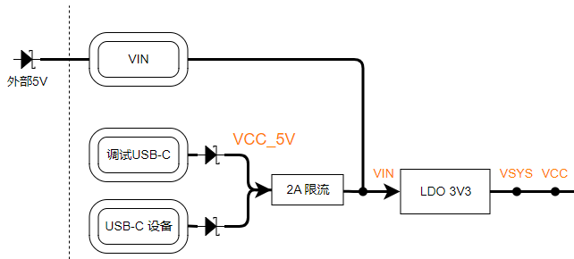
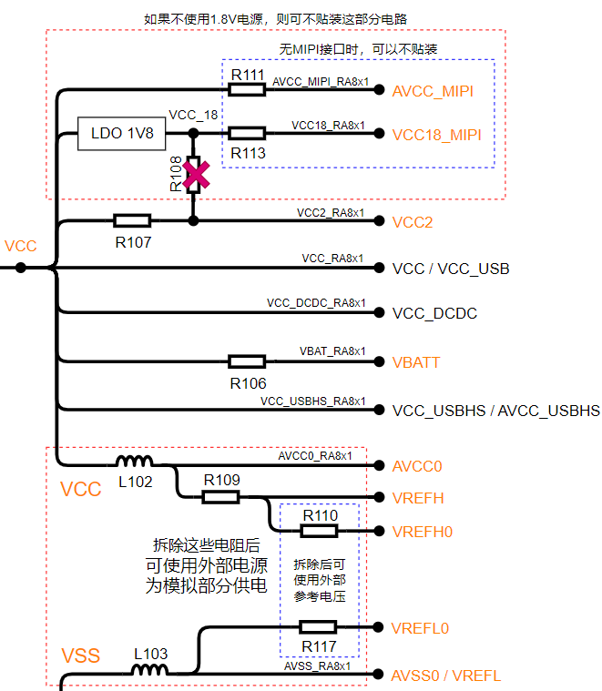
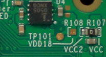
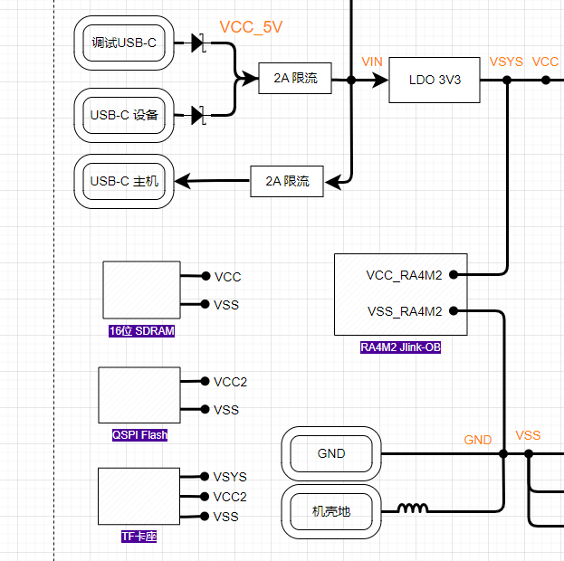
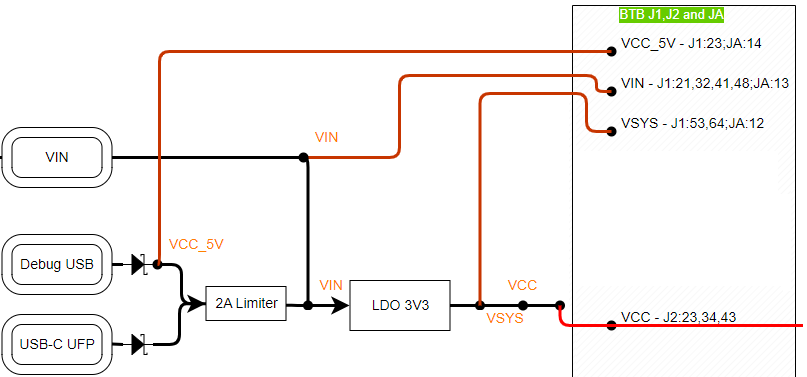
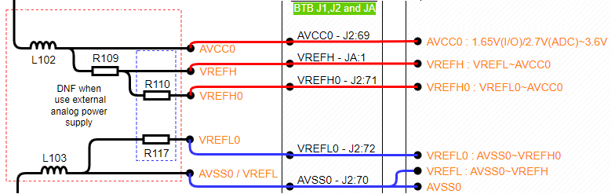

## CPKCOR-RA8D1B的电源设计

### RA8D1B MCU的电源需求

RA8D1/M1/T1 MCU是瑞萨MCU中为数不多的可以支持多I/O电源域的产品，此外，MCU内部还集成了DC-DC电路为内核供电，简化外部电源设计。

RA8D1B MCU的电源构成和电压范围如下图所示，多种电压输入可以满足不同的应用需求。

最简单的应用需求下，RA8D1B只需要一个3.3V为MCU系统供电，同时有个1.8V为MIPI接口供电。瑞萨官方的EK-RA8D1评估板采用的就是这个设计。
- 如果不使用MIPI-DSI接口，只使用RGB接口的LCD，那可以选用RA8D1A芯片，省去MIPI部分的供电，只用单个3.3V供电
- 各个电源的电流需求请参考MCU硬件手册60.2.5章节-工作和待机电流

### CPKCOR-RA8D1B的电源输入

核心板有两个USB Type-C 2.0接口，其中JDBG接口只做UFP，主机可以通过USB-C口或USB-A口对JDBG提供5V电源。JUSB做了简化的双向设计，作为设备时，主机只能通过USB-A口（或USB-C经过C转A转接器）为JUSB供电。

USB接口上有防反向二极管，经过2A限流后为核心板提供5V电源。扩展接插件JA和J1上也有VIN信号，可以由外部向核心板提供5V电源，使用VIN时请注意在外部扩展板上做好防反灌措施。然后通过LDO ISL80102IRAJZ（2A）后为核心板提供3.3V电压。核心板原理图上有区分标注VSYS_3V3和VCC，VCC为RA8 MCU系统的电源，但在此核心板设计上，这两个网络是直接相连的。

核心板的RA8电源设计采用了电阻硬件跳线方式，缺省的配置是VCC直接连接到AVCC_MIPI, VCC2, VBATT和模拟电源（AVCC0，VREFH，VREFL0）。LDO ISL80505IRAJZ为MIPI-DSI接口提供1.8V电源，如下图所示。

由于板上已经实装了1.8V的LDO，在设计上预留了R108，用于将1.8V连接到VCC2。如果您需要在扩展底板上评估1.8V的Octa-Memory/HyperRAM，可以直接修改R107和R108。R107和R108在PCB上为互斥封装排布，在PCB顶层的右上角。

  

### 核心板上其他器件的电源

供电情况如下
- SDRAM由VCC供电，3.3V。
- JLink-OB MCU RA4M2由VSYS供电，3.3V。
- 板载QSPI Flash由VCC2供电，缺省3.3V。如果修改了VCC2电压到1.8V，则QSPI Flash无法工作。
- MicroSD（TF）卡槽由VSYS供电，3.3V。存储卡使用的SDHI接口是VCC2电源域的，信号上拉电阻上拉到VCC2。如果VCC2改为1.8V，则可能造成存储卡无法使用，详见[RA8外接存储器](08_storage.md)章节中TF卡的注意事项。

### 扩展板供电选项

如前所述，RA8D1B MCU有多个电源管脚，可以分别设置供电电压。在核心板设计上，预留了通过扩展板进行供电的能力，配合修改核心板上的供电电阻，即可实现灵活的电压配置。

VIN可以实现双向供电。
- 当核心板不使用USB供电时，扩展板可通过VIN为核心板提供5V电源，在搭建快速原型系统时较为实用。
- 当核心板由USB口供电时，可通过JA,J1,J2的VIN管脚向扩展板限流的5V电源。

VCC_5V的作用类似，但请注意J1管脚的载流能力只有300mA，如果电流太大，请使用JA上的通孔管脚。
- VCC_5V的设计初衷是通过J1向扩展板提供完整的全速USB接口，VCC_5V提供全速USB HOST的电源。由于J1管脚的电流限制，扩展板上全速USB HOST无法为外设提供大的电流，在外设电流要求不高（如HID设备）或USB外设自供电时，可以使用VCC_5V这个脚上的供电。如果全速USB所连接的外设有大电流需求，则需要在扩展板上有独立的供电电路。

#### 由核心板向扩展板提供电源

缺省状态下，核心板通过USB口供电时，可通过JA,J1,J2向扩展板提供各种电源。

VSYS，VCC，，VBATT，AVCC0，VREFH，VREFH0都是3.3V，VCC2可以是3.3V或1.8V。

MIPI电源的三个管脚可以向扩展板提供电源，但主要的作用是核心板的兼容设计，在使用RA8D1A，RA8M1和RA8T1时，断开相关的电阻即可

#### 由扩展板向核心板上的RA8 MCU提供电源

在评估某些配置时，需要为RA8 MCU提供不同的电压，此时可以配合扩展板和跳线电阻实现外部电源输入。

断开R106后，可由扩展板为核心板提供VBATT电源，进行VBATT相关的评估。

尽管核心板上已经提供了可将VCC2连到1.8V的选项，您也可以断开R107和R108，由J1接口提供VCC2电源。

如果需要外接模拟电源和参考源实现高精度模拟采样，则有多个层级的选择。
- ADC单元0的模拟参考可以通过断开R110和/或R117后，通过J2外部输入模拟参考电压
- ADC单元1的模拟参考高电平可在断开R109后，由JA从外部输入
- 断开L102和L103，整个模拟部分的供电和参考电平都由J2（和JA）从外部输入
  

综上所述，核心板作为独立的开发板工作时，使用USB供电，通过LDO为RA8 MCU系统提供3.3V供电，同时另一个LDO为MIPI-DSI提供1.8V供电。配合扩展板工作时，可为扩展板提供5V，3.3V和1.8V电源和模拟参考电源，也可以配合跳线电阻，由扩展板反向为核心板提供某些电源，满足不同的评估和原型系统的需求。

[返回目录](01_overview.md)      