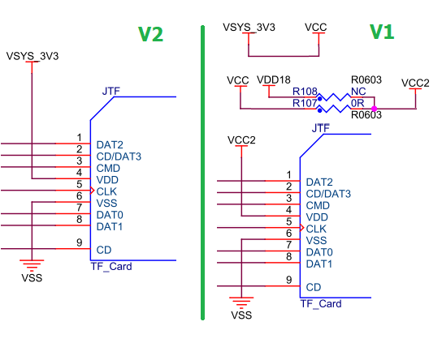
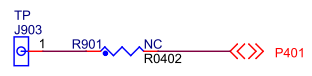
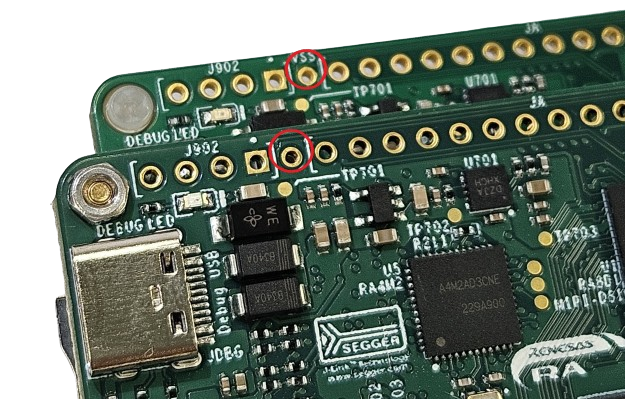
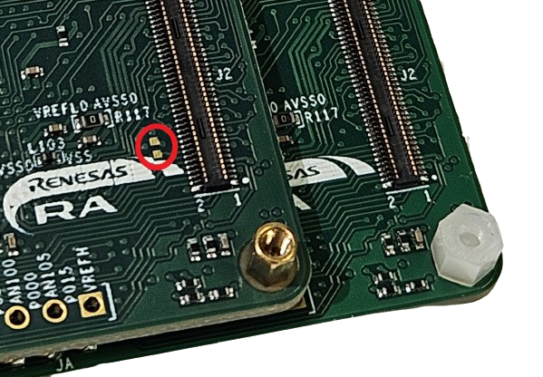

## CPKCOR-RA8D1B V1和V2版本的硬件区别

- [CPKCOR-RA8D1B V1和V2版本的硬件区别](#cpkcor-ra8d1b-v1和v2版本的硬件区别)
  - [外观区别：](#外观区别)
  - [功能区别：](#功能区别)

CPKCOR-RA8x1x核心板使用兼容设计，可以通过不同的电阻贴装选项支持RA8D1B（支持MIPI-DSI）、RA8D1A、RA8M1、RA8T1。
量产版的PCB设计相对于小批量生产的PCB硬件上有一些改动，罗列如下。

小批量生产的都是贴装RA8D1B MCU，所以PCB改动仅影响CPKCOR-RA8D1B.

小批量批次：CPKCOR-RA8D1B

量产批次：  CPKCOR-RA8D1B V2

### 外观区别：

顶面丝印标明了开发板的型号，图片里上面的开发板是V2

### 功能区别：

1. V2版TF卡槽的供电改为VSYS_3V3，V1版使用VCC2。
   - V1版，TF卡使用VCC2供电，缺省情况下，VCC2连接3.3V，TF卡可以正常使用。
   - V1版，当VCC2供电通过R108连接到1.8V时，TF卡不能使用。
   - V2版，当VCC2供电改为1.8V时，不建议使用TF卡。如果一定需要用TF卡，可以参考CPKHMI-RA8D1B的样例程序将TF卡设置为1.8V通信电平。
     - 注意：CPKCOR-RA8D1B V2没有TF卡接口电平转换电路，TF卡上电后，MCU发送更改改运行电压命令（ACMD41，CMD11）时，两边电平不匹配，RA8的SDCMD管脚上的注入电流会短暂超出设计允许的最大值（2mA）。
     - CMD11命令完成后，TF卡改到1.8V通信电平，就可以正常通信了。
     - TF卡的通信电平只有在TF卡重新上电后才需要再次设定，RA8软件方面需要做相应的处理。
  
     

2. V2版上的通孔接口上预留了RA8的P401端口（J903），和V1版上的VSS测试孔（J702）使用同一个位置。
   - P401通过跳接电阻连到J903，缺省不连接。所以，除了V2版无法使用这个VSS测试孔以外，其他功能两个版本没有任何区别，软件也不用修改。
   
     
   - 硬件板上的位置如下图，图片里上面的开发板是V2。
   
    
   - 跳接电阻R901在电路板底面，图片里上面的开发板是V2。
   
     

RA8D1A、RA8M1、RA8T1 MCU的CPKCOR板没有V1版，都是V2版硬件。