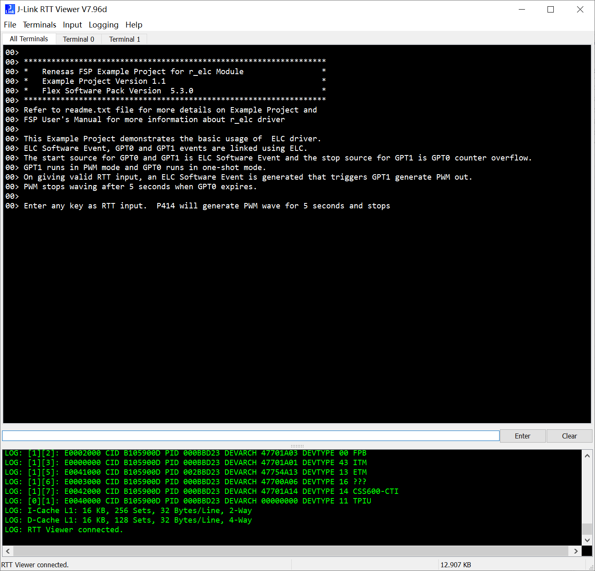
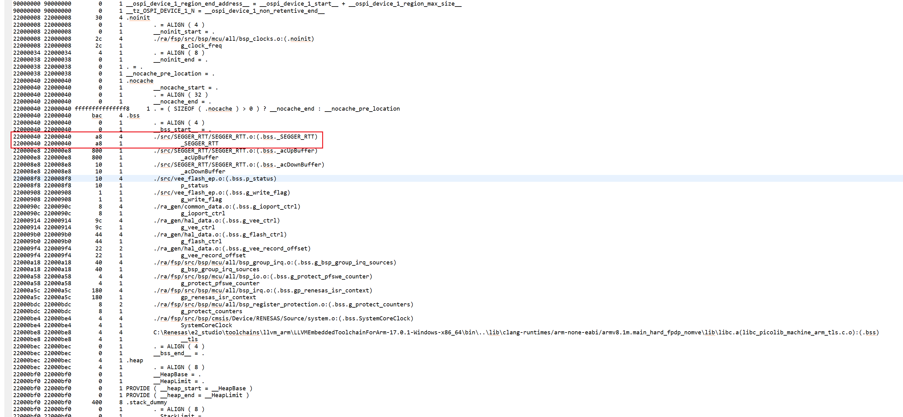
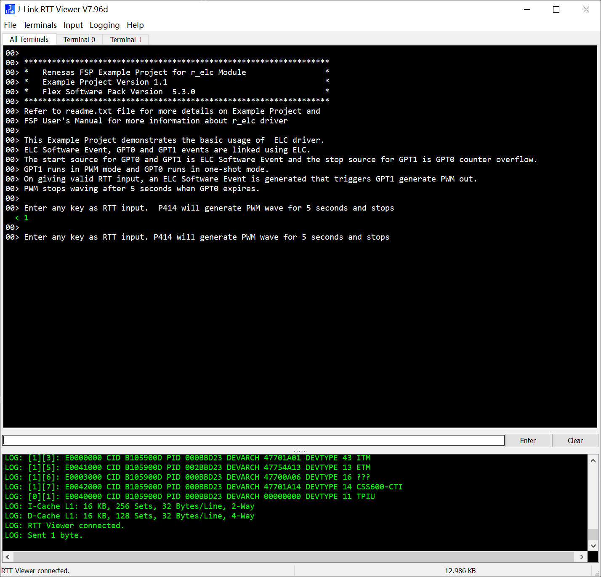

1. 例程概述：
此示例项目演示了基于 Renesas FSP 的 Renesas RA MCU 上的 elc 功能。
在 RTTviewer 上提供任何输入时，elc 将会生成 sofware trigger 同时启用GPT0以及GPT1，GPT0为周期5秒的单次计时器，GPT1为周期500毫秒，50%占空比PWM输出的计时器。
当GPT0计时器超时时将会生成 GPT0 overflow trigger来停止GPT1的PWM输出。

成功完成每个操作后，Jlink RTTViewer 上将显示成功消息。
错误和信息消息将打印在 JlinkRTTViewer 上。

2. 硬件要求：
- RA8D1-CPKCOR开发板 x1
- USB Type-C设备电缆 x1

3. 硬件连接：
将Type-C 电缆连接到CPKCOR-RA8D1B的调试USB口（JDBG）端口。将此电缆的另一端连接到主机 PC 的 USB 端口。

4. 使用方法：
1) 需要在RTT Viewer中填入 _SEGGER_RTT 变量的地址进行连接，例程默认状态下地址如下：
e2studio：0x22000040

2) 如果修改、编译和下载了例程，请在构建配置文件夹中生成的 .map 文件中找到块地址（RAM 中名为 _SEGGER_RTT 的变量）。

3) 按照RTT_Viewer中打印的提示进行操作，ELC将会自动驱动GPT0以及GPT1，并且GPT0超时后会自动停止GPT1：

