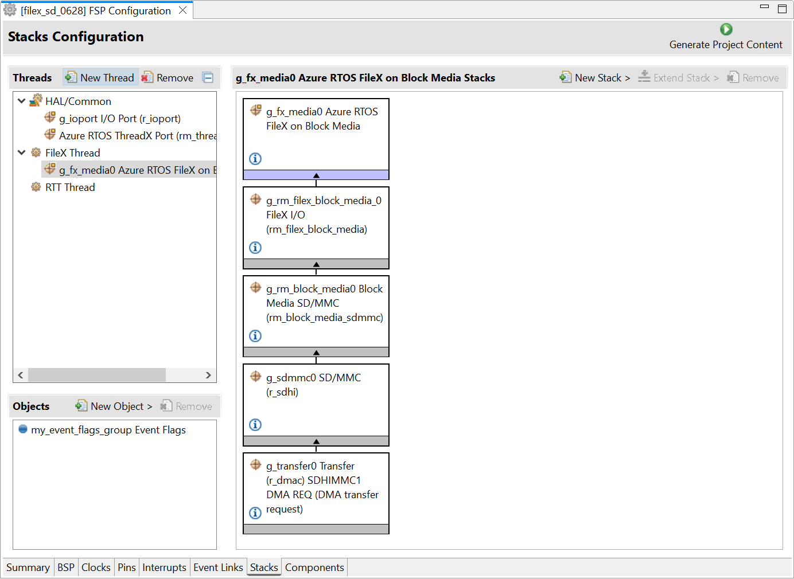
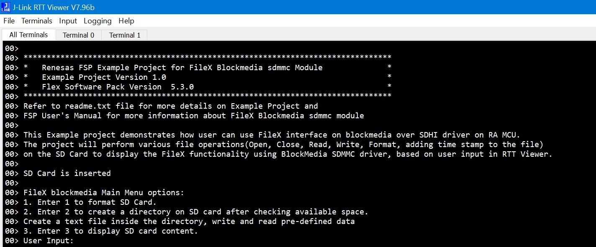
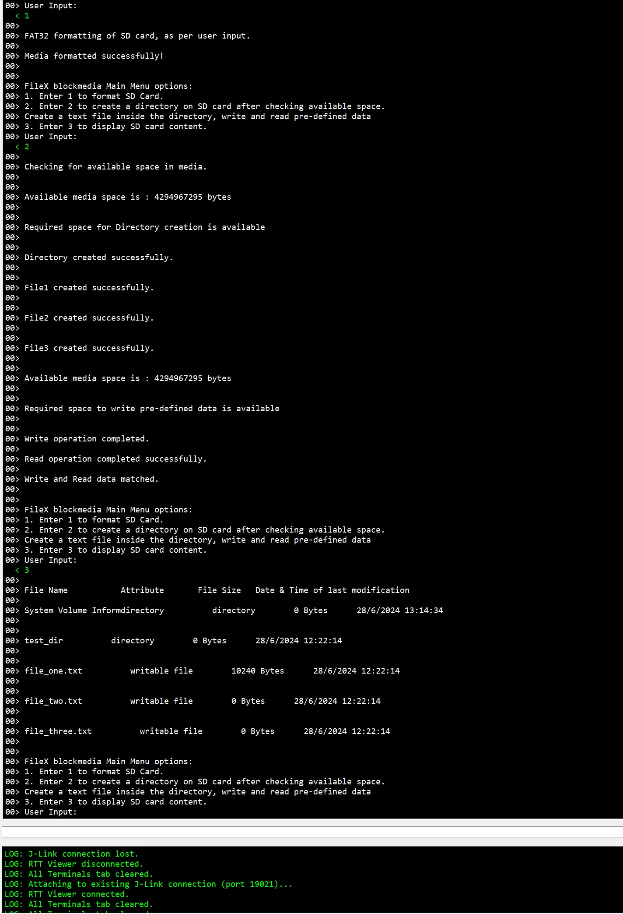

## 1.参考例程概述
该示例项目演示了基于瑞萨 FSP 的瑞萨 RA MCU SD卡的基本功能，注意本例程基于AzureRTOS。当代码运行时，RA8D1可以对插入JTF口的MicroSD卡（FAT32格式）进行操作。
代码流程说明如下：
上电后，MCU会通过RTT Viewer打印一些Log，提示支持的操作，可以根据提示信息，键入相应的命令，如对SD卡进行格式化，写入数据并读出之后做比较，弹出SD卡等。

### 1.1 创建新工程，BSP选择“CPKCOR-RA8D1B Core Board”，RTOS选择FreeRTOS。
### 1.2 Stack中添加“Azure RTOS FileX on Block Media”，详细的属性设置请参考例程

### 1.3 在卡槽中插入MicroSD卡后，连接调试PC和JDBG。
### 1.4 在e2 studio中调试代码，代码自由运行。PC端打开J-Link RTT Viewer，会显示如下Log打印：

### 1.6 键入相应的指令，如“1”，格式化SD卡：

操作的结果会在RTT Viewer中打印。更多细节，请参考代码中的内容。

## 2. 支持的电路板：
CPKCOR-RA8D1B

## 3. 硬件要求：
1块瑞萨 RA核心板：CPKCOR-RA8D1B

1根Type-C USB 数据线，用于连接JDBG和PC。

1张Micro SD卡。

## 4. 硬件连接：

将SD卡插入背面卡槽JTF中。

通过Type-C USB 电缆将 CPKCOR-RA8D1B板上的 USB 调试端口（JDBG）连接到主机 PC。
