## 1.参考例程概述
该示例项目演示了基于瑞萨 FSP 的瑞萨 RA8 MCU 上 [heilum](https://www.arm.com/technologies/helium)的基本功能。

### 1.1 创建新工程，FSP选择"5.3.0"，Board选择“CPK-RA8D1B Core Board”，Toolchains选择"LLVM Embedded Toolchain for Arm: 17.0.1"
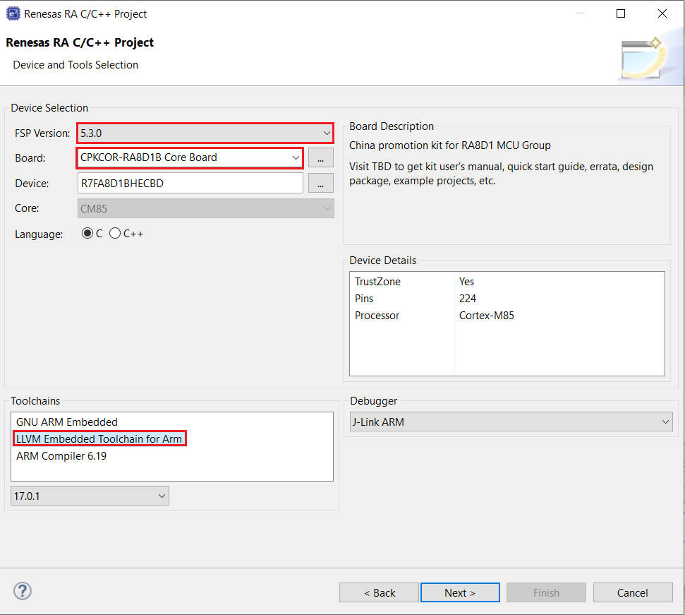
### 1.2 Stack中添加“UART (r_sci_b_uart)”，详细的属性设置请参考例程
添加uart组件

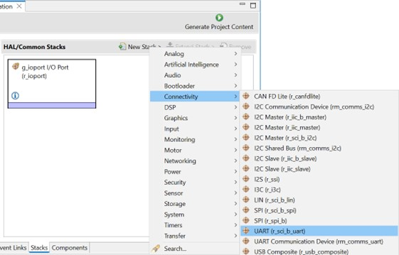

uart序号选择3，并设置中断回调函数和引脚

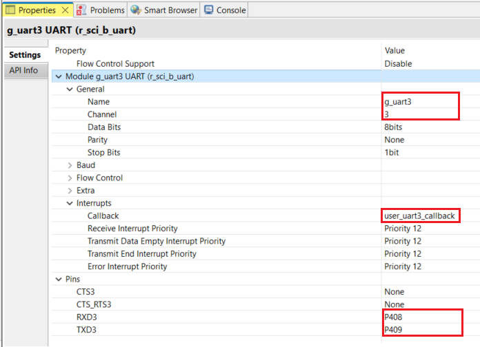

设置uart时钟

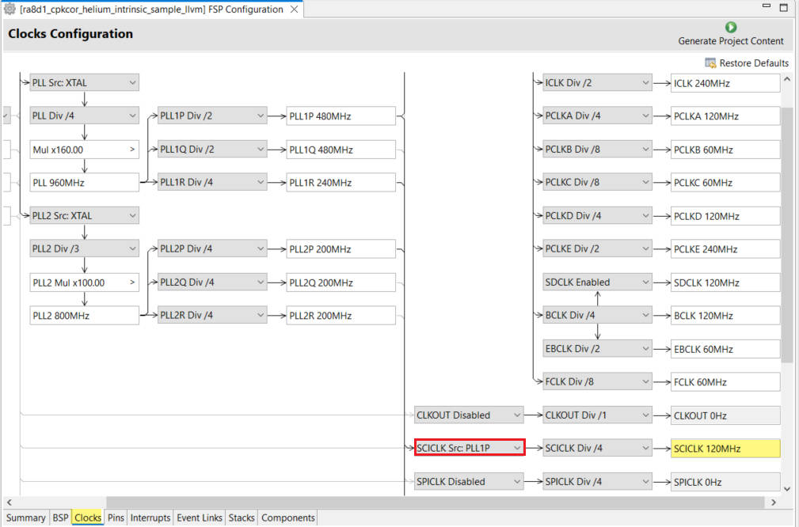

### 1.3 在BSP设定中的"Cache settings->Data cache"选择"Enabled"，同时设置栈为"0x68000"，堆为"0x1000"
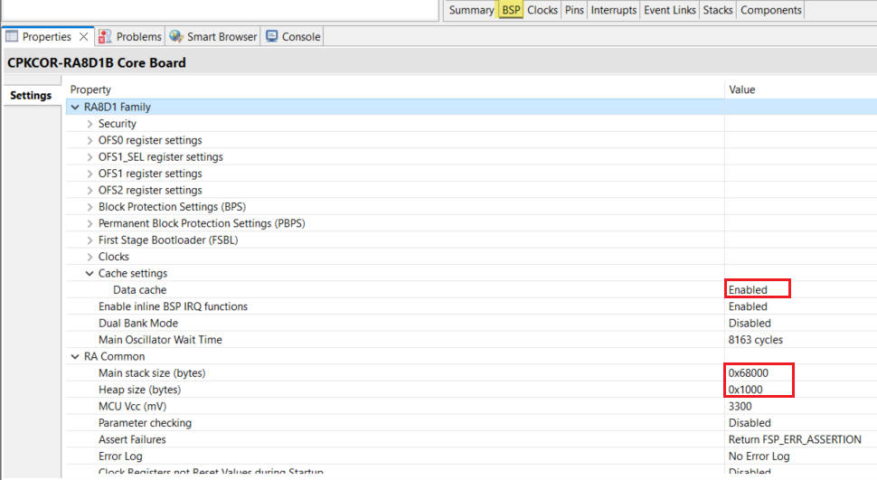

### 1.4 添加low_level.c，dwt.c，dwt.h，pic.h文件到工程中

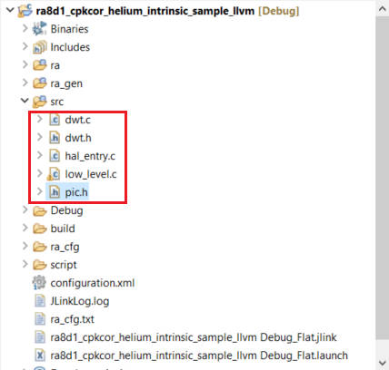

dwt.c和dwt.h是DWT相关的代码，DWT是（Data Watchpoint and Trace）的缩写，它是ARM cortex M中的一个32位的向上计数器，记录的是内核时钟运行个数，
内核时钟跳动一次，该计数器就加1，精度非常高，用于系统调试和跟踪，也可以用来测试代码运行时间。

pic.h是一张240*160的32-bit RGBA8888图片数据。

在hal_entry.c中的第12~13行，有两个宏定义。

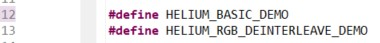

HELIUM_BASIC_DEMO 是使能helium的基础例子的开关，它展示使用helium 原语函数[(intrinsic)](https://developer.arm.com/architectures/instruction-sets/intrinsics/)来进行加法，减法和乘法运算。

HELIUM_RGB_DEINTERLEAVE_DEMO 是使能helium 进行图像RGBA数据色彩数据分离例子的开关，它展示了在色彩数据分离中，普通c代码实现和通过使用helium 原语函数(intrinsic)的实现之间的效率对比。
注：HELIUM_BASIC_DEMO的优先级比HELIUM_RGB_DEINTERLEAVE_DEMO高，如果这两个宏同时定义，hal_entry.c中的第15~17行代码会自动进行 #undef HELIUM_RGB_DEINTERLEAVE_DEMO操作。

### 1.5 运行代码
#### 1.5.1 运行helium基础例子代码
板子总览图

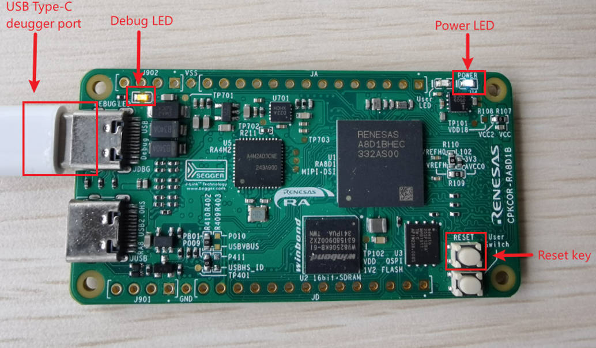

先前步骤添加的uart相关代码，运行起来后，板子会自动被识别成一个串口设备。

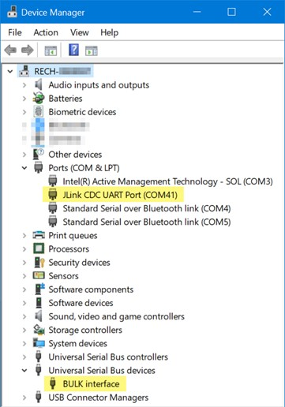

你会在串口终端中看到vadd，vsub，vmul_q运行结果。

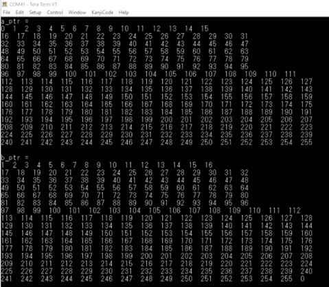

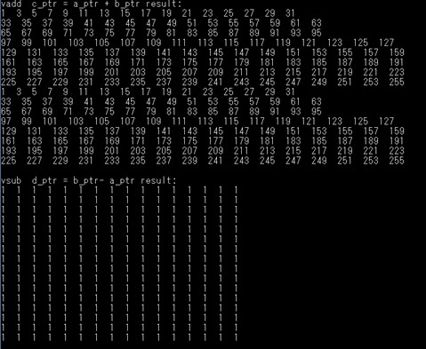

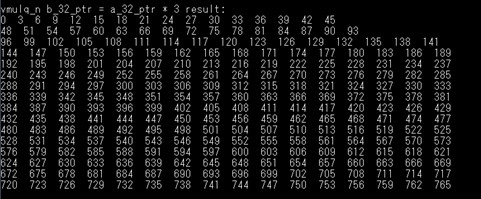

本示例中使用的原语函数(intrinsic)

- uint8x16_t vld1q u8(uint8 t const*base)
                从内存中加载数据到uint8x16_t (16个uint8数据)类型矢量寄存器中。
- void vst1q_u8(uint8_t *base,uint8x16_t value)
                将uint8x16_t (16个uint8数据)类型矢量寄存器中的数据写到内存中。
- uint8x16_t vaddq_u8(uint8x16_t a,uint8x16_t b)
                将两个uint8x16_t (16个uint8数据)类型矢量寄存器中的数据相加，并返回计算结果。
- uint8x16_t vsubq_u8(uint8x16_t a,uint8x16_t b)
                将两个uint8x16_t (16个uint8数据)类型矢量寄存器中的数据相减，并返回计算结果。
- uint32x4 t vld1q u32(uint32 t const*base)
                从内存中加载数据到uint32x4_t (4个uint32数据)类型矢量寄存器中。
- uint32x4_t vmulq_n_u32(uint32x4_t a,uint32_t b)
               将两个uint32x4_t (4个uint32_t数据)类型矢量寄存器中的数据相乘，并返回计算结果。

#### 1.5.2 运行helium图像RGBA数据色彩数据分离例子代码
注释掉hal_entry.c 的第12 行“#define HELIUM_BASIC_DEMO”，并编译和运行代码。

你会在串口终端中看到运行结果。可以发现，使用了helium原语函数(intrinsic)的方式代码比普通c代码运行时间要快1倍左右，如果图形数据越大，helium原语函数方式对于运行时间的提升会越明显。
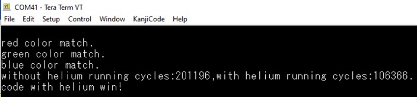

TIPS:可以使用e2 studio中的memory视图，查看处理的图形数据。
在memory中查看待处理的图像数据和处理后的图像数据。

点击绿色加号图标 ，如下图所示

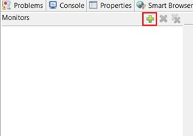

在弹出的窗口中输入gImage_dog_240_160，点击“OK”。

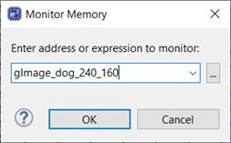

再点击“New Renderings...”

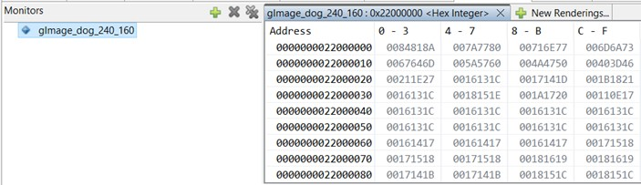

选择Raw Image。

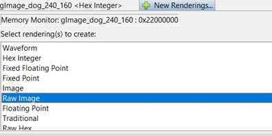

再选择 Raw Image Format。

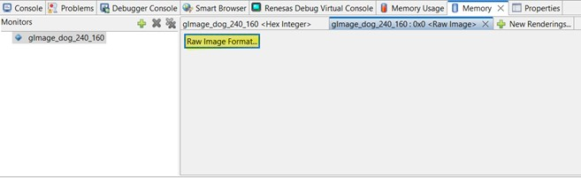

填入图片的格式，宽为240，高为160,编码为RGB 32bpp(8:8:8:8)。点击“OK”。

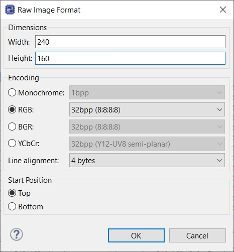

设置完成后，会在gImage_dog_240_160:0x22000000<Raw Image>处显示彩色图片。

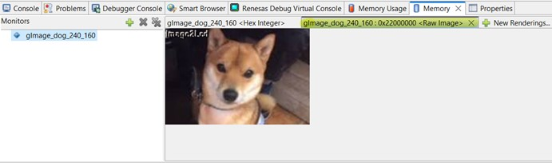

使用同样的方法，添加rgba_b_mve到memory中，会发现显示的图片不正常。

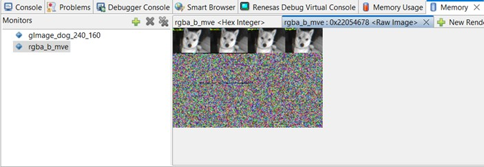

在图片上鼠标右键选择“Format” 填入参数宽为240，高为160,编码为Monochrome 8bpp。点击“OK”。

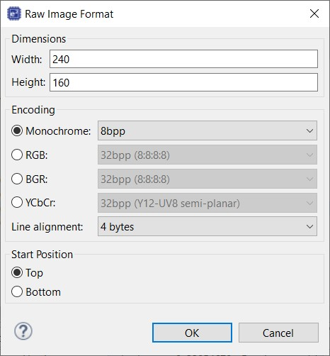

现在图片就显示正常了。因为现在这个数据是单一色彩通道的数据，所以，就是一个8位的灰度图。

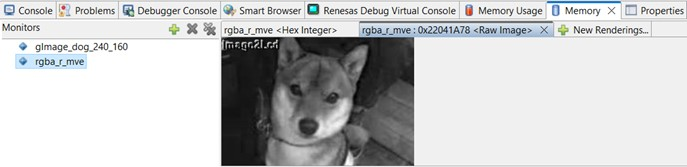

原语函数 | 含义 | 作用
| :--- | :---: | :---:
vld4q(…) | 通过加载4*16字节内存的连续区域返回uint8x16x4_t的函数。加载的每个字节都以交替模式放置在4个uint8x16_t数组之一中。 | 生成LD4指令，该指令将给定地址中的值以交替模式加载到4个helium寄存器中。具体作用参考下图。
vst1q_u8(…) | 在给定地址存储uint8x16_t的函数。 | 存储整个128位数据的函数。

代码中的图片是RGBA格式，通过使用Helium的原语函数(intrinsic)，实现RGBA色彩数据分离。

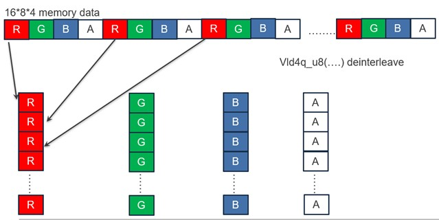

## 2. 支持的电路板：
CPKCOR-RA8D1B

## 3. 硬件要求：
1块瑞萨 RA核心板：CPKCOR-RA8D1B

1根Type-C USB 数据线

## 4. 硬件连接：
通过Type-C USB 电缆将 CPKCOR-RA8D1B板上的 USB 调试端口（JDBG）连接到主机 PC。

