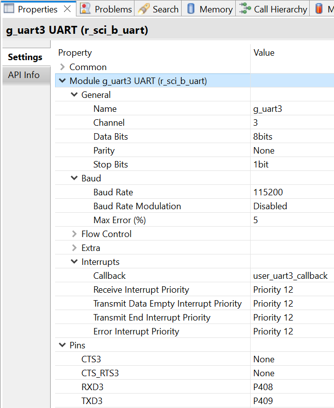
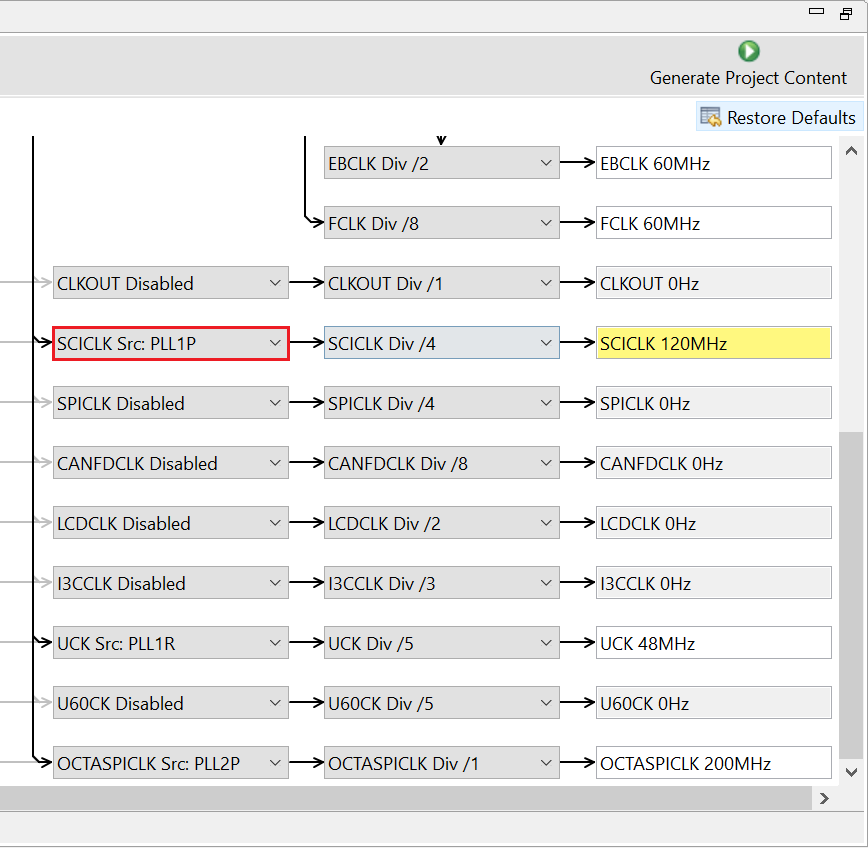
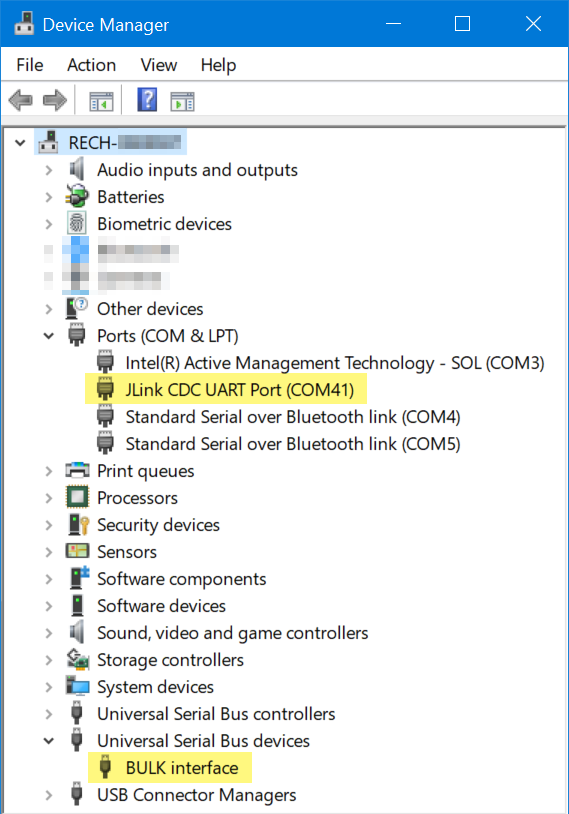
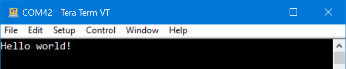

## 1.参考例程概述
该示例项目演示了基于瑞萨 FSP 的瑞萨 RA MCU将printf函数重定向到SCI UART的基本功能。

### 1.1 创建新工程，BSP选择“CPK-RA8D1B Core Board”
### 1.2 Stack中添加“UART (r_sci_b_uart)”，详细的属性设置请参考例程

### 1.3 需要将SCICLK使能，最大频率为120MHz，Clock配置如下图所示：

### 1.4 具体操作：
#### 1.4.1 打开PC端设备管理器，找到Ports (COM & LPT)下面的JLink CDC UART Port (COM41)，记下该串口标号。

#### 1.4.2 PC端打开串口工具，如TeraTerm，找到对应串口，将波特率设定为115200。
#### 1.4.3 在e2 studio中调试代码，会在TeraTerm中看到Log打印如下所示：

## 2. 支持的电路板：
CPKCOR-RA8D1B

## 3. 硬件要求：
1块瑞萨 RA核心板：CPKCOR-RA8D1B

1根Type-C USB 数据线

## 4. 硬件连接：
通过Type-C USB 数据线将 CPKCOR-RA8D1B板上的 USB 调试端口（JDBG）连接到主机 PC。