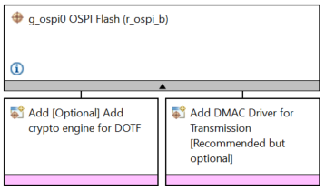
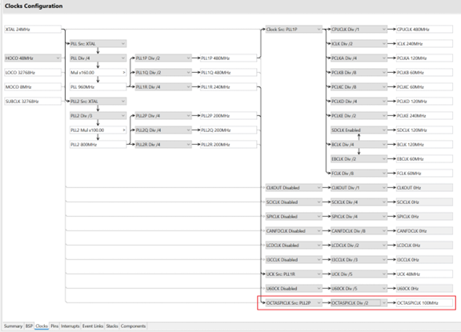
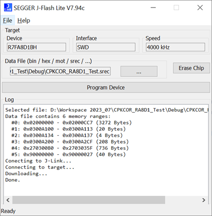
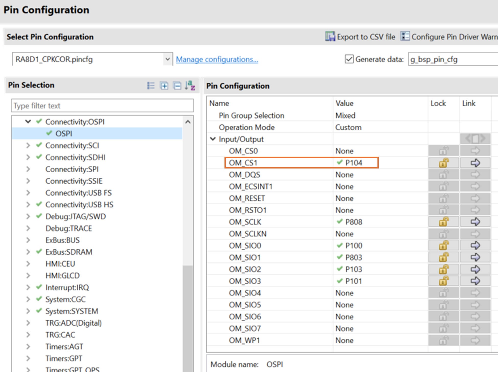

## 1.参考例程概述
该示例项目演示了基于瑞萨 FSP 的瑞萨 RA MCU 上 OSPI_B 驱动程序的基本功能。

### 1.1 创建新工程，BSP选择“CPK-RA8D1B Core Board”
### 1.2 Stack中添加“OSPI Flash (r_ospi_b)”，详细的属性设置请参考例程

### 1.3 根据QSPI Flash的数据手册，调整OSPICLK
参考该板上的QSPI Flash的数据手册，读写操作时的最大频率如下：

建议修改OSPICLK为100MHz。

### 1.4 具体操作：
#### 1.4.1 用户选择 opsi_b 模块的模式：SPI 1S-1S-1S 协议模式。
#### 1.4.2 擦除QSPI FLASH 的一个扇区。
#### 1.4.3 将数据写入 QSPI FLASH。
#### 1.4.4 从QSPI FLASH读回数据，并进行比较，确认写入成功。也可以从Memory窗口看到写入的数据。

## 2. 支持的电路板：
CPKCOR-RA8D1B

## 3. 硬件要求：
1块瑞萨 RA核心板：CPKCOR-RA8D1B

1根Type-C USB 数据线

## 4. 硬件连接：
通过Type-C USB 数据线将 CPKCOR-RA8D1B板上的 USB 调试端口（JDBG）连接到主机 PC。

## 5. 使用JFlash Lite对外部QSPI Flash进行操作：
运行JFlash Lite

添加需要烧录的.srec文件，可以在Log窗口看到改烧录文件中数据所在地址范围和大小。

由于该核心板上QSPI Flash使用的的片选信号为CS1。

所以，对应的QSPI. FLASH的地址范围为0x9000_0000~0x9FFF_FFFF。

