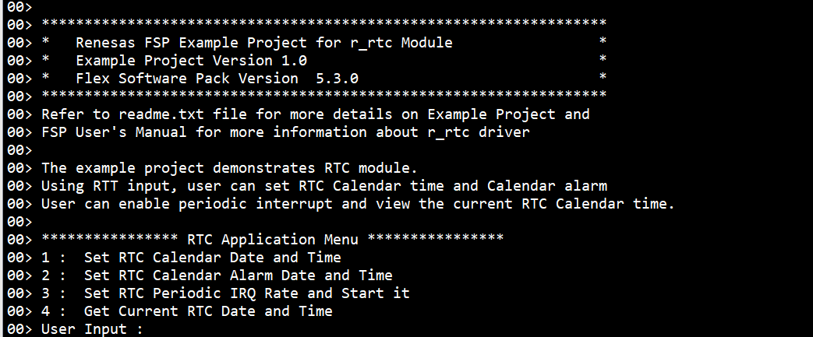
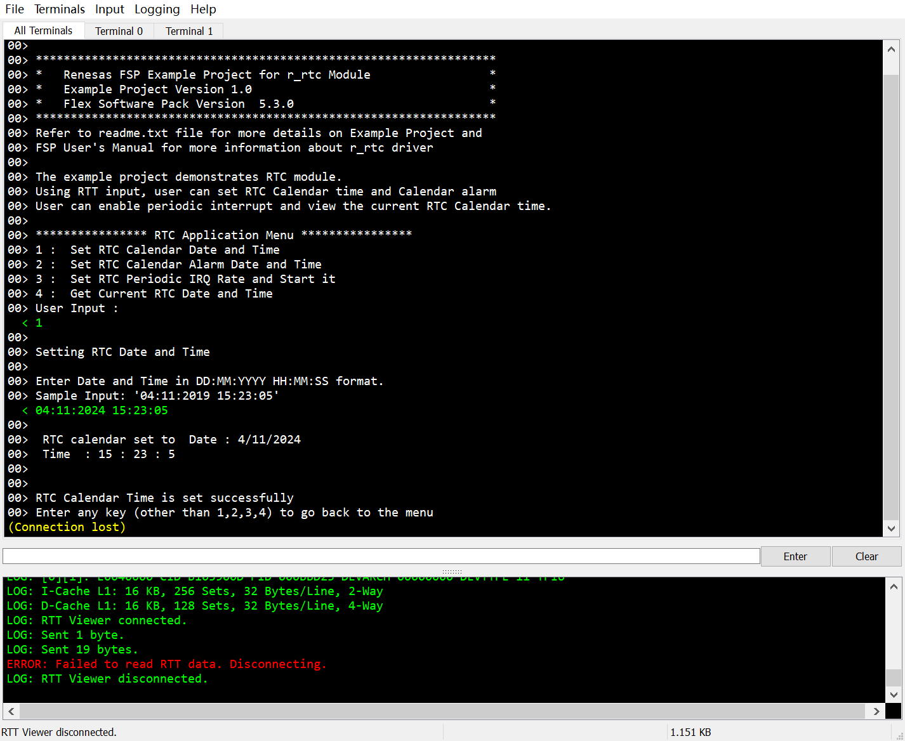

1. 例程概述：
此示例项目演示了基于 Renesas FSP 的 Renesas RA MCU 上的 RTC 的基本功能。
根据用户输入，例程可以执行以下操作：
1. 设置RTC的日期与时间
2. 设置RTC闹钟日期与时间
3. 设置RTC周期中断并启动
4. 获取当前RTC的日期与时间

成功完成每个操作后，Jlink RTTViewer 上将显示成功消息。
错误和信息消息将打印在 JlinkRTTViewer 上。

2. 硬件要求：
- RA8D1-CPKCOR开发板 x1
- USB Type-C 设备电缆 x1

3. 硬件连接：
将Type-C 电缆连接到CPKCOR-RA8D1B的调试USB口（JDBG）端口。将此电缆的另一端连接到主机 PC 的 USB 端口。

4. 使用方法：
1) 编译完成后在e2studio中点击debug按钮进入debug模式

2) 需要在RTT Viewer中填入 _SEGGER_RTT 变量的地址进行连接，例程默认状态下地址如下：
e2studio：0x22000040

3) 如果修改、编译和下载了例程，请在构建配置文件夹中生成的 .map 文件中找到块地址（RAM 中名为 _SEGGER_RTT 的变量）。

4) 按照RTT_Viewer中打印的提示进行操作，可以对RTC进行日期时间配置，闹钟设置，以及获取当前时间等：
