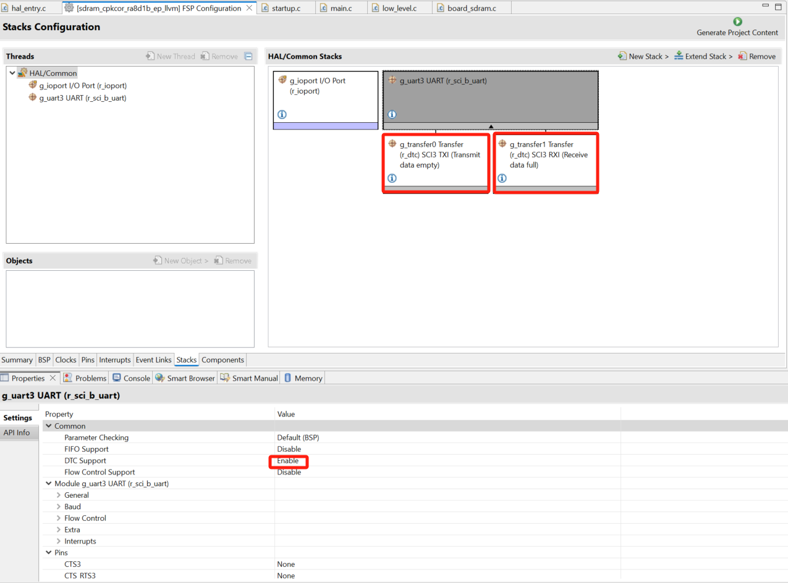
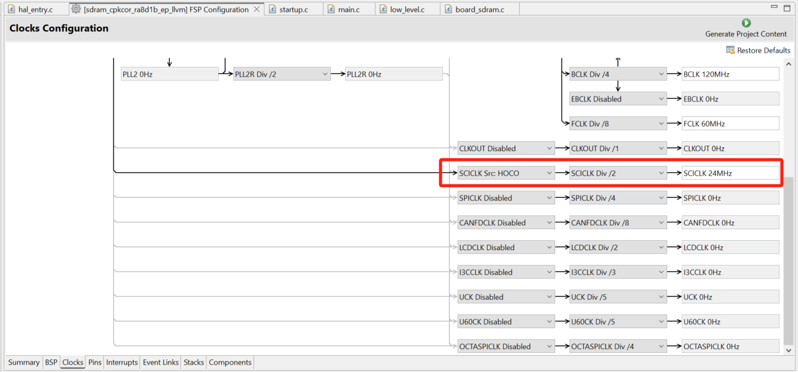
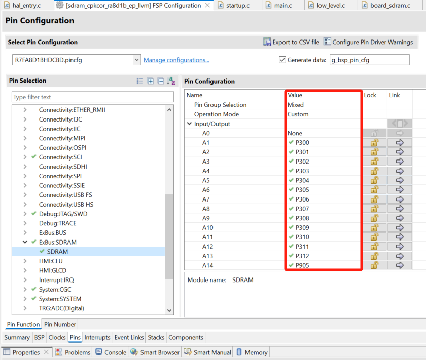
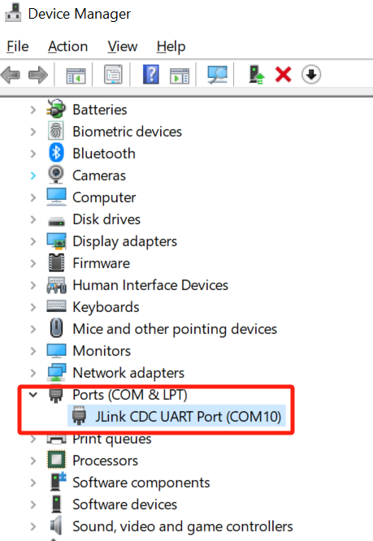
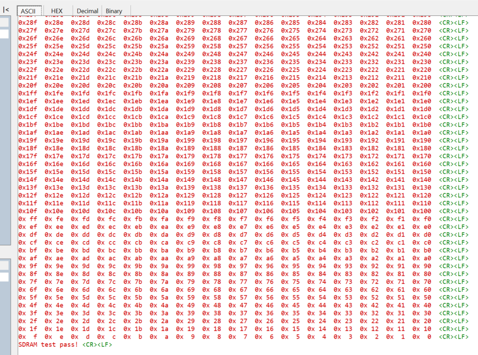

## 1.参考例程概述
该示例项目演示了基于瑞萨 FSP 的瑞萨 RA8D1 SDRAM 的基本读写功能。

### 1.1 创建新工程，芯片选择 R7FA8D1BHDCBD
### 1.2 Stack中添加“UART (r_sci_b_uart)”，属性设置使能DTC，并为UART stack添加DTC功能，如下：

### 1.3 需要将SCICLK使能，设置为24MHz，Clock配置如下图所示：

### 1.4 设置SDRAM引脚，具体参考例程中的引脚设置：

### 1.5 具体操作：
#### 1.5.1 打开PC端设备管理器，找到Ports (COM & LPT)下面的JLink CDC UART Port (COM10)，记下该串口标号。

#### 1.5.2 PC端打开串口工具，找到对应串口，将波特率设定为115200。
#### 1.5.3 在e2 studio中调试代码，会在串口工具中看到Log打印如下所示：

## 2. 支持的电路板：
CPKCOR-RA8D1B

## 3. 硬件要求：
1块瑞萨 RA核心板：CPKCOR-RA8D1B

1根Type-C USB 数据线

## 4. 硬件连接：
通过Type-C USB 数据线将 CPKCOR-RA8D1B板上的 USB 调试端口（JDBG）连接到主机 PC。