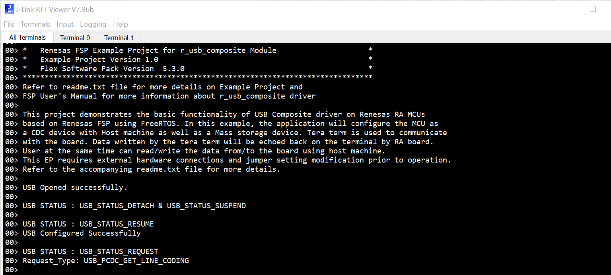
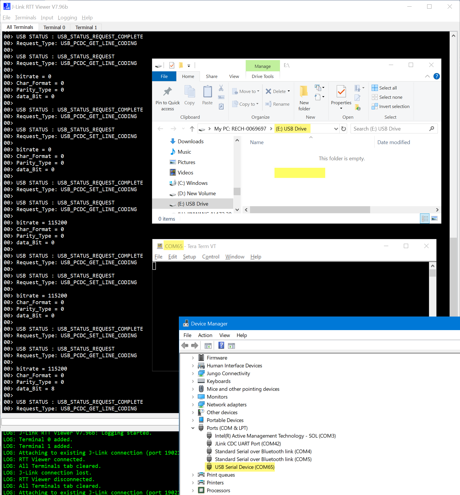

## 1.参考例程概述
该示例项目演示了基于瑞萨 FSP 的瑞萨 RA MCU在FreeRTOS下作为PCDC和PMSC复合设备的基本功能。当代码运行时，RA8D1可以作为USB PCDC及USB PMSC复合设备和主机通信。
代码流程说明如下：
上电后，MCU会通过RTT Viewer打印一些Log，提示当前的通信过程，如枚举的过程以及和主机之间的数据交互。

### 1.1 创建新工程，BSP选择“CPKCOR-RA8D1B Core Board”，RTOS选择FreeRTOS。
### 1.2 Stack中添加“FreeRTOS+FAT”，详细的属性设置请参考例程
### 1.3 利用一根USB线连接芯片的JDBG和PC，另一根USB线连接芯片的JUSB和PC。
### 1.4 在e2 studio中调试代码，代码自由运行。PC端打开J-Link RTT Viewer，会显示如下Log打印：

### 1.6 初始化完成后，PC端的设备管理器可以识别到一个COM口和一个USD Drive，如图所示：

如果在Tera Term中打开相应COM口，则配置信息如波特率等会显示在RTT Viewer中。

## 2. 支持的电路板：
CPKCOR-RA8D1B

## 3. 硬件要求：
1块瑞萨 RA核心板：CPKCOR-RA8D1B

1根USB Type A->Type C或Type-C->Type C线 （支持Type-C 2.0即可）。

1根USB Type A->Type C线 （支持USB 2.0即可）。

## 4. 硬件连接：

USB Type A->Type C或Type-C->Type C线连接CPKCOR-RA8D1B的JDBG和调试所用PC。

USB Type A->Type C连接CPKCOR-RA8D1B的JUSB和PC。