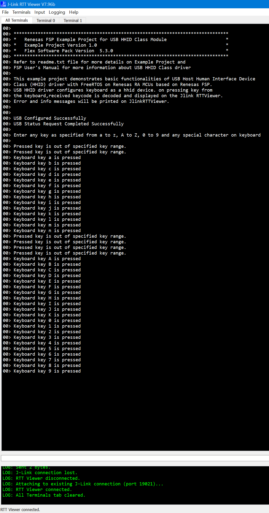

## 1.参考例程概述
该示例项目演示了基于瑞萨 FSP 的瑞萨 RA MCU在FreeRTOS下作为HHID的基本功能。
代码流程说明如下：
上电后，MCU会通过RTT Viewer打印一些Log，提示当前已经接入一个USB PHID设备（如键盘）。在键盘上按下任一按键（a～z，A～Z，0～9），该数据会被发送到RTT Viewer上显示。

### 1.1 创建新工程，BSP选择“CPKCOR-RA8D1B Core Board”，RTOS选择FreeRTOS。
### 1.2 Stack中添加“USB HHID”，详细的属性设置请参考例程
### 1.3 将键盘接入板上的JUSB接口（可能需要USB Type-C -> Type-A母座支持）。
### 1.4 在e2 studio中调试代码，代码自由运行。PC端打开J-Link RTT Viewer，会显示如下Log打印，在键盘上按下按键，则会在RTT Viewer上显示：

## 2. 支持的电路板：
CPKCOR-RA8D1B

## 3. 硬件要求：
1块瑞萨 RA核心板：CPKCOR-RA8D1B

1根Type-C USB 数据线，用于连接JDBG和PC。

1根Type-C -> Type-A母座，用于接入键盘到JUSB。

1个USB键盘作为PHID设备接入。

## 4. 硬件连接：
通过Type-C USB 电缆将 CPKCOR-RA8D1B板上的 USB 调试端口（JDBG）连接到主机 PC。

键盘连接至JUSB（可能需要Type-C -> Type-A母座转接）。