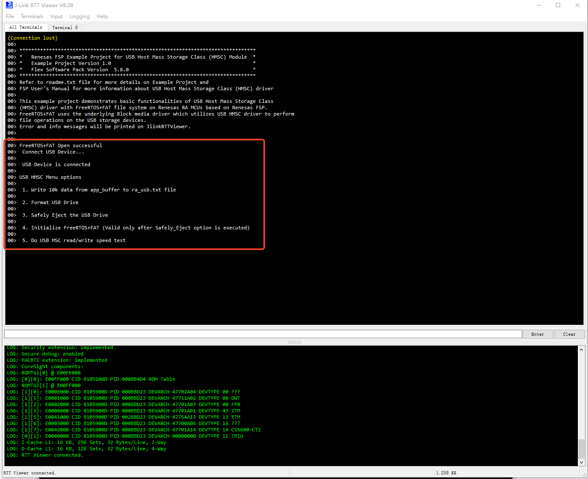

## 1.参考例程概述
该示例项目演示了基于瑞萨 FSP 的瑞萨 RA MCU在FreeRTOS下作为HMSC的基本功能。
代码流程说明如下：
上电后，MCU会通过RTT Viewer打印一些Log，提示支持的操作，可以根据提示信息，插入U盘，输入命令进行操作，如写入数据并读回验证，格式化，安全弹出等。

### 1.1 创建新工程，BSP选择“CPKCOR-RA8D1B Core Board”，RTOS选择FreeRTOS。
### 1.2 Stack中添加“USB HMSC”，详细的属性设置请参考例程

### 1.3 插入U盘（需要USB Type-C -> Type-A母座转接线支持）。
### 1.4 在e2 studio中调试代码，代码自由运行。PC端打开J-Link RTT Viewer，会显示如下Log打印，键入相应的指令，如“1”，向U盘中写入文件并读出，“2”格式化U盘等：

操作的结果会在RTT Viewer中打印。更多细节，请参考代码中的内容。

## 2. 支持的电路板：
CPKCOR-RA8D1B

## 3. 硬件要求：
1块瑞萨 RA核心板：CPKCOR-RA8D1B

1根USB Type A->Type C或Type-C->Type C线 （支持Type-C 2.0即可），用于连接JDBG和PC。

1根Type-C -> Type-A母座转换线。

1个U盘。

## 4. 硬件连接：
通过Type-C USB 电缆将 CPKCOR-RA8D1B板上的 USB 调试端口（JDBG）连接到主机 PC。

将U盘通过转换线连接至JUSB端口。