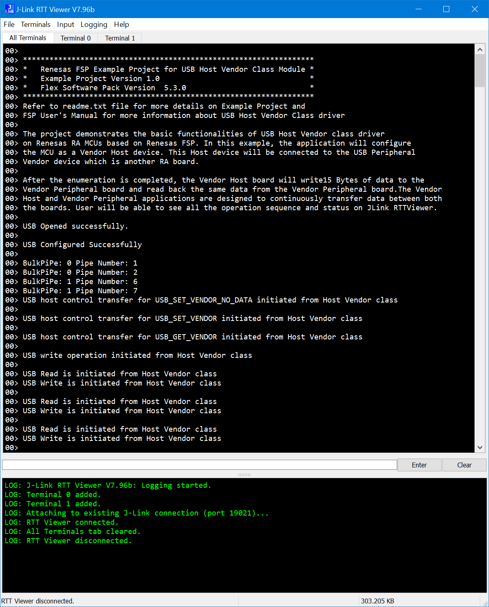

## 1.参考例程概述
该示例项目演示了基于瑞萨 FSP 的瑞萨 RA MCU在FreeRTOS下作为HVND的基本功能。
代码流程说明如下：
上电后，MCU会通过RTT Viewer打印一些Log，提示当前正在进行的和PVND之间的通信，如打开USB设备，列出通信所用的Pipe等信息。成功建立通信后，Vendor Host会给Vendor Peripheral写15字节并读回，可依据实际需要进行修改。

### 1.1 创建新工程，BSP选择“CPKCOR-RA8D1B Core Board”，RTOS选择FreeRTOS。
### 1.2 Stack中添加“USB HVND”，详细的属性设置请参考例程

### 1.3 接入已经烧录好usb_pvnd_freertos_cpkcor_ra8d1b_ep的CPKCOR-RA8D1B到JUSB。
### 1.4 在e2 studio中调试代码，代码自由运行。PC端打开J-Link RTT Viewer，会显示如下Log打印，Host Vendor和Peripheral Vendor之间的交互记录在RTT Viewer的界面中：

操作的结果会在RTT Viewer中打印。更多细节，请参考代码中的内容。

## 2. 支持的电路板：
CPKCOR-RA8D1B

## 3. 硬件要求：
1块瑞萨 RA核心板：CPKCOR-RA8D1B

1根USB Type A->Type C或Type-C->Type C线 （支持Type-C 2.0即可），用于连接JDBG和PC。

1个烧录了usb_pvnd_freertos_cpkcor_ra8d1b_ep的CPKCOR-RA8D1B板。

1根Type-C -> Type-C线。

## 4. 硬件连接：
通过USB Type A->Type C或Type-C->Type C线将 CPKCOR-RA8D1B板上的 USB 调试端口（JDBG）连接到主机 PC。

通过Type-C -> Type-C线将pvnd板连接至JUSB端口。