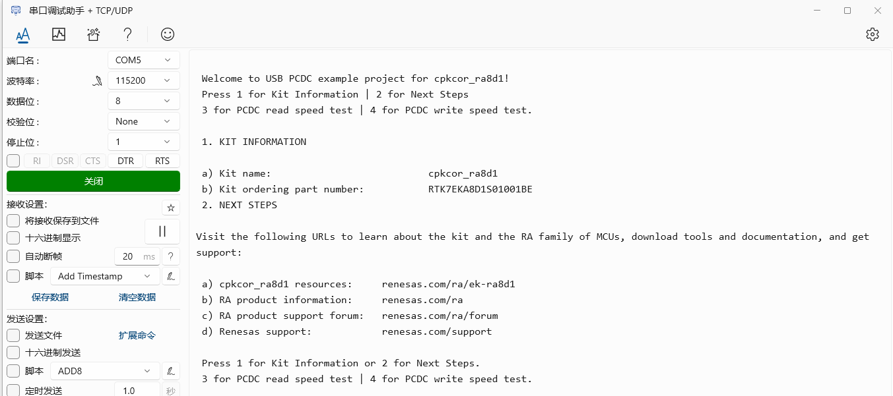
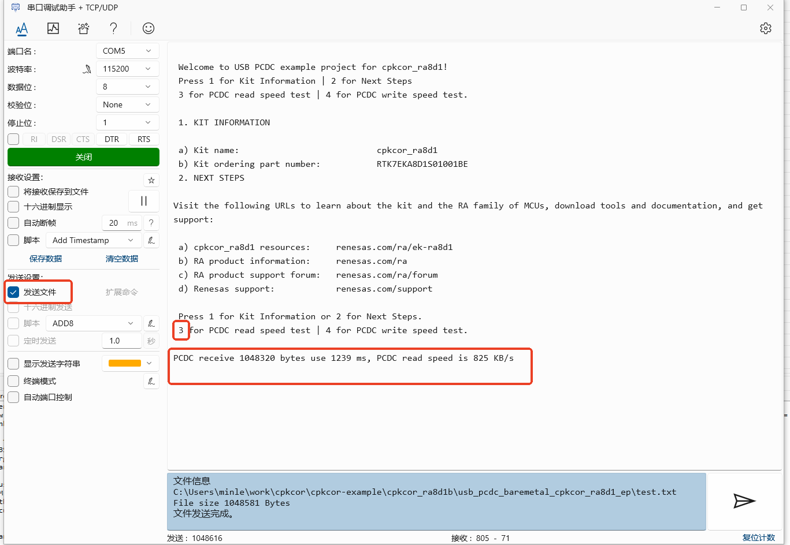
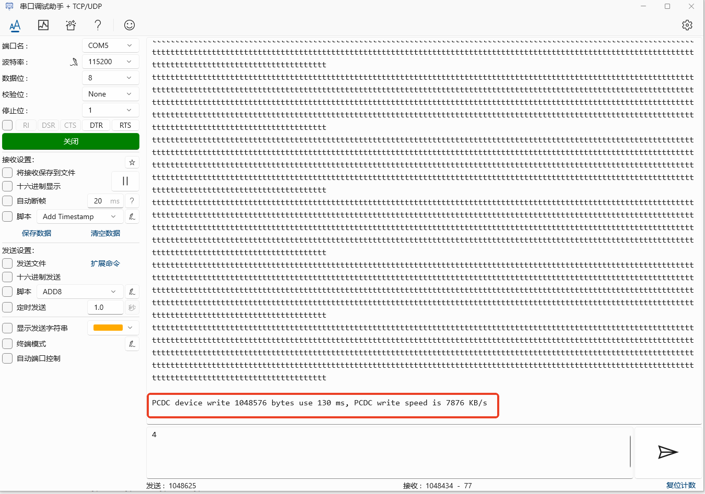

## 1.参考例程概述
该示例项目演示了基于瑞萨 FSP 的瑞萨 RA MCU在Baremetal下作为USB 2.0 High-Speed PCDC的基本功能。当代码运行时，RA8D1可以作为USB PCDC设备和主机通信，利用USB 2.0 High-Speed模块。

代码流程说明如下：上电后，MCU作为PCDC设备和PC通信，在PC端打开串口调试助手等串口工具，键入“1”则会看到板子相关信息打印出来。

### 1.1 创建新工程，BSP选择“CPKCOR-RA8D1B Core Board”，RTOS选择Baremetal。
### 1.2 Stack中添加“USB PCDC”，详细的属性设置请参考例程。
### 1.3 利用一根USB线连接扩展板上的USB1和PC。
### 1.4 在e2 studio中调试代码，代码自由运行。PC端打开相应串口，会显示如下Log打印，键入“1”打印当前硬件信息，键入“2”则可以打印相关支持信息：

### 1.5 PCDC读速度测试

发送3命令可以进行PCDC读速度测试，测试需要从PC测发送一个1M的文件至开发板，1M测试文件在工程文件夹中：

读速度测试测试流程为：

1. 发送数字3至开发板。
2. 选择1M文件发送至开发板.
3. 等待文件测试完成，显示速度信息。

测试效果如下图：

### 1.6. PCDC写速度测试

写速度测试相比读速度测试要简单，只需发送命令 4 至开发板即可，测试效果如下图：

## 2. 支持的电路板：
CPKCOR-RA8D1B和扩展板

## 3. 硬件要求：
1块瑞萨 RA核心板：CPKCOR-RA8D1B

1根USB Type A->Type C或Type-C->Type C线 （支持Type-C 2.0即可）。

1根USB Type A->Type C线 （支持USB 2.0即可）。

## 4. 硬件连接：

USB Type A->Type C或Type-C->Type C线连接CPKCOR-RA8D1B的JDBG和调试所用PC。

USB Type A->Type C连接CPKCOR-RA8D1B扩展板上的USB1和PC。
