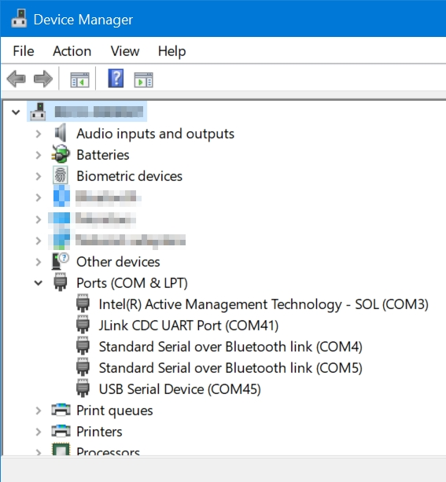
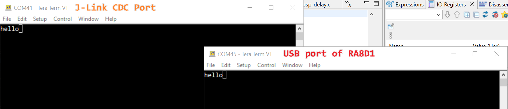

## 1.参考例程概述
该示例项目演示了基于瑞萨 FSP 的瑞萨 RA MCU USB PCDC的基本功能，注意本例程基于FreeRTOS。当代码运行时，RA8D1的USB口会在PC的设备显示器中呈现一个COM口。

### 1.1 创建新工程，BSP选择“CPK-RA8D1B Core Board”，RTOS选择FreeRTOS。
### 1.2 Stack中添加“USB PCDC (r_usb_pcdc)”，详细的属性设置请参考例程

### 1.3 利用一根USB线（A to C）将PC和板上的JUSB连接起来。

### 1.4 调试代码，打开PC的设备管理器，在Ports (COM & LPT)分类下可以看到两个端口，JLink CDC UART Port是板载J-Link OB对应的COM口，另外一个USB Serial Device则是RA8D1的PCDC USB端口。如下图所示：

### 1.5 打开PC端的串口工具，以TeraTerm为例，分别打开COM45和COM41：
在其中任一一个窗口输入字符，则内容会在另一个端口上同时显示。如下图所示：

本示例代码中展示了将RA8D1作为USB-UART Bridge的功能，由于RA8D1的UART3连接到了J-Link OB，因此从PC端发出的数据经由MCU PCDC接口到MCU，然后在MCU内部通过PCDC口将数据发送至UART3，然后经过J-Link OB返回至PC端。

## 2. 支持的电路板：
CPKCOR-RA8D1B

## 3. 硬件要求：
1块瑞萨 RA核心板：CPKCOR-RA8D1B

2根Type-C USB 数据线，一根用于连接JDBG和PC，另一根用于连接JUSB和PC。

## 4. 硬件连接：
通过Type-C USB 电缆将 CPKCOR-RA8D1B板上的 USB 调试端口（JDBG）连接到主机 PC。