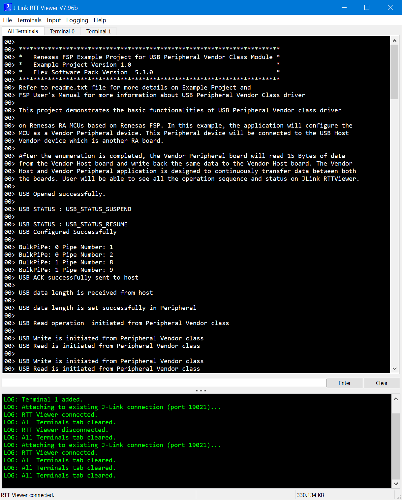

## 1.参考例程概述
该示例项目演示了基于瑞萨 FSP 的瑞萨 RA MCU在FreeRTOS下作为PVND的基本功能。当代码运行时，RA8D1可以作为USB PVND设备和HVND（另一块烧录了usb_hvnd_freertos_cpkcor_ra8d1b_ep）通信。
代码流程说明如下：
上电后，MCU作为PVND设备和HVND通信，建立通信后，HVND向PVND写入15字节数据并都会，此例程验证需要一个HVND支持。

### 1.1 创建新工程，BSP选择“CPKCOR-RA8D1B Core Board”，RTOS选择FreeRTOS。
### 1.2 Stack中添加“USB PVND”，详细的属性设置请参考例程
### 1.3 利用一根USB Type C连接芯片的JDBG和PC，另外一根USB Type C->Type C线连接芯片的JUSB和HVND的JUSB。
### 1.4 在e2 studio中调试代码，代码自由运行。打开RTT Viewer，可以看到如下Log打印，显示当前PVND和HVND通信的过程：

## 2. 支持的电路板：
CPKCOR-RA8D1B

## 3. 硬件要求：
1块瑞萨 RA核心板：CPKCOR-RA8D1B

1块瑞萨 RA核心板，烧录usb_hvnd_freertos_cpkcor_ra8d1b_ep作为HVND。

1根USB Type A->Type C或Type-C->Type C线 （支持Type-C 2.0即可），用于连接JDBG和PC。

1跟Type-C -> Type C USB线（支持Type-C 2.0即可）用于连接两块板子的JUSB。

## 4. 硬件连接：

USB Type A->Type C或Type-C->Type C线将 CPKCOR-RA8D1B板上的 USB 调试端口（JDBG）连接到主机 PC。

使用Type-C -> Type C USB线连接两块板子的JUSB。