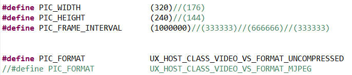
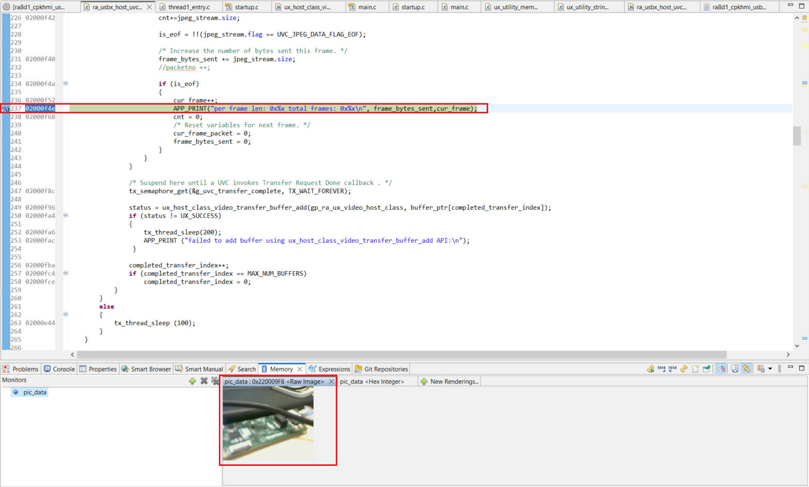
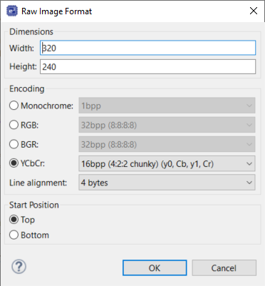

# usbx_huvc_azurertos_cpkcor_ra8d1b_ep 介绍
该工程是使用CPKCOR-RA8D1B的USBX UVC的例子。展示了使用RA8D1 MCU配合THREADX系统通过USBHS接口来接收UVC中图像数据流。
当前例子用的YUV格式的图像数据。图像的分辨率为320x240，FPS为10。分辨率和FPS根据连接的USB摄像头支持的参数来配置下图所示的宏定义。
其中，PIC_FORMAT表示图像的数据格式。
UX_HOST_CLASS_VIDEO_VS_FORMAT_UNCOMPRESSED 是YUV(422)格式数据。
UX_HOST_CLASS_VIDEO_VS_FORMAT_MJPEG 是MJPG格式数据。

图像数据可以使用e2 studio里面的插件显示。

e2 studio中的设定如下

项目已经可以默认使用了Segger RTT viewer，显示调试信息。

### 软件开发环境：

* FSP版本
  * FSP 6.2.0
* 集成开发环境和编译器：
  * e2studio v2025-10 + LLVM v18.1.3
* 第三方软件
  * 无 
