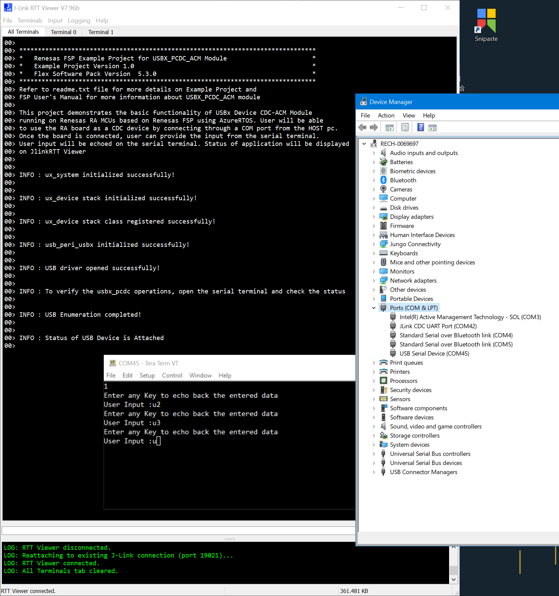
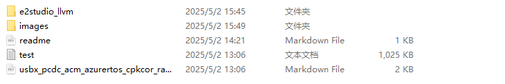
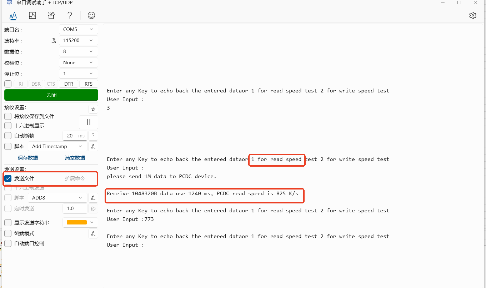
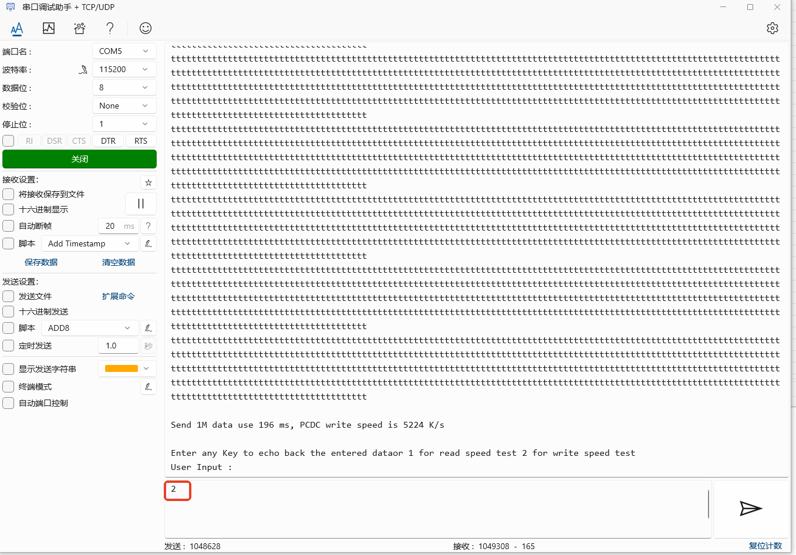

## 1.参考例程概述
该示例项目演示了基于瑞萨 FSP 的瑞萨 RA MCU在AzureRTOS下作为PCDCACM的基本功能。当代码运行时，RA8D1可以作为USB PCDCACM设备和主机通信。
代码流程说明如下：
上电后，MCU作为PCDCACM设备和PC通信，在PC端显示为USB COM口，可以接收COM的输入数据，在COM上ECHO。

### 1.1 创建新工程，BSP选择“CPKCOR-RA8D1B Core Board”，RTOS选择AzureRTOS。
### 1.2 Stack中添加“USB PCDCACM”，详细的属性设置请参考例程
### 1.3 利用一根USB线连接芯片的JDBG和PC，另一根USB线连接芯片的JUSB和PC。
### 1.4 在e2 studio中调试代码，代码自由运行。PC端打开资源管理器，可以看到已经识别为USB COM口，在串口工具如Tera Term中打开相应串口，随意键入一个字符，则该字符可以在本COM口ECHO回来：

### 1.5 PCDC读速度测试

发送1命令可以进行PCDC读速度测试，测试需要从PC测发送一个1M的文件至开发板，1M测试文件在工程文件夹中：

读速度测试测试流程为：

1. 发送数字3至开发板。
2. 选择1M文件发送至开发板.
3. 等待文件测试完成，显示速度信息。

测试效果如下图：

### 

### PCDC写速度测试

写速度测试相比读速度测试要简单，只需发送命令 4 至开发板即可，测试效果如下图：

## 2. 支持的电路板：
CPKCOR-RA8D1B

## 3. 硬件要求：
1块瑞萨 RA核心板：CPKCOR-RA8D1B

1根USB Type A->Type C或Type-C->Type C线 （支持Type-C 2.0即可）。

1根USB Type A->Type C线 （支持USB 2.0即可）。

## 4. 硬件连接：

USB Type A->Type C或Type-C->Type C线连接CPKCOR-RA8D1B的JDBG和调试所用PC。

USB Type A->Type C连接CPKCOR-RA8D1B的JUSB和PC。