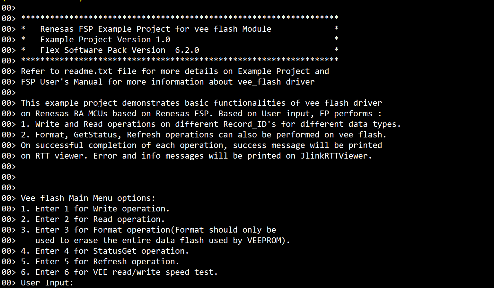
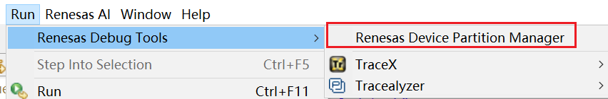
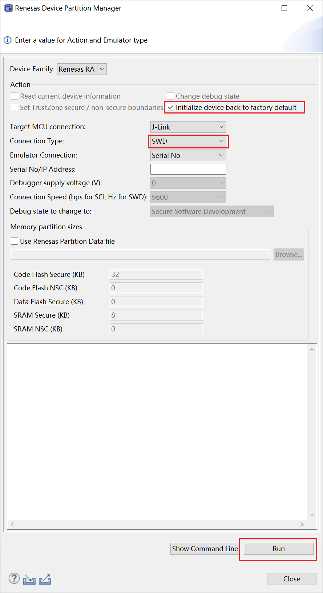
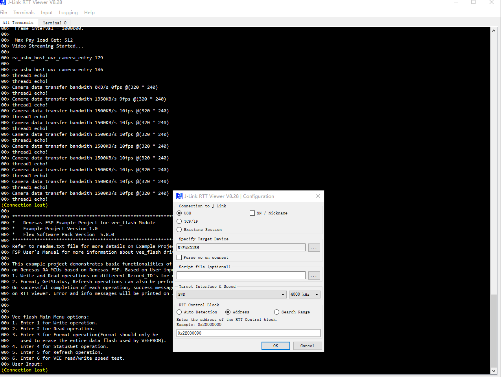
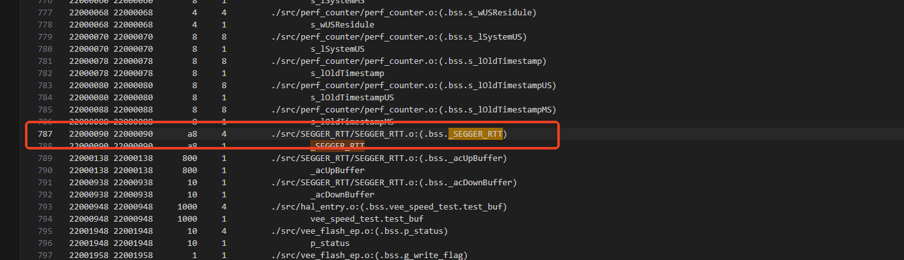
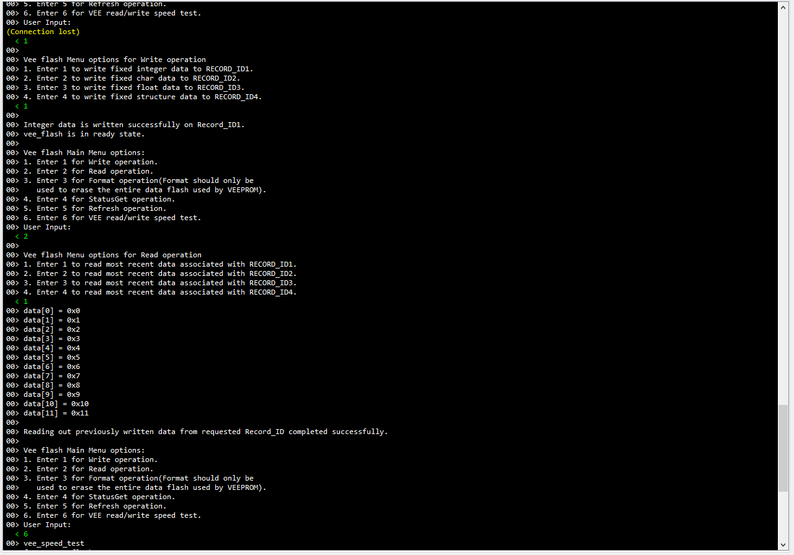
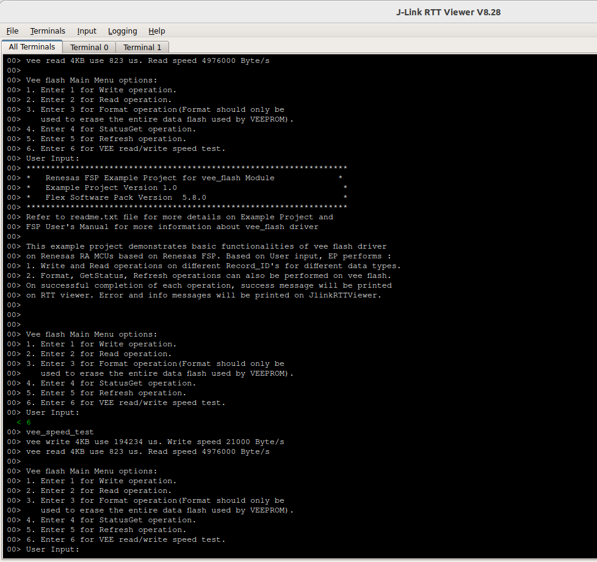

# vee_flash_cpkcor_ra8d1_ep 例程介绍

此示例项目演示了基于 Renesas FSP 的 Renesas RA MCU 上的 vee flash 驱动程序的基本功能。
根据用户输入，例程可以执行以下操作：

1. 将不同类型的数据类型写入 vee flash 的不同记录 ID。

2. 从不同的记录 ID 读回数据。

3. 格式化操作。

4. 获取虚拟 EEPROM 的状态。

5. 刷新操作。

6. 测试VEE的读写速度

  

  

成功完成每个操作后，Jlink RTTViewer 上将显示成功消息。错误和信息消息将打印在 JlinkRTTViewer 上。

## 硬件要求

- RA8D1-CPKCOR开发板 x1
- USB Type-C 设备电缆 x1

3. 硬件连接：
将Type-C 电缆连接到CPKCOR-RA8D1B的调试USB口（JDBG）端口。将此电缆的另一端连接到主机 PC 的 USB 端口。

4. 使用方法：
1) 在运行示例项目之前，使用 Renesas 设备分区管理器将设备初始化回出厂默认设置。
- 启动 E2Studio -> run -> Renesas debug tool -> Renesas Partition Manager（在 e2studio 上可用）

2) 需要在RTT Viewer中填入 _SEGGER_RTT 变量的地址进行连接，例程默认状态下地址如下：e2studio：0x22000090

3) 如果修改、编译和下载了例程，请在构建配置文件夹中生成的 .map 文件中找到块地址（RAM 中名为 _SEGGER_RTT 的变量）。

4) 按照RTT_Viewer中打印的提示进行操作，可以对vee flash进行写入、擦除、状态读取等操作。

