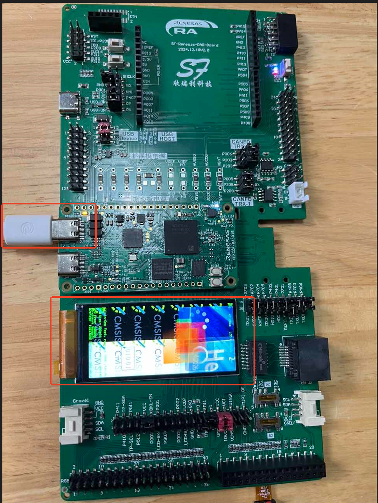

## 1.参考例程概述
该示例项目演示了基于瑞萨 CPKCOR + 扩展板 ARM2D benchmark演示程序。

### 1.1 打开工程
### 1.2 注意J5的跳帽连接，屏接口显示为 MIPI 的选择如下：

### 1.3 编译，下载，运行

## 2 最后显示如下

## 3. 支持的电路板：
CPKCOR+扩展板

## 4. 硬件要求：
* 1块 Renesas RA8开发板：CPKCOR-RA8D1B
* 1根 USB Type A->Type C 或 Type-C->Type C 线 （支持 Type-C 2.0 即可）
* 1个 MIPI 显示屏，型号是H0233S001 V1，驱动芯片是ST7796U
* 1个 扩展板

## 5. 硬件连接：
通过Type-C USB 数据线将 CPKCOR-RA8D1B 板上的 USB 调试端口（JDBG）连接到主机 PC