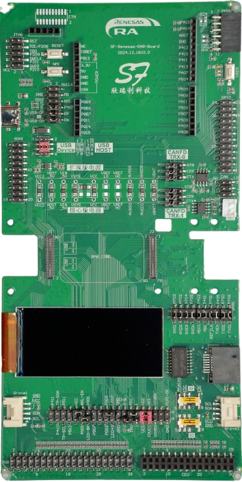
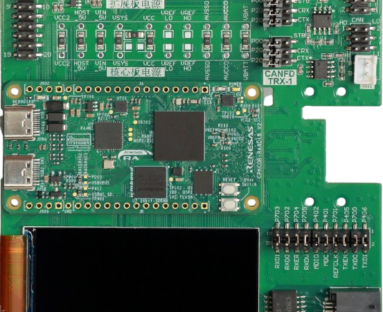
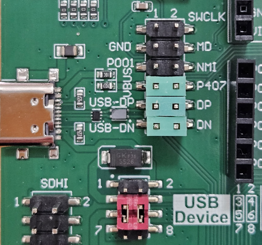
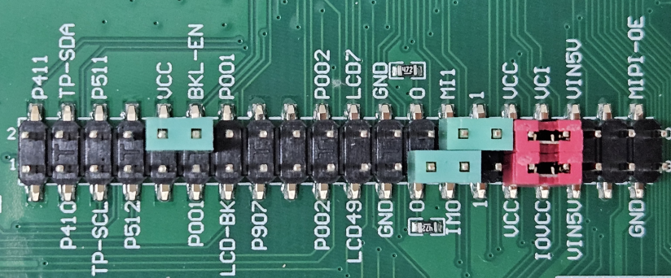
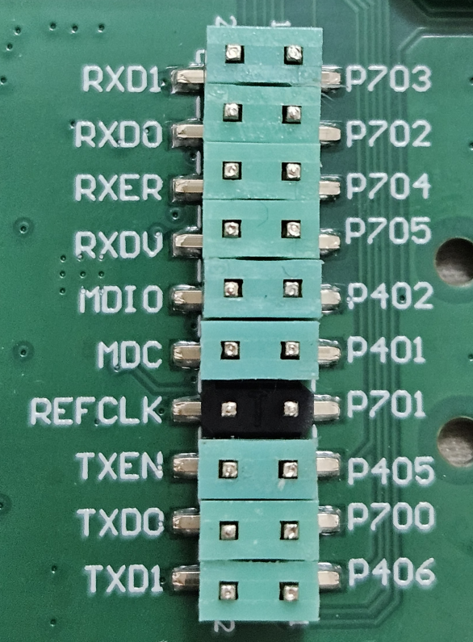
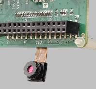
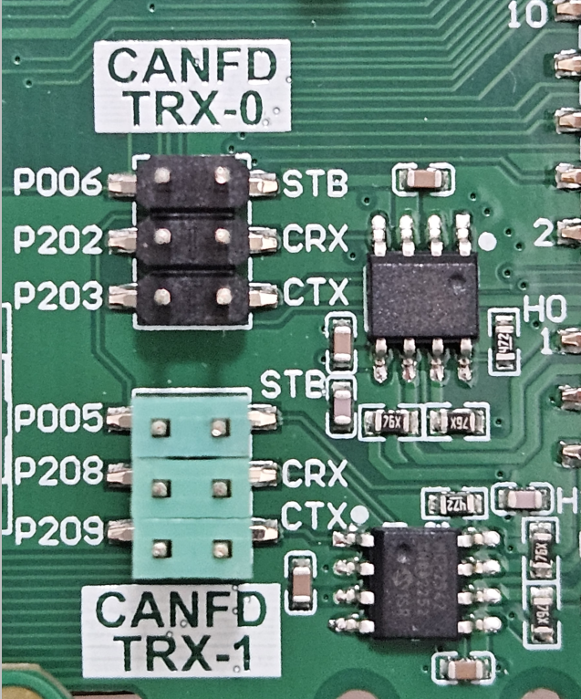
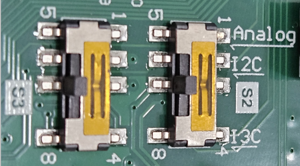

:scripts: cjk

= CPKEXP-EKRA8X1 通用扩展板使用手册

- [x] <<CPKEXP-EKRA8x1 简介,01. 简介>>
- [ ] link:02_displaycam.adoc[02. 显示和摄像头]
- [ ] link:03_communication.adoc[03. 通信接口]
- [ ] link:04_ecoexpansion.adoc[04. 生态系统扩展接口]
- [ ] link:05_generalexpansion.adoc[05. 通用扩展接口]
- [ ] link:06_powermisc.adoc[06. 电源和按键]
- [ ] link:07_newboarddesign.adoc[07. 设计您自己的扩展板]

== CPKEXP-EKRA8x1 简介

CPKEXP-EKRA8X1 是适用于CPK-RA8x1系列核心板的通用扩展板，扩展板上提供了和EK-RA8x1类似的接口，其中部分接口和EK-RA8x1管脚兼容，可以方便地评估RA8x1 MCU的大部分功能。

此通用扩展板也可作为一个设计样例，当用户有特定的功能需求时，可以自行修改，快速设计出符合需求的原型系统。

原理图下载：link:CPKEXP-EKRA8X1_V1_SCH.pdf[CPKEXP-EKRA8X1 V1版原理图]

通用扩展板可以配合以下核心板使用:

* CPKCOR-RA8D1B
* CPKHMI-RA8D1B

CPK-RA8x1核心板可以贴装不同类型的RA8x1 MCU，配合通用扩展板时能实现的功能也有所不同，请参考不同核心板J1和J2接口的信号定义。

== CPKEXP-EKRA8x1通用扩展板支持的功能

=== 板载硬件功能

* USB-FS Type-C 接口，通过2.0mm跳线组合选择Host或Device功能，支持RA8x1 MCU的USB-Boot功能。
* 2路CAN-FD 收发器，通过2.54mm跳线座连接MCU，可灵活适配需要使用的CAN通道和管脚。
* 百兆以太网，使用LAN8720AI PHY。
* H0233S001 2.33英寸全接口LCD模组，支持MIPI-DSI/RGB666/SPI显示接口（可选装）。
* QSPI Flash，WSON 6x8封装，可贴装NAND Flash (缺省不贴装)。
* RESET按键和NMI中断按键，1个用户按键。
* 1个电源LED，2个用户LED

=== 扩展接口

所有的扩展接口都可以作为GPIO扩展来使用，但在管脚分布上，同一外设功能的I/O尽量分布在一起。排针接口的规格均为2.54mm间距。

* PMOD接口，支持Type2A扩展SPI接口（缺省）以及Type3A扩展UART接口（需修改跳接电阻）。
* Arduino UNO扩展接口。
* Grove接口1，仅支持I^2^C功能。
* Grove接口2，可选I^2^C、I^3^C或模拟接口功能。
* 50pin FPC LCD触摸屏扩展接口，支持MIPI-DSI（2 Lane）、RGB666、SPI显示，I2C触摸屏。
* 40pin 双排针 LCD触摸屏接口，支持RGB888显示，I2C触摸屏（与EK-RA8D1兼容）。
* 24pin FPC CEU接口（DVP摄像头接口），可以直接连接OV7725摄像头模组。
* 30pin 双排针 摄像头接口，其中前20pin的管脚定义和EK-RA8D1兼容。
* 20pin FPC接口，用于扩展OSPI设备（需要禁用核心板上的QSPI存储）。
* 20pin 双排针 SDIO/MMC接口。
* 24pin 双排针 GPIO信号扩展。
* 10pin 双排针 USB FS及调试烧录控制。
* 10pin CMSIS-DAP调试接口。
* 20pin ETM调试接口（未实装）。

=== 电源选项

* 当USB Type-C接口配置为Device时，可以通过USB Type-C接口为扩展板（以及核心板）提供5V电源，限流2A。
* 扩展板上有电源选择区域，可以选择是否将核心板的电源信号连接到扩展板，也可通过扩展板上的电源脚为核心板提供独立的供电（例如模拟电源等）。
* 电池供电接口，可以为核心板提供VBATT电源。

== CPKEXP-EKRA8x1通用扩展板的缺省配置

CPKCOR-RA8D1B核心板 + CPKEXP-EKRA8x1扩展板，组成CPK-RA8x1开发套件，本手册以此套件为例，介绍通用扩展板的各个功能。

核心板上RA8x1 MCU的大部分功能管脚都通过2个80Pin的高密高速接口J1/J2连接到扩展板的各个接口，可以进行灵活的配置。
开发板套件在缺省状态下（出厂设置），可以直接使用以下接口。

* 核心板上的所有功能，包括SDRAM，QSPI NOR Flash，JLink，USB-HS，MicroSD卡，J901扩展口。
* MIPI-DSI接口，连接分辨率为480x222的LCD屏。
* OV7725摄像头接口（背面），直接连接OV7725 24Pin的摄像头模组。
* USB-FS Type-C 2.0接口，缺省配置为Device，可通过跳线配置为Host。
* 1路CAN-FD接口。
* QSPI NAND Flash（背面）。
* Arduino UNO 扩展接口。
* PMOD接口，Type 2A扩展SPI模式。
* 两个Grove接口，I^2^C模式。

image::images/01_overview/image-1.png[0,800]

=== 缺省配置的BSP现在和跳线设置

瑞萨提供CPK-RA8D1B开发板套件的BSP，下载地址：link:Renesas.RA_board_ra8d1_cpkexp.5.1.0.pack[CPKEXP-EKRA8X1 BSP Pack]。

瑞萨也提供给一个Excel表格，详细记录了BSP对应的各个管脚的功能设置。
表格下载：link:CPK-RA8x1_Full_PinAssign_cn_release_protected.xlsm[CPK-RA8x1 BSP管脚配置]
表格的详细使用请参考手册的link:05_generalexpansion.adoc[通用扩展接口]部分

BSP缺省配置对应的跳线及开关设置如下。

1. USB-FS接口设置为USB Device，并将P407作为USB-FS的VBUS检测引脚（可以支持USB Boot）。红色跳线块为USB电源设置，绿色为信号连接。

2. 显示输出缺省使用板载2.33寸LCD（H0233S001），跳线设置如下。红色为LCD电源（3.3V），LCD接口模式为MIPI-DSI（IM0=0，IM1=1），LCD背光设置为常亮（BLK-EN=VCC）。
    这个跳线模组采用了安全设计，使用2pin跳线块时，即使不小心插错跳线块，也不会造成系统短路或MCU管脚短接。
   

3. CEU摄像头和以太网复用，BSP缺省使用CEU摄像头功能，以太网PHY的RESET信号拉低。以太网RMII接口数据线上的跳线可以不用断开，但REFCLK50需要断开（以太网PHY的REFCLK50管脚一直有时钟信号输出，会干扰CEU接口的数据）。

配套的OV7725摄像头的接口PCB底面，信号上接方式。安装后摄像头应该朝着板的正面，请勿接反。

4. CAN-FD使用CAN-FD收发器1，P208/P209端口作为CAN-FD功能使用，P005作为Standby控制。

5. Grove2接口功能为I3C/I2C/Analog可选，缺省使用I2C功能，S2和S3开关拨到中间位置。

确认设置完成后，即可运行CEU样例程序，确认摄像头和显示屏是否工作正常。

<<CPKEXP-EKRA8x1 简介,返回简介>>                下一篇：link:02_displaycam.adoc[02. 显示和摄像头]
