:scripts: cjk

= 第2部分 - 显示和摄像头接口
:toc:

== 显示和摄像头

瑞萨RA8D1 MCU片内集成了LCDC控制器，2D图形加速器，支持并行RGB接口和MIPI-DSI接口（仅限RA8D1B型号）。RA8D1和RA8M1 MCU也支持CEU接口，可以连接DVP摄像头。
在CPKEXP-EKRA8x1扩展板上，可以通过板载硬件快速开始评估这两个功能，
也可以通过扩展接口连接您自己的LCD屏幕或摄像头。

=== 板载LCD显示屏

扩展板通过50 Pin FPC连接H0233S001 LCD显示模组，此LCD模组可以通过管脚配置，设置为MIPI接口或RGB/SPI接口。
该显示模组也支持8080总线模式，但扩展板的J1和J2接口上并没有预留8080总线接口，所以扩展板上的50 Pin FPC接口不支持8080总线模式。

H0233S001分辨率为222x480，不支持触摸屏，link:H0233S001_V1.pdf[点击查看/下载H0233S001的产品资料]。
使用的驱动芯片为ST7796U，link:ST7796U_V1.pdf[点击查看/下载ST7796U用户手册]。

板载LCD显示屏主要是为了演示RA8D1 MCU的显示功能，可以用同一个LCD评估和学习MIPI-DSI， RGB和SPI接口的显示驱动功能。

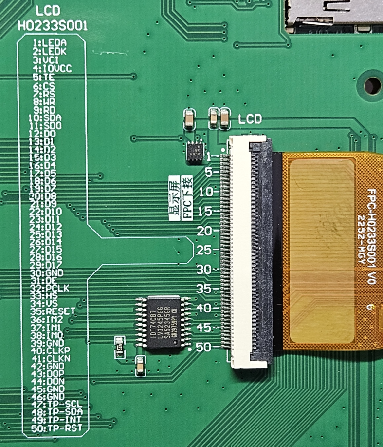

配合搭载MIPI接口的RA8D1B MCU，H0233S001 LCD可以实现以下显示模式，各个模式需要用到的管脚如下表所示。

[%autowidth, cols="6*", options="header"]
|============================================================================================================================================================
| FPC | CPKEXP-EKRA8X1   | H0233S001       ^| MIPI                          ^| RGB模式                                      ^| SPI模式                
| 1       | +5V （VIN_5V）    | LEDA      3+^| LEDA，背光LED+          
| 2       | AW9364驱动输出   | LEDK       3+^| LEDK，背光LED-           
| 3       | J5:34 - VCI      | VCC/TPVCC 3+^| J5跳线接VCC，模拟电源，3.3V                      
| 4       | J5:33 - IOVCC    | IOVCC     3+^| J5跳线接VCC，I/O电源，3.3V                       
| 5       | P206             | TE          ^| DSI-TE                      2+^| J5:40 MIPI-OE接GND，管脚悬空       
| 6       | P413             | CS          ^| 不使用                       2+^| SSLB0_B，SPI 接口的片选信号                 
| 7       | J5:22 - LCD7     | RS          ^| 不使用                       2+^| 3SPI模式下J5:22接GND；4SPI模式下J5:22接P002，用P002模拟D/CX信号                  
| 8       | P412             | SCL         ^| 不使用                       2+^| SPCKB_B，SPI 接口的时钟信号                                           
| 9       | VSS              | RD        3+^| MIPI/RGB/SPI接口均不使用这个信号，接地           
| 10      | J5:4 - TP-SDA    | SDA         ^| 不使用                       2+^| 跳线接P411，MOSIB_B，LCD SPI 接口的数据输入                   
| 11      | J5:5 - TP-SCL    | SDO         ^| 不使用                       2+^| 跳线接P410，MISOB_B，LCD SPI 接口的数据输出                  
| 12-29   | LCD_DATA0_B~17_B | DB0-DB17    ^| 不使用                         ^| LCD_DATA0~17_B RGB数据                        ^| FSP配置中将所有管脚设置为输出低电平
| 30      | VSS              | GND       3+^| GND 
| 31      | P515             | DE          ^| 不使用                         ^| LCD_TCON3_B，DE信号                           ^| FSP配置中将P515设置为输出低电平  
| 32      | P806             | PCLK        ^| 不使用                         ^| LCD_CLK_B，Pixel时钟                          ^| FSP配置中将P806设置为输出低电平  
| 33      | P805             | HS          ^| 不使用                         ^| LCD_TCON0_B，水平同步                         ^| FSP配置中将P805设置为输出低电平  
| 34      | P807             | VS          ^| 不使用                         ^| LCD_TCON1_B，垂直同步                         ^| FSP配置中将P807设置为输出低电平  
| 35      | P000             | RESET     3+^| P000 用作LCD复位信号，低电平有效              
| 36      | VCC              | IM2       3+^| IM2接VCC（IM2=0时是8080总线模式，扩展板上不支持8080模式）                
| 37      | J5:28 - IM1      | IM1         ^| IM1=1                       2+^| IM1=0 - 3SPI模式， IM1=1 - 4SPI模式 （IM0=1时）      
| 38      | J5:27 - IM0      | IM0         ^| IM0=0                       2+^| IM0=1                                        
| 39      | VSS              | GND       3+^| GND                                                     
| 40      | MIPI_CL_P/P203   | CLKP        ^| CLKP                        2+^| J5:40 MIPI-OE接GND，管脚悬空                       
| 41      | MIPI_CL_N/P202   | CLKN        ^| CLKN                        2+^| J5:40 MIPI-OE接GND，管脚悬空                       
| 42      | VSS              | GND       3+^| GND                                                     
| 43      | MIPI_DL0_P/P205  | D0P         ^| MIPI_D0P                    2+^| J5:40 MIPI-OE接GND，管脚悬空                       
| 44      | MIPI_DL0_N/P204  | D0N         ^| MIPI_D0N                    2+^| J5:40 MIPI-OE接GND，管脚悬空                       
| 45      | VSS              | GND       3+^| GND                                                     
| 46      | VSS              | GND       3+^| GND                                                     
| 47      | MIPI_DL1_P/P313  | TP SCL    3+^| NC （H0233S001不支持触摸屏）                                                   
| 48      | MIPI_DL1_N/P314  | TP SDA    3+^| NC （H0233S001不支持触摸屏）                                                        
| 49      | J5:21 - LCD49    | TP INT    3+^| NC （H0233S001不支持触摸屏）                                                       
| 50      | J5:13 - LCD-BK   | TP RST    3+^| NC （H0233S001不支持触摸屏）                                                       
|============================================================================================================================================================

部分信号需要通过J5上的跳线来进行配置，J5的缺省配置是使用H0233S001 LCD的MIPI模式，如下图所示：

image::images/01_overview/image-3.png[0,600]

H0233S001的背光由驱动芯片AW9364提供。AW9364支持通过GPIO来调整LED电流。在扩展板设计上，J5:12 BLK-EN可以选择AW9364的背光控制模式。
缺省接VCC，即背光常亮。
也可以跳线接到RA8 MCU的P001，由I/O口来控制背光。具体的控制逻辑请参考link:HAW9364DNR.pdf[AW9364的用户手册，点此查看/下载]。

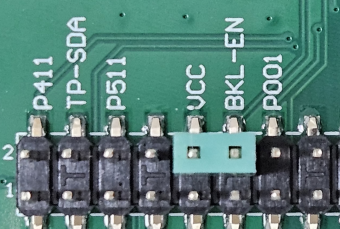

H0233S001有对应的带触摸屏的型号，HS0233S001T001。
如果想要在此扩展板上使用H0233S001T001，则只能使用不支持MIPI的MCU（RA8D1A，RA8M1，RA8T1）核心板，然后使用RGB或SPI接口连接触摸屏。
此时，触摸屏接口的管脚分布如下：

[%autowidth, cols="4*", options="header"]
|==============================================================================
| FPC     | ON CPKEXP        | H0233S001 ^| RGB/SPI触摸屏               
| 47      | P313             | TP SCL    ^| 软件模拟 I^2^C SCL                                                  
| 48      | P314             | TP SDA    ^| 软件模拟 I^2^C SDA                                                      
| 49      | J5:21 - LCD49    | TP INT    ^| 跳线接P002，作为触摸屏中断信号                                                       
| 50      | J5:13 - LCD-BK   | TP RST    ^| 跳线接P001或P907，触摸芯片复位                                                       
|==============================================================================

=== 外接LCD显示屏/触摸屏

这个50Pin FPC也可以用于连接用户自己的LCD触摸屏，一般情况下，需要设计一个转接板，将50pin FPC上的信号转换到对应LCD模组的接口信号。
设计MIPI LCD或RGB LCD转接板时，可参考如下设置：

[%autowidth, cols="4*", options="header"]
|==============================================================================
| FPC     | ON CPKEXP        ^| MIPI触摸屏                   ^| RGB666 触摸屏              
| 1       | +5V （VIN_5V）  2+^| LEDA，背光LED+                   
| 2       | AW9364驱动输出   2+^| LEDK，背光LED-，最大驱动能力80mA        
| 3       | J5:34 - VCI      2+^| 可根据屏幕要求选择+5V或VCC              
| 4       | J5:33 - IOVCC    2+^| 可根据屏幕要求选择+5V或VCC              
| 5       | P206             ^| DSI-TE                    ^| NC                  
| 6       | P413             2+^| P413，备用GPIO                   
| 7       | J5:22 - LCD7     2+^| 触摸屏中断 J5:22接P002(IRQ8-DS)     
| 8       | P412             2+^| P412，备用GPIO                   
| 9       | VSS              2+^| GND                           
| 10      | J5:4 - TP-SDA    2+^| 触摸屏中断,跳线接P511/SDA1            
| 11      | J5:5 - TP-SCL    2+^| 触摸屏中断,跳线接P512/SCL1            
| 12-29   | LCD_DATA0_B~17_B ^| NC                        ^| LCD_DATA0~17_B RGB数据
| 30      | VSS              2+^| GND                           
| 31      | P515             ^| NC                        ^| LCD_TCON3_B，DE信号    
| 32      | P806             ^| NC                        ^| LCD_CLK_B，Pixel时钟   
| 33      | P805             ^| NC                        ^| LCD_TCON0_B，水平同步    
| 34      | P807             ^| NC                        ^| LCD_TCON1_B，垂直同步    
| 35      | P000             2+^| P000用作LCD和触摸屏的复位信号            
| 36      | VCC              2+^| VCC                           
| 37      | J5:28 - IM1      2+^| 跳线接VCC                        
| 38      | J5:27 - IM0      2+^| 跳线接VCC                        
| 39      | VSS              2+^| GND                           
| 40      | MIPI_CL_P/P203   ^| MIPI_CL_P                 ^| NC                  
| 41      | MIPI_CL_N/P202   ^| MIPI_CL_N                 ^| NC                  
| 42      | VSS              2+^| GND                           
| 43      | MIPI_DL0_P/P205  ^| MIPI_DL0_P                ^| NC                  
| 44      | MIPI_DL0_N/P204  ^| MIPI_DL0_N                ^| NC                  
| 45      | VSS              2+^| GND                           
| 46      | VSS              2+^| GND                           
| 47      | MIPI_DL1_P/P313  ^| MIPI_DL1_P                ^| NC                  
| 48      | MIPI_DL1_N/P314  ^| MIPI_DL1_N                ^| NC                  
| 49      | J5:21 - LCD49    ^| 跳线接GND                 ^| 跳线接GND或P002         
| 50      | J5:13 - LCD-BK   2+^| LCD背光控制，跳线接P001或P907          
|==============================================================================

扩展板上也预留了40Pin的双排插针，可以连接RGB888接口的LCD触摸屏。该40pin插针与EK-RA8D1的LCD扩展接口定义完全一致。

接口上每个管脚名称的丝印标注在PCB反面，位置和正面插针的位置对应（1脚靠近安装孔）。

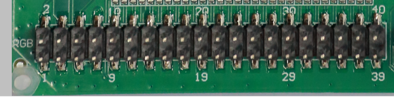

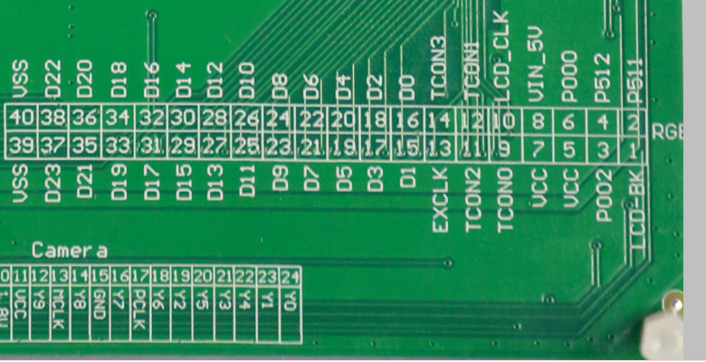

接插件1脚的LCD背光信号和50pin FPC上的50脚相同，通过J5:13跳线控制，可以由用户自行选择接P001或P907。

注意：PB01/LCD_DATA18_B和核心板上的USBHS_VBUS共用一个I/O口，如果需要同时使用高速USB Device功能和RGB888接口，需要在核心板上，将USBHS的VBUS信号通过R403跳接到P010。具体可参考CPKCOR-RA8D1B的手册（filelink）。

[%autowidth, cols="8*", options="header"]
|===========================================================================
>| 功能         >| 管脚  ^s| 丝印  2+^s| Pin      ^s| 丝印 <| 管脚  <| 功能           
>| LCD背光选择  >| J5:13 ^s| LCD-BK ^s| 1   ^s| 2  ^s| P511    <| P511  <| SDA1_A       
>| IRQ8-DS      >| P002  ^s| P002   ^s| 3   ^s| 4  ^s| P512    <| P512  <| SCL1_A       
>| VCC电源      >| VCC   ^s| VCC    ^s| 5   ^s| 6  ^s| P000    <| P000  <| LCD RESET    
>| VCC电源      >| VCC   ^s| VCC    ^s| 7   ^s| 8  ^s| VIN_5V  <| +5V   <| 5V电源         
>| LCD_TCON0_B  >| P805  ^s| TCON0  ^s| 9   ^s| 10 ^s| LCD_CLK <| P806  <| LCD_CLK_B    
>| LCD_TCON2_B  >| P513  ^s| TCON2  ^s| 11  ^s| 12 ^s| TCON1   <| P807  <| LCD_TCON1_B  
>| LCD_EXTCLK_B >| P514  ^s| EXCLK  ^s| 13  ^s| 14 ^s| TCON3   <| P515  <| LCD_TCON3_B  
>| LCD_DATA1_B  >| P915  ^s| D1     ^s| 15  ^s| 16 ^s| D0      <| P914  <| LCD_DATA0_B  
>| LCD_DATA3_B  >| P911  ^s| D3     ^s| 17  ^s| 18 ^s| D2      <| P910  <| LCD_DATA2_B  
>| LCD_DATA5_B  >| P913  ^s| D5     ^s| 19  ^s| 20 ^s| D4      <| P912  <| LCD_DATA4_B  
>| LCD_DATA7_B  >| P903  ^s| D7     ^s| 21  ^s| 22 ^s| D6      <| P904  <| LCD_DATA6_B  
>| LCD_DATA9_B  >| P207  ^s| D9     ^s| 23  ^s| 24 ^s| D8      <| P902  <| LCD_DATA8_B  
>| LCD_DATA11_B >| P712  ^s| D11    ^s| 25  ^s| 26 ^s| D10     <| P711  <| LCD_DATA10_B 
>| LCD_DATA13_B >| P714  ^s| D13    ^s| 27  ^s| 28 ^s| D12     <| P713  <| LCD_DATA12_B 
>| LCD_DATA15_B >| PB07  ^s| D15    ^s| 29  ^s| 30 ^s| D14     <| P715  <| LCD_DATA14_B 
>| LCD_DATA17_B >| PB05  ^s| D17    ^s| 31  ^s| 32 ^s| D16     <| PB06  <| LCD_DATA16_B 
>| LCD_DATA19_B >| PB04  ^s| D19    ^s| 33  ^s| 34 ^s| D18     <| PB01* <| LCD_DATA18_B*
>| LCD_DATA21_B >| PB02  ^s| D21    ^s| 35  ^s| 36 ^s| D20     <| PB03  <| LCD_DATA20_B 
>| LCD_DATA23_B >| P707  ^s| D23    ^s| 37  ^s| 38 ^s| D22     <| PB00  <| LCD_DATA22_B 
>| 接地         >| GND   ^s| VSS    ^s| 39  ^s| 40 ^s| VSS     <| GND   <| 接地           
|===========================================================================

=== OV7725摄像头接口

扩展板底面贴装了一个24Pin的上接FPC接口，可以直接连接市售的OV7725摄像头模组。
FPC上的信号见丝印注明。
OV7725的时钟由RA8 MCU的定时器产生，无需独立的时钟振荡器。具体的使用方式请参考摄像头样例程序。

注意：1.8V使用的是核心板上的VCC18_MIPI电源，如果使用的是不带MIPI功能的核心板，则J1接口上可能只有P315端口信号，而没有1.8V电源。使用时请注意确认电源状况。

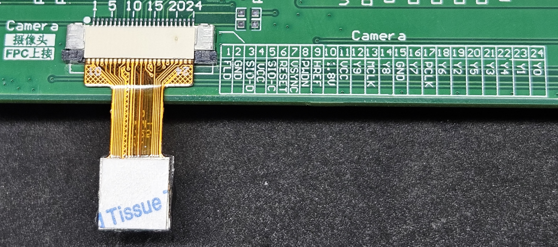

[%autowidth, cols="4*", options="header"]
|=================================
^| Pin ^| 丝印  ^| 功能      ^| 管脚   
^| 1   ^| FLD   | VIO-FLD    | P513 
^| 2   ^| GND   | GND        | GND     
^| 3   ^| SIO-D | SDA1_A     | P511 
^| 4   ^| VCC   | VCC        | VCC     
^| 5   ^| SIO-C | SCL1_A     | P512 
^| 6   ^| RESET | P402 I/O   | P402 
^| 7   ^| VSYNC | VIO_VD     | P710 
^| 8   ^| PWDN  | P404 I/O   | P404 
^| 9   ^| HREF  | VIO_HD     | P709 
^| 10  ^| 1.8V  | VCC18_MIPI | P315*
^| 11  ^| VCC   | VCC        | VCC     
^| 12  ^| Y9    | VIO_D7     | P703 
^| 13  ^| MCLK  | GTIOC3A    | P403 
^| 14  ^| Y8    | VIO_D6     | P702 
^| 15  ^| GND   | GND        | GND     
^| 16  ^| Y7    | VIO_D5     | P701 
^| 17  ^| PCLK  | VIO_CLK    | P708 
^| 18  ^| Y6    | VIO_D4     | P700 
^| 19  ^| Y2    | VIO_D0     | P400 
^| 20  ^| Y5    | VIO_D3     | P406 
^| 21  ^| Y3    | VIO_D1     | P401 
^| 22  ^| Y4    | VIO_D2     | P405 
^| 23  ^| Y1    | 无连接     | NC   
^| 24  ^| Y0    | 无连接     | NC   
|=================================

=== 通用CEU扩展接口

扩展板上提供了CEU通用扩展接口，使用30pin 母座接插件。其中1-24pin的管脚定义和EK-RA8D1上的摄像头扩展接口兼容。

此处丝印标注出错误，5脚位HD，7脚为XCLK

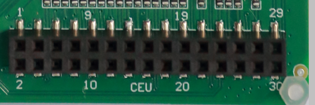

image::images/02_displaycam/image-6.png[0,600]

具体的管脚定义如下：

注意：PB01和核心板上的USBHS_VBUS共用一个I/O口，如果需要同时使用高速USB Device功能和此接口上的PB01功能，需要在核心板上，将USBHS的VBUS信号通过R403跳接到P010。具体可参考CPKCOR-RA8D1B的手册（filelink）。

[%autowidth, cols="8*", options="header"]
|==========================================================
| 功能    | 管脚  ^| 丝印 2+^| Pin      ^| 丝印 | 管脚  | 功能     
| VCC     | VCC   ^| VCC  ^| 2   ^| 1  ^| GND  | GND  | GND    
| SCL1_A  | P512  ^| P512 ^| 4   ^| 3  ^| P511 | P511 | SDA1_A 
| VIO_VD  | P710  ^| VD   ^| 6   ^| 5  ^| HD   | P709 | VIO_HD 
| VIO_CLK | P708  ^| CLK  ^| 8   ^| 7  ^| XCLK | P403 | GTIOC3A
| VIO_D7  | P703  ^| D7   ^| 10  ^| 9  ^| D6   | P702 | VIO_D6 
| VIO_D5  | P701  ^| D5   ^| 12  ^| 11 ^| D4   | P700 | VIO_D4 
| VIO_D3  | P406  ^| D3   ^| 14  ^| 13 ^| D2   | P405 | VIO_D2 
| VIO_D1  | P401  ^| D1   ^| 16  ^| 15 ^| D0   | P400 | VIO_D0 
| VIO_D8  | P704  ^| D8   ^| 18  ^| 17 ^| D9   | P705 | VIO_D9 
| VIO_D10 | P706  ^| D10  ^| 20  ^| 19 ^| D12  | P415 | VIO_D12
| P707    | P707  ^| P707 ^| 22  ^| 21 ^| D13  | P414 | VIO_D13
| PB00    | PB00  ^| PB00 ^| 24  ^| 23 ^| D14  | P806 | VIO_D14
| VIO_D11 | PB01* ^| D11  ^| 26  ^| 25 ^| D15  | P805 | VIO_D15
| P404    | P404  ^| P404 ^| 28  ^| 27 ^| FLD  | P513 | VIO_FLD
| P510    | P510  ^| P510 ^| 30  ^| 29 ^| P402 | P402 | P402   
|==========================================================

如果需要扩展其他DVP接口的摄像头，建议使用这个CEU接口设计扩展板。

=== 摄像头CEU接口和以太网接口冲突注意事项

由于CPKCOR核心板上已经防止了SDRAM，在RA8D1/M1 MCU剩余可用的端口中，CEU接口和以太网RMII接口的管脚是复用的，只能使用其中一个功能。
在CPK-RA8D1B开发套件的缺省配置里，使用了CEU连接摄像头，以太网接口无法使用。

缺省配置中，以太网PHY芯片的RESET会被一只拉低，只需断开REFCLK和P701的跳线即可。
以太网PHY芯片会一直发送REFCLK信号，对P701/VIO_D5造成干扰。如果您看到摄像头显示的画面上有波纹，请确认一下这个跳线是否断开。
当然，您也可以断开所有的跳线，保证CEU信号不与任何其他管脚复用。

image::images/01_overview/image-5.png[0,300]

如果需要使用以太网，请务必将24pin Camera FPC或CEU双排母座上的摄像头模块取下。

CPKCOR核心板预留了手工连接以太网PHY的方式，可以在不使用SDRAM时，同时使用以太网和CEU，这部分内容请参考手册第3部分-通信接口。

=== LCDC显示缓存设置注意事项 （MIPI-DSI，RGB输出时）

当使用LCDC模块时，LCDC作为总线主控，会从显示缓存中自动读入图形数据。显示缓存一般放在外部存储器中，如SDRAM。如果显示分辨率较低，也可以用片内SRAM作为显示缓存。

==== 写入外部SDRAM显示缓存的策略

外部SDRAM的显示缓存区域设置为Non-Cacheable，可以得到最优化的写入性能。

* 显示缓存区需要设置为Volatile，数据需要实际更新到存储器内，而不能仅更新D-Cache。
* 外部SDRAM作为显示缓存时，写入的数据量较大，且在大多数情况下（使用GUI软件），写入的数据不会在很短时间内再被CPU读取。
* RA8x1 MCU的SDRAM控制器内部有写缓存，可以提高SDRAM实际写入的性能。

综上所述，即使使用了D-Cache，也只能使用Write Through模式。并且显示缓存一般数据量较大，写入的数据并不会被CPU立刻读取，D-Cache的数据很快就会被更新掉。在显示缓存上使用D-Cache只是徒增了系统消耗。

在实际的Benchmark测试中，写入SDRAM Non-Cacheable区域的速度比使用D-Cache更高。

所以建议外部SDRAM的显示缓存区域属性设置为Non-Cacheable。具体可以参考CPKHMI-RA8D1B的MIPI显示样例程序或CPKEXP-RA8x1的显示样例程序。

==== 显示缓存设置时的地址对齐

一般显示缓存的大小设置就是根据分辨率和色深，乘积即为需要的显示缓存大小。RA8D1 MCU手册中，有数据对齐要求，详见手册的Table 56.2。其中第二条，Marco Line的偏移量需要64字节对齐。

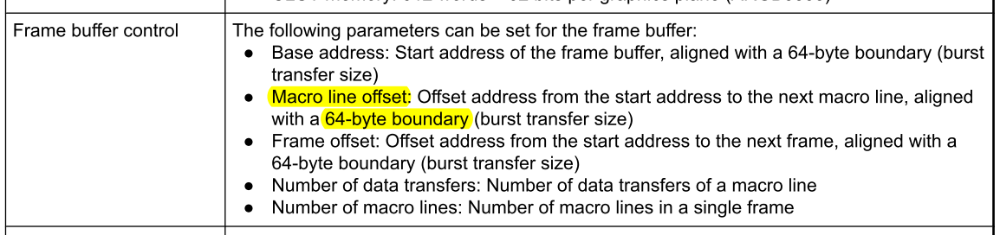

一般情况下，这个设置数据都是64字节对齐的，例如480x272分辨率的屏，RGB565色深，一行数据就是480x2=960字节。

但H0233S001的分辨率为222x480（竖屏），RGB565色深，一行数据量为444 bytes，无法满足64字节对齐的要求。如果按照每行222个像素来设置显示缓存，就会看到如下现象，本应显示红绿蓝白四个长方形色块图案，但实际显示是偏的。

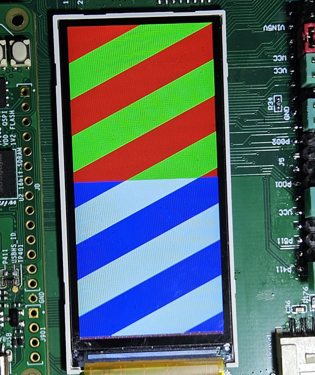

放大后，可以发现每一行都向左偏移了两个像素。

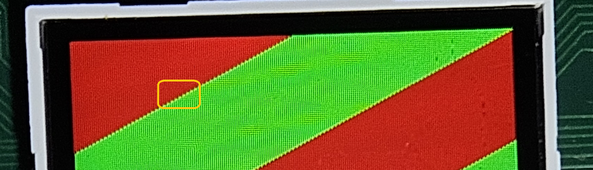

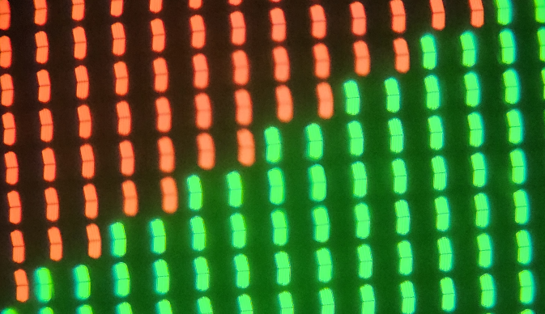

LCDC控制器在读取显示缓存时，每次读取64个字节，需要224个像素才能对齐（224x2=448字节），这样就会把下一行的两个像素的数据也读进去了，但这一行显示输出上又没有这两个像素，造成每行都丢失了2个像素（4个字节）。

屏幕一共480行，共丢失了960个像素，也就是大概4.3行的显示数据（960/222=4.324），在屏幕上检查也能发现，屏幕最底下4行多是没有显示数据的，都是随机显示内容。

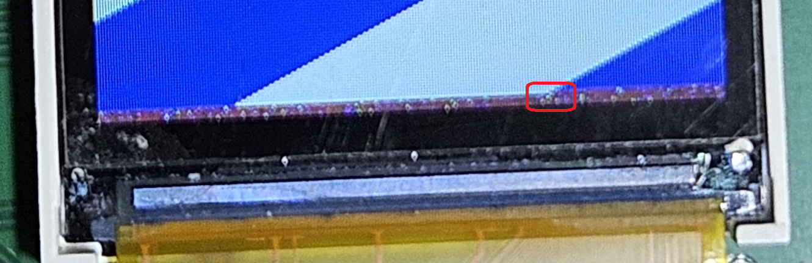

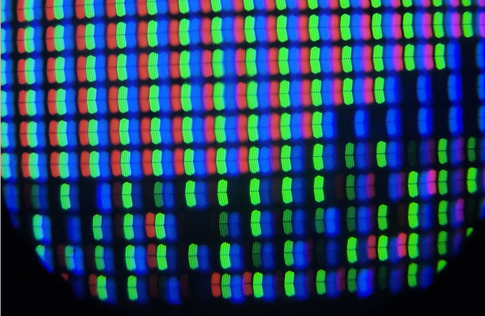

将显示缓存宽度设为224像素后（LCD输出设置的宽度还是222像素），问题解决。详情可参考CPKEXP-RA8x1的MIPI设置样例程序。
在您的实际开发中，如果遇到分辨率较为独特的显示屏，请务必注意数据对齐要求。

上一篇：link:01_overview.adoc[01. CPKEXP-EKRA8x1 简介]                下一篇：link:03_communication.adoc[03. 通信接口]
