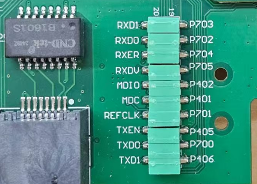
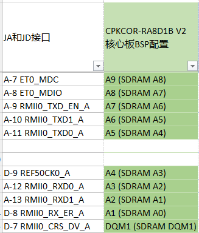
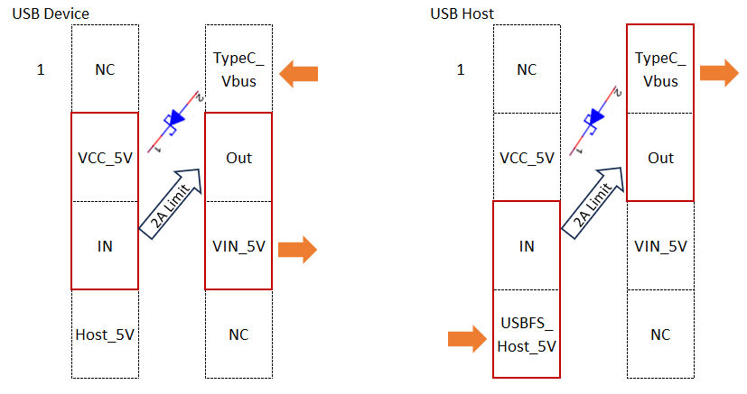
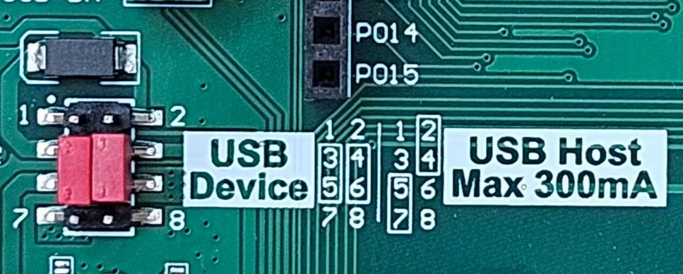
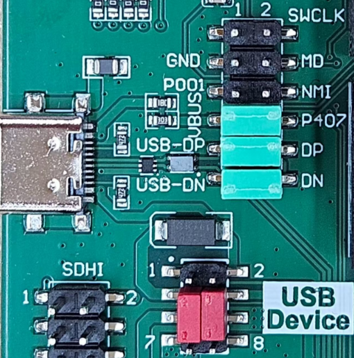
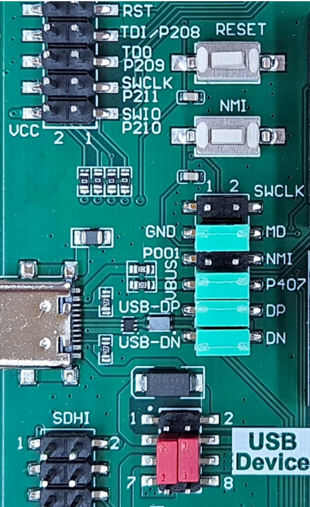
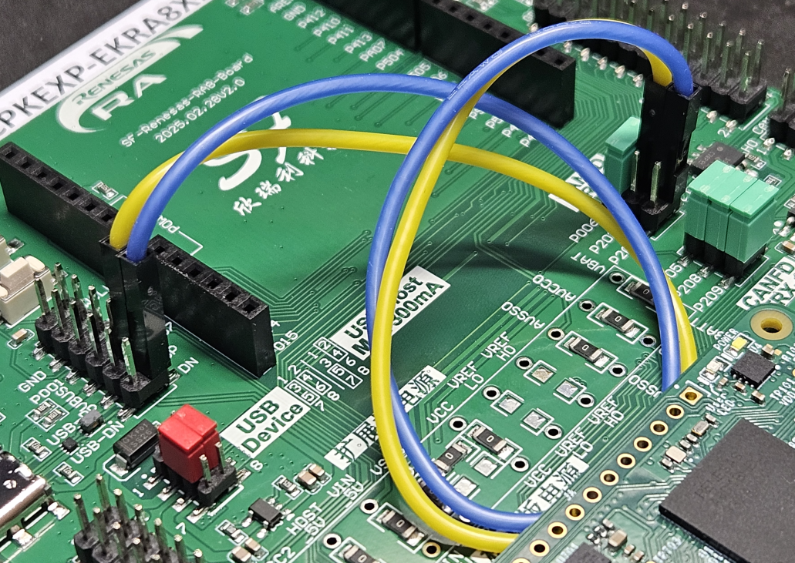

:scripts: cjk
# 第3部分 - 通信接口
:toc:

== CPKEXP=EKRA8X1上的通信接口

CPKEXP-EKRA8X1扩展板上设计了丰富的接口，这里我们先介绍一些专用的通信接口，生态系统的扩展接口会在第4部分介绍。

=== 以太网接口

扩展板上有一个百兆以太网接口，使用的PHY是LAN8720I，RMII接口。PHY以及电路连接与CPKHMI-RA8D1B完全一致，所以在CPKEXP的目录下没有以太网相关的样例程序，请直接使用CPKHMI-RA8D1B的样例程序（如果您有其他需要使用的非以太网相关的管脚，请注意对应进行修改）。

由于RA8D1 MCU的设计限制，使用了SDRAM后，CEU摄像头接口和以太网接口就有复用，使用时请注意将以太网信号跳线全部连上，且不要在扩展板上安装摄像头。

如果您不使用SDRAM，那可以尝试同时使用以太网和CEU摄像头。
CPKCOR核心板上，在JA和JD口上，预留了RMII接口的另一组I/O，具体可以参考CPKCOR-RA8D1B的用户手册。

CPKCOR核心板上禁用SDRAM后（SDCS/P115手工配置为输出高电平），可以通过杜邦线将这一组RMII接口连接到PHY的信号脚上，即可实现以太网和CEU同时工作。

image::images/03_communication/image-7.png[0,800]

=== USB-FS Type-C 接口

扩展板上有一个USB Type-C接口，通过跳线连接RA8x1 MCU的 USB-FS接口。

==== Type-C接口的电源设置

这个Type-C接口没有使用核心板上的自动方向判断功能，使用跳线配置USB主机/设备电源。

* 当最为USB设备时，CC脚有4.7K下拉电阻，USB Type-C主机可以识别到有SINK接入，并开始供电。
* 当作为USB主机时，CC脚无法支持供电判断功能，Type-C设备可能无法正确识别到USB主机。建议使用USB TypeC转TypeA转接头，转换为Type-A主机接口后使用USB主机功能。

跳线逻辑如下，缺省为USB Device模式，PCB丝印上也有注明。

* 作为USB Device使用时，Type-C口提供5V电源，通过防反灌二极管和2A限流电路，为扩展板（及核心板）提供VIN_5V供电。
* 作为USB Host使用时，由USBFS_Host_5V提供电源给USB HOST接口，虽然这边使用了2A限流器件，但实际上USBFS_Host_5V由核心板通过J1的23脚提供，J1管脚的载流能力为300mA，在这种情况下，请注意所接USB设备的功耗，不要超过300mA电流。
** 如果您确实有大电流USB-FS Host的需求，可以通过外接电源，直接为USB电源跳线的2脚供电，即可不受电流限制。也可以为USB电源跳线的7脚供电，使用板上的2A限流器件来限制USB HOST的供电电流。

==== Type-C接口的数据设置

RA8D1的USB-FS的数据线端口（P814/P815）在RESET后自动设置为USB FS DP/DM功能，但也可以通过程序配置为GPIO或其他功能扩展板设计上通过跳线连接这些信号，可以实现灵活的配置。

缺省状态下，作为USB Device使用，连接USB DP，DM和P407（USB-FS VBUS）。如果您使用USB Host功能，则可以断开P407到USB Type-C接口的连接，把P407作为其他功能使用。

这个Type-C接口也支持RA8 MCU的USB Boot功能，通过跳线将MD脚接地，RESET后（通过上电复位或RESET按键）RA8 MCU进入USB Boot模式，配合上位机软件（如瑞萨的RFP软件）或烧录器即可实现程序写入以及密钥管理/产品生命周期管理等安全设置功能。

=== CAN-FD接口

RA8x1 MCU支持两路CAN-FD接口，在扩展板上也设计了两个CAN-FD收发器。

RA8x1 MCU的CAN-FD端口配置十分灵活，CAN-FD0有6个端口位置可选，CAN-FD1有4个端口位置可选。
在扩展板设计上，使用了跳线块设计，除了已经预设的端口组合，还可以通过杜邦线将需要的端口接到CAN-FD收发器。

image::images/01_overview/image-4.png[0,400]

其中CAN-FD1缺省使用P208和P209端口，P005作为STB控制脚，跳线块以预先插上。

CAN-FD0缺省使用P202和P203，在使用RA8D1B的核心板上，这两个端口被用作MIPI-DSI输出，无法作为CAN-FD0使用。只有在贴装非MIPI的RA8D1 MCU，或RA8M1/RA8T1 MCU时，才能使用P202/P203端口。所以在扩展板上，跳线缺省未安装。

CAN-FD0还有其他5个端口位置可选择，您可以选择没有冲突的I/O口，用杜邦线将CAN-FD0信号接过来。

例如，扩展板上不使用USB-FS功能，则可以将P814/DP作为CRX0，P815/DM作为CTX0，将CAN-FD0接到收发器上进行评估。
注意，此时虽然不使用USB-FS的数据通信功能，但扩展板上的Type-C接口还是可以作为SINK，为扩展板提供5V电源。

回到首页：link:01_overview.adoc[01. CPKEXP-EKRA8x1 简介]       上一篇：link:02_displaycam.adoc[02. 显示和摄像头]     下一篇：link:04_ecoexpansion.adoc[04. 生态系统扩展接口]
