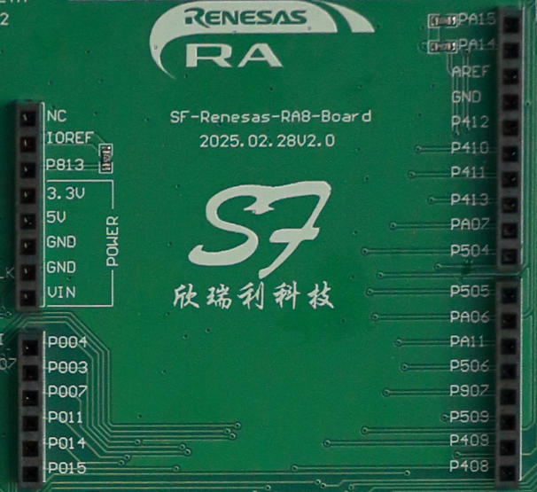
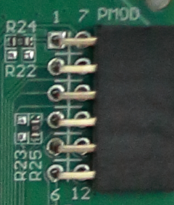
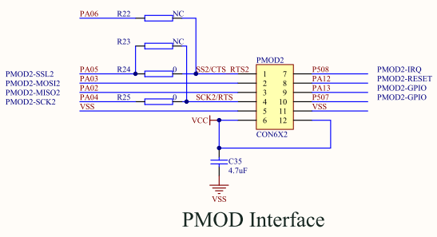
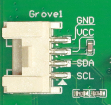
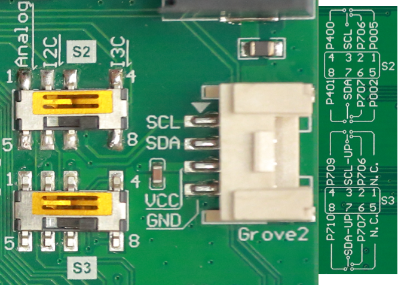

:scripts: cjk

# 第4部分 - 生态系统扩展接口
:toc:

== 生态系统扩展接口

CPKEXP-EKRA8X1上设计了Arduino， PMOD以及Grove接口。

=== Arduino接口的引脚已经在PCB丝印上标注，可以快速定位您想要使用的MCU管脚

Power接口上的VIN没有连接到扩展板上的任何网络，即不支持Arduino扩展板通过VIN脚对扩展板供电。如果需要使用外部供电，可以使用5V管脚，连接的网络是VIN_5V，具体请查看原理图。

端口功能连接的具体外设如下表所示：

[%autowidth, cols="3*", options="header"]
|=====================================
| Arduino管脚 | MCU端口  | 特别功能           
| UNO RESET | P813   | 复位，带上拉         
| UNO D19   | PA15   | SCL9_C         
| UNO D18   | PA14   | SDA9_C         
| UNO AREF  | VREFH0 | 模拟参考           
| UNO D13   | P412   | RSPCKB_B       
| UNO D12   | P410   | MISOB_B        
| UNO D11   | P411   | MOSIB_B        
| UNO D10   | P413   | SSLB0_B        
| UNO D9~   | PA07   | GTIOC7A - PWM  
| UNO D8    | P504   | 数字I/O口         
| UNO D7    | P505   | 数字I/O口         
| UNO D6~   | PA06   | GTIOC7B - PWM  
| UNO D5~   | PA11   | GTIOC6A - PWM  
| UNO D4    | P506   | 数字I/O口         
| UNO D3~   | P907   | GTIOC13A - PWM 
| UNO D2    | P509   | 数字I/O口         
| UNO D1    | P409   | TXD3_A         
| UNO D0    | P408   | RXD3_A         
| UNO A0    | P004   | AN000          
| UNO A1    | P003   | AN104          
| UNO A2    | P007   | AN004          
| UNO A3    | P011   | AN106          
| UNO A4    | P014   | AN007/DA0      
| UNO A5    | P015   | AN105/DA1      
|=====================================

=== PMOD接口缺省支持Type-3A 扩展SPI模式，通过修改跳接电阻，可以将接口改为Type-2A 扩展UART模式

具体的管脚功能如下表所示：

[%autowidth, cols="3*", options="header"]
|===============================
| PMOD Type 2A | MCU端口 | PMOD功能 
| PMOD 2A:1    | PA05  | SS2_C  
| PMOD 2A:2    | PA03  | MOSI2_C
| PMOD 2A:3    | PA02  | MISO2_C
| PMOD 2A:4    | PA04  | SCK2_C 
| PMOD 2A:7    | P508  | IRQ1   
| PMOD 2A:8    | PA12  | RESET  
| PMOD 2A:9    | PA13  | 数字I/O口 
| PMOD 2A:10   | P507  | 数字I/O口 
|===============================

[%autowidth, cols="3*", options="header"]
|==============================
| PMOD Type 3A | MCU端口 | PMOD功能
| PMOD 3A:1    | PA06  | CTS_2 
| PMOD 3A:2    | PA03  | TXD2_C
| PMOD 3A:3    | PA02  | RXD2_C
| PMOD 3A:4    | PA05  | RTS_2 
| PMOD 3A:7    | P508  | IRQ1  
| PMOD 3A:8    | PA12  | RESET 
| PMOD 3A:9    | PA13  | 数字I/O口
| PMOD 3A:10   | P507  | 数字I/O口
| PMOD 2A:10   | P507  | 数字I/O口
|==============================

=== 两个Grove接口，其中一个为标准I^2^C接口，另一个可以配置为I^2^C、I^3^C或模拟功能

Grove1接口只支持I^2^C功能,连接到RA8 MCU的I2C功能模块，SCL：P512/SCL1_A ； SDA：P511/SDA1_A。

Grove2接口支持I^2^C、I^3^C或模拟功能三选一，通过两个双刀三掷开关来切换，注意这两个开关需要切换到相同的档位。
每个档位连接的端口在PCB板反面的丝印上有标注。

具体设计实现如下面的示意图，通过两个开关来切换连接到Grove接口的信号以及对应的上拉。

* 使用I^3^C功能时
** S2连接I^3^C模块的管脚P400和P401，注意由于管脚冲突，此时CEU和以太网都不能使用
** S3连接P710和P709，作为I3C信号的可编程上拉控制
* 使用I^2^C功能时
** S2连接I^2^C模块的功能管脚P706和P707
** S3连接VCC，将I^2^C信号上拉
* 使用模拟功能时
** S2连接AN001和AN102
** S3悬空

image::images/04_ecoexpansion/image-4.png[0,600]

具体的连接也可参考原理图。

回到首页：link:01_overview.adoc[01. CPKEXP-EKRA8x1 简介]       上一篇：link:03_communication.adoc[03. 通信接口]     下一篇：link:05_generalexpansion.adoc[05. 通用扩展接口]
