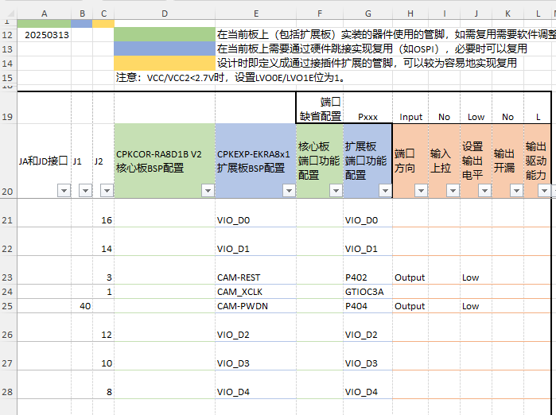
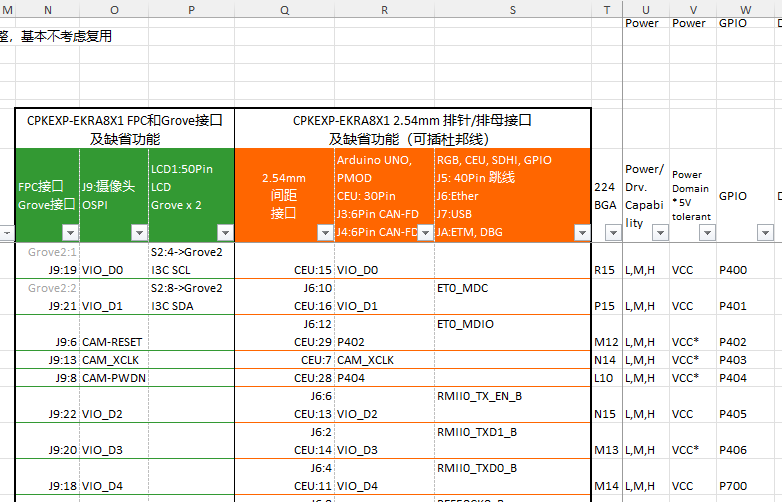
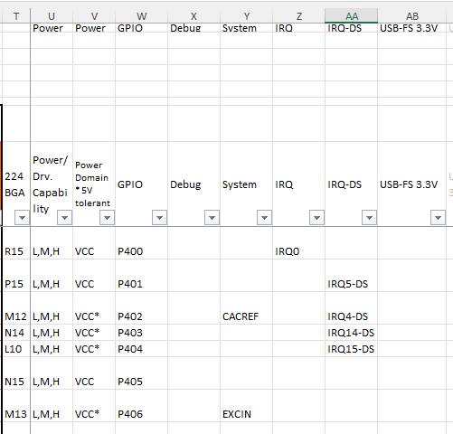
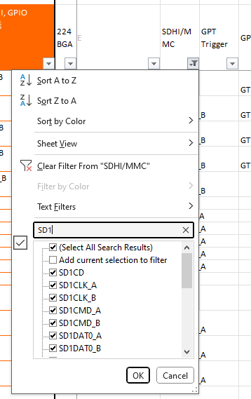
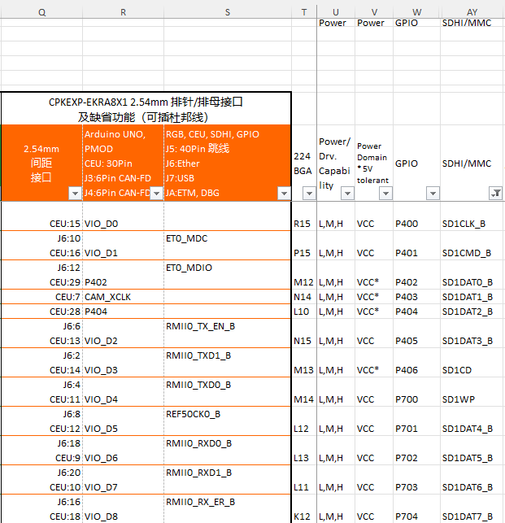
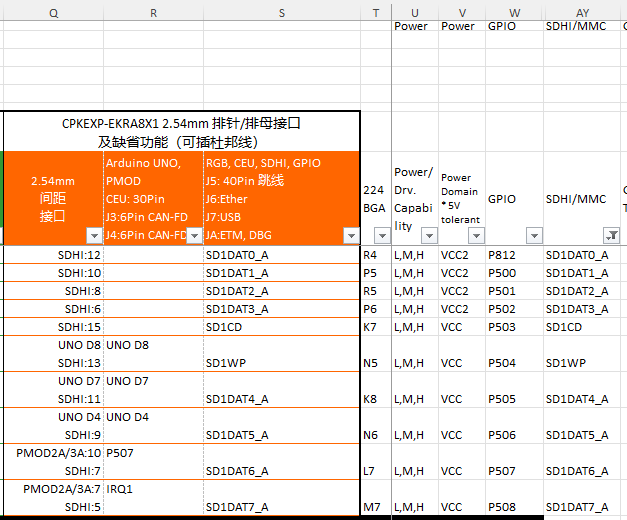
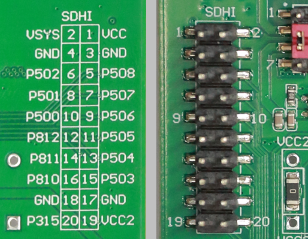
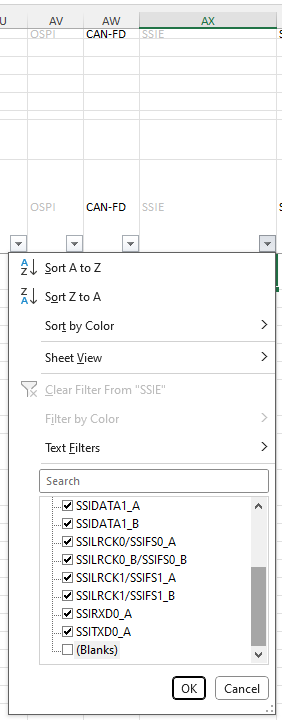
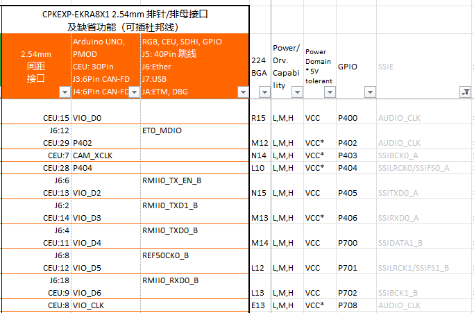

:scripts: cjk
= 第5部分 - 通用扩展接口
:toc:

== 通用扩展接口

除了前面提到的各种接口，CPKEXP-EKRA8X1作为一块开发板，可以灵活进行端口配置。 J1，J2接口上的所有信号，都连接到了2.54mm间距的排针或排母上，方便进行评估和系统调试。包括：

* RGB扩展口，40pin双排针
* CEU/I2S扩展口，30pin双排母
* SDHI 20pin双排针接口
* GPIO 24pin双排针接口
* J3，J4 6pin双排针CAN-FD接口
* J6 20pin双排针 以太网跳线接口
* DBG 10pin双排针 调试接口
* J7 10pin双排找 USB接口
* J5 40pin双排针跳线

此外，从Arduino和PMOD口上也能引出各个信号。

=== 我们提供一个Excel 表格，可以方便的查找每个外设功能或GPIO在扩展板及核心板上对应的引脚。

表格的第一部分A列到L列是功能配置区，具体内容如下：

* A,B,C三列表示这个管脚在JA/JD以及J1/J2接口上的位置。
* D列和E列是这个管脚在核心板和扩展板上的配置，目前表格是按照CPK-RA8D1B开发板套件的缺省配置填写的。
* F列和G列是对应的端口功能配置，即在FSP配置程序里，该端口被配置成什么功能。
* H列到L列是端口的其他配置信息，包括：
** 用作GPIO，设置为输入还是输出
** 作为（GPIO及外设的）输入管脚时，是否设置上拉
** 作为（GPIO的）输出管脚时，输出的缺省电平
** 作为（GPIO及外设的）输出时，是否需要输出开漏
** 作为（GPIO及外设的）输出时的驱动能力

表格的第二部分，即N列到S列罗列除了每个I/O口在扩展板FPC和2.54mm间距接插件上的位置，有些信号会连到多个接插件管脚上，请按需选择需要使用的管脚。

表格第三部分，即T列往右，是RA8x1 MCU的管脚功能分配，通过自动筛选功能，即可快速定位您想查找的功能管脚。

* P列为224BGA上的管脚号
* U列为端口的输出驱动能力
** 驱动能力设置过高，有时会造成EMC问题
** 高速接口需要设置为HH（High Speed High Driver），即高速高驱动能力
* V列表示该端口所在的电源域，即端口由那个电源供电。带*的为5V耐压端口
* W列为端口号，这个也是RA8x1 MCU每个管脚的唯一标识（瑞萨所有的MCU都是用端口号作为唯一标识的）

=== 几个使用的例子。

==== 以SDHI接口为例，我们向右找到AY列 SDHI/MMC，通过筛选功能选择SDHI模块1的管脚

即可看到，SDHI/MMC模块1的B组功能管脚都可以在CEU接口上找到，且所有的信号都是VCC电源域的。

SDHI/MMC模块1的A组功能管脚都可以在SDHI接口上找到，其中部分信号在VCC电源域，部分在VCC2电源域。

对应PCB上，SDHI接口背面也有丝印标明端口号

==== 以音频接口为例，在AX列上，取消勾选空白单元格，即可选出所有的I2S接口使用的管脚

可以看到，在CEU接口上，可以找到所有I2S的功能引脚，通过CEU接口设计一个音频扩展板，即可评估I2S功能

==== 其他功能，也可以通过表格快速找到对应的接插件管脚

回到首页：link:01_overview.adoc[01. CPKEXP-EKRA8x1 简介]       上一篇：link:04_ecoexpansion.adoc[04. 生态系统扩展接口]     下一篇：link:06_powermisc.adoc[06. 电源和按键]
