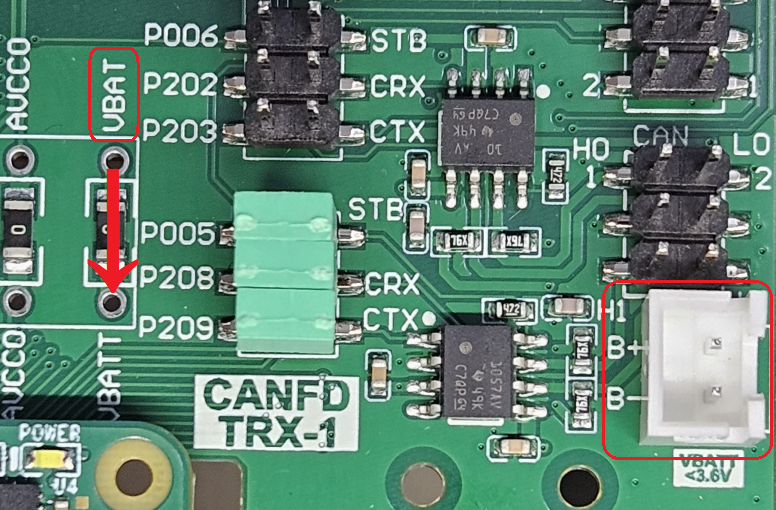
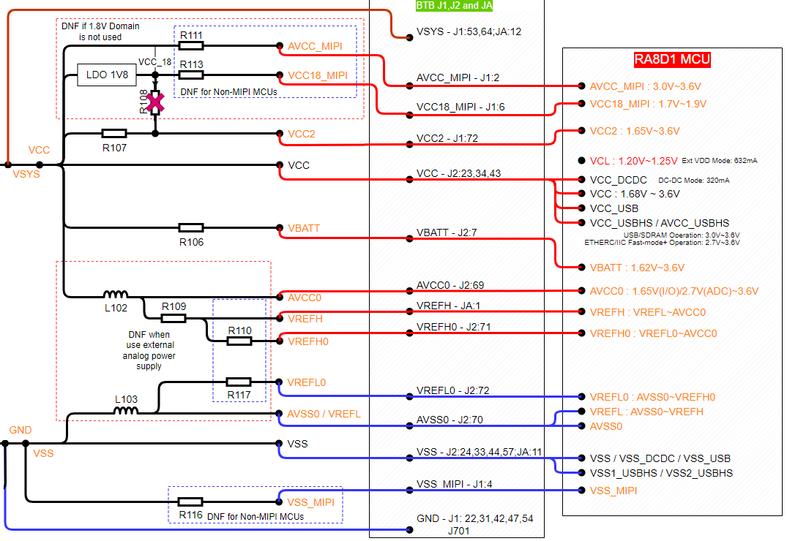
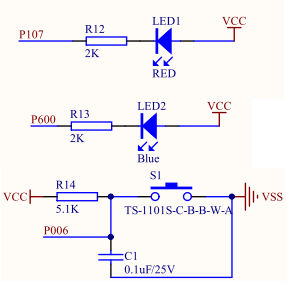
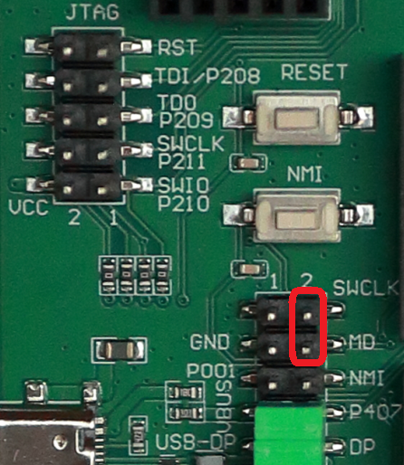
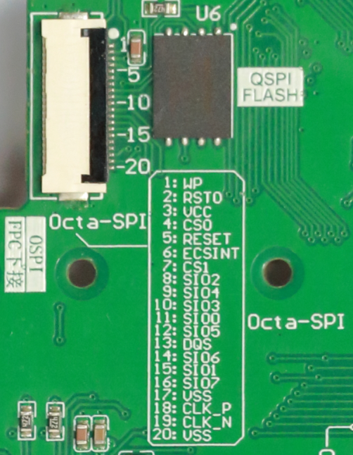
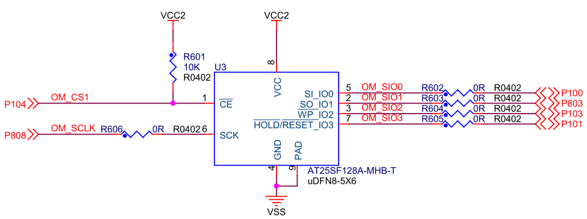

:scripts: cjk

= 第6部分 - 电源设计和按键等
:toc:

== 电源设计和按键等其他部分

=== 电源设计

CPKEXP-EKRA8X1板上并没有电源芯片，但支持通过USB-FS Type-C接口输入5V电源。
当然也可以从各个扩展接口的电源脚输入电源，但每个管脚的载流能力不同，不建议这么做。

扩展板上专门设计了一块电源跳接电路，可以配合外接电源，实现多种电源配置和测量功能，例如：

==== 缺省供电功能
* 将核心板接口J1、J2上的电源和扩展板电源完全分离，通过缺省的跳接电阻
** 扩展板上USB Device的5V供电可以供给核心板（J1上输入到核心板的5V载流能力为1.2A）
** 核心板上的LDO输出可以给扩展板供各种电源

image::images/06_powermisc/image.png[]

==== 外接VBATT电池
* 通过外接电池，并配合修改CPKCOR核心板上的跳接电阻，为核心板提供电源
** 例如断开核心板上的R106，即可通过扩展板上的电池供电接口，为RA8x1 MCU提供VBATT电源
** 在需要高精度AD采样时，可以断开核心板上的R110和R117，使用外接参考源通过扩展板为RA8x1 MCU提供ADC参考电平。

==== 电流测量
* 将0R电阻替换为高精度毫欧电阻，配合外接电源，即可测量对应电源的电流。
** 核心板没有供电的情况下，使用外部电源，通过扩展板的VCC电源脚为核心板提供VCC电源，即可在毫欧电阻两端用仪器精确测量VCC电源的电流和功耗。

=== 按键和LED

扩展板上提供一个用户按键和两个LED，注意P107和OSPI接口的CS0复用，在扩展板上使用QSPI Flash时，那红色的LED1就无法使用。
* 在BSP中，缺省将P107设置为CS0，您需要手动修改设置才能使用LED1

=== 调试接口

在扩展板上预留了CMSIS规范的10pin调试接口，如果您不使用核心板上的Jlink调试器，则可以通过JTAG口连接外部调试器。

RA8x1 MCU支持SWD调试和SWD Boot，只需连接SWDIO，SWDCLK，RESET和GND四个信号即可进行调试和烧录。
如果需要通过调试器使用RA8x1 MCU的SCI Boot功能，请使用跳线块将SWCLK和MD脚短接。
支持SWD调试，SWD Boot和SCI Boot的调试器如下：

* 瑞萨EZ-Cube3
* 瑞萨E2-Lite
* Segger JLink

CMSIS-DAP调试器不支持SWD Boot模式和SCI Boot模式，如果您如果您使用CMSIS-DAP作为调试器，请参考前面通信接口章节，使用USB Boot模式进行MCU的初始化和其他安全设定。

=== 存储扩展

==== QSPI NAND接口

CPKCOR核心板上使用的是QSPI接口的NOR Flash，如果应用需要扩展更大容量的低成本存储器，可以在扩展板上评估QSPI NAND Flash。

核心板底面预留了WSON8封装的Flash贴装位置，可以贴装华邦的W25N01GV 1G bit NAND Flash。

==== Octa-SPI扩展接口

如上图所示，扩展板底面也预留了Octa-SPI接口的FPC插座，如果您想要通过CPKCOR板（板载16位SDRAM）来评估Octa-SPI接口的存储器，则可以设计一个存储扩展板，通过FPC线连接到CPKEXP-EKRA8X1。

* 存储扩展板的电路设计可以参考CPKHMI板
* 需要将CPKCOR板上的R602~R606移除，以保证Octa-SPI接口信号质量
** 最好将CPKCOR核心板上的U3及相关器件全部移除
* CPKCOR核心板上虽然没用到Octa-SPI的差分时钟，但MCU到J2的连接已经按照差分线要求布线。

回到首页：link:01_overview.adoc[01. CPKEXP-EKRA8x1 简介]       上一篇：link:05_generalexpansion.adoc[05. 通用扩展接口]     下一篇：link:07_newboarddesign.adoc[07. 设计您自己的扩展板]
