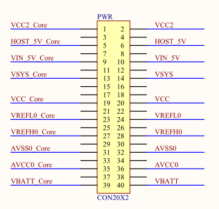
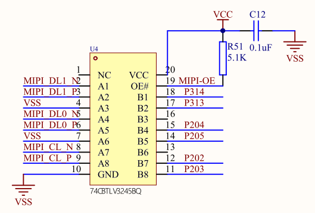
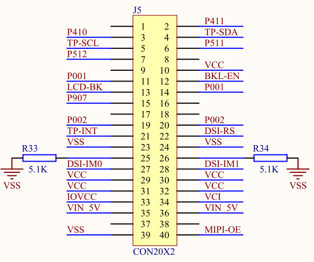
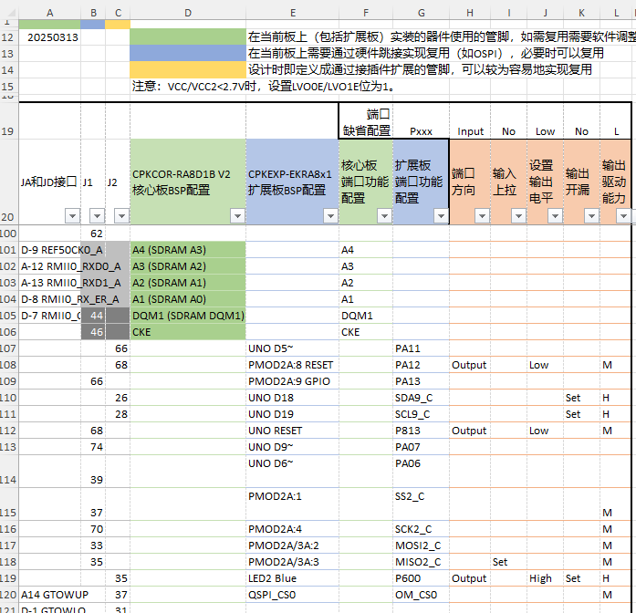

:scripts: cjk

= 第7部分 - 设计您自己的扩展板
:toc:

== 设计您自己的扩展板

瑞萨提供CPKEXP-EKRA8X1的原理图和PCB设计文件，您可以根据您的应用要求进行修改，快速设计出符合您应用要求的扩展板，开始系统评估。

=== CPKEXP-EKRA8X1扩展板上可以省略的部分

==== 电源测量和外部供电

对于确定的应用需求，一般电源设计已经定型，您可以先省略扩展板上的电源跳接部分，将核心板的电源信号直接连接到扩展板。
* 还是建议将扩展板的电源单独标注，和J1/J2上的电源区分开来，方便后续修改。
* 删除PWR器件，将J1/J2的电源和扩展板电源直连（或通过0R相连，看应用需求）

==== MIPI信号隔离

由于CPKEXP-EKRA8X1需要连接不同类型的核心板，在扩展板上设计了MIPI信号到GPIO的隔离芯片，当使用MIPI接口时，芯片OE关断，连到GPIO接口的线路不会影响MIPI的信号质量。
在您自己设计的扩展板上，应用需求已经明确，或使用MIPI接口，或使用不带MIPI接口的MCU，使用P203~P205以及P313，P314接口，这个隔离电路可以省略。

==== LCD接口的信号跳线

CPKEXP-EKRA8X1的50Pin FPC接口设计成可以支持多种LCD接口，所以使用了J5跳线进行灵活配置。在您自己设计的系统上，一般已经确定了是否使用LCD已经使用什么样的LCD接口，可以删除J5。

==== 调试接口

CPKCOR核心板上已经自带了JLink调试器，并支持1路USB转串口。如果没有特别需求（如测试量产烧写流程），可以删除调试接口相关的电路。

=== 需要注意的电路修改

==== 以太网和CEU摄像头接口的信号冲突

虽然可以通过手工方式将CPKCOR上的以太网接口跳接到扩展板，但如果您需要同时使用以太网和CEU，建议您重新设计完整的电路进行详细评估。
此时如果需要扩展RAM，可以考虑使用HyperRAM。您可以使用CPKHMI-RA8D1B评估HyperRAM（或设计一个HyperRAM存储扩展板）。

==== USB-FS

CPKEXP-EKRA8X1的USB-FS并没有考虑完整的Type-C接口支持，如果您需要支持Type-C自动方向判断（DRP），Dead Battery等功能，可以参考瑞萨其他RA8核心板的设计。

=== 其他功能模块

CPKEXP-EKRA8X1的其他功能模块仅为评估RA8x1 MCU的各项功能而设计，您可以根据具体应用需求连接到您选定的外设器件。

各个外设功能的I/O选择和复用，可以继续使用瑞萨提供的管脚功能Excel表格，将您需要的功能填到E列和G列中，即可快速确认使用CPKCOR核心板+自定义扩展板，是否可以满足您的应用要求。

回到首页：link:01_overview.adoc[01. CPKEXP-EKRA8x1 简介]                       上一篇：link:06_powermisc.adoc[06. 电源和按键]