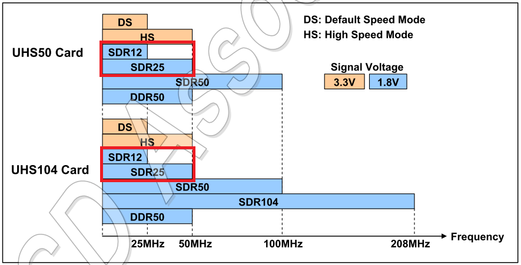
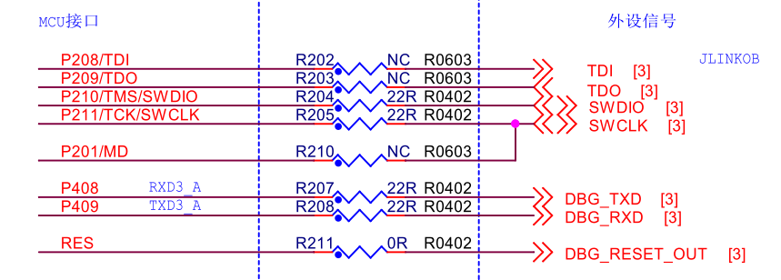
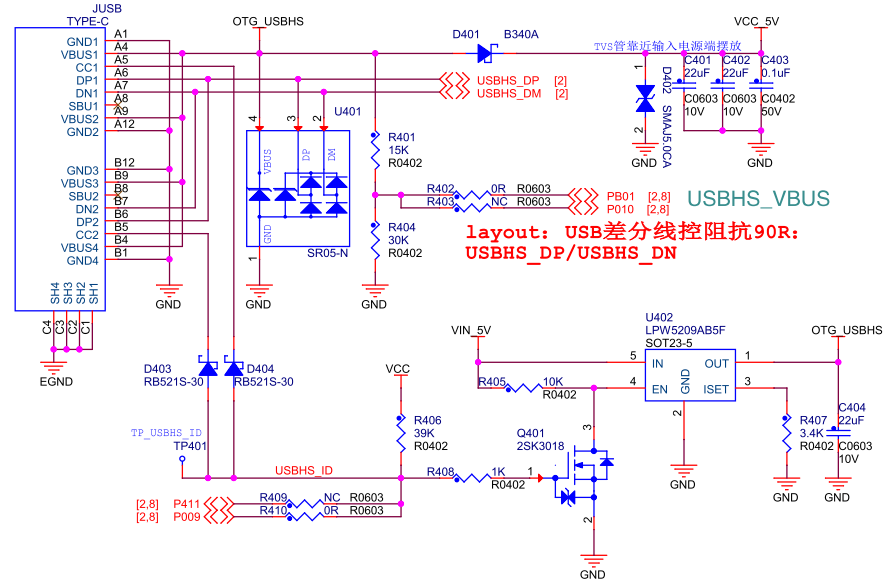
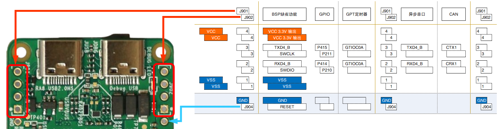
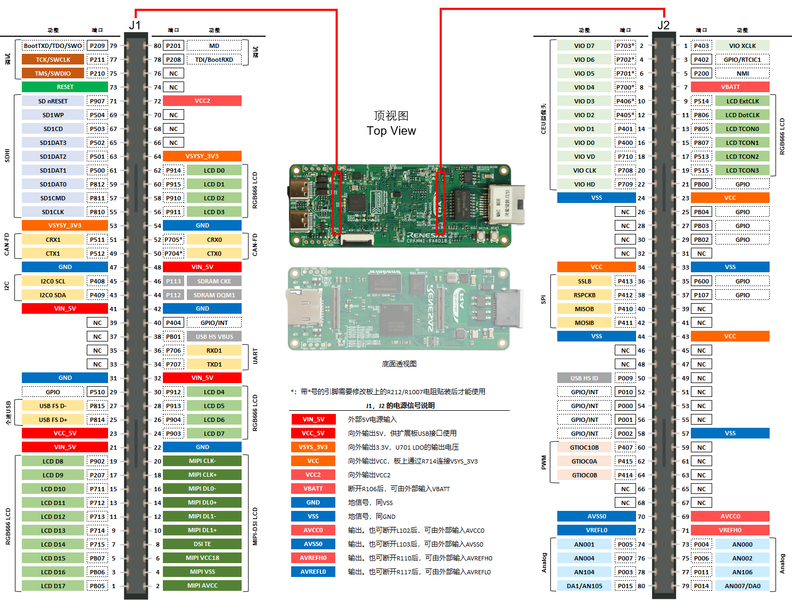

## 核心板硬件概述

RA8 MCU本身已经集成了2M字节的Flash，1M字节的SRAM，在大多数应用场景下无需外扩存储。

CPKHMI-RA8D1B核心板作为RA8 MCU的开发/演示板，需要支持各种评估和使用的需求，在板上搭载了SDRAM和Octa NOR Flash，以及其他必需的外围器件。

### RA8 MCU最小系统

最小系统包括系统**MCU的供电**和**系统控制功能**。

RA8D1 MCU可以使用单一3.3V供电，简化系统设计。但MCU 本身有4个主要的电源域
- VCC：为MCU的主要供电电源，支持大部分片内设备的运行
- VCC2：为部分I/O口提供一个独立的电源，例如Octa-SPI接口，可以通过VCC2使用1.8V电平
- AVCC：为模拟电路和模拟I/O口提供电源
- VCL：MCU核心供电，不影响I/O电平
  - RA8 MCU片内自带DC-DC电路，可以使用片内DC-DC为VCL供电
  - 也可以使用外部DC-DC芯片为VCL供电，电压为1.2V

除了这些主要的电源，RA8 MCU还有两个特殊的电源域
- VBATT：电池供电引脚，为片内的可在低功耗模式下运行的外设供电，例如RTC
  - VBATT不影响I/O口电平，如果不需要使用VBAT，可以将VBAT直接连到VCC
- RA8D1B MCU支持MIPI-DSI接口，MIPI-DSI需要一个独立的1.8V供电。

RA8的供电方式和芯片的运行模式有很多互相影响的地方，在后续的[RA8电源设计](09_powerdesign.md)章节中有详细的解释。

RA8 MCU的**系统控制**包括**时钟**，**复位**和**系统控制**。

RA8D1/M1/T1 MCU具有三个内部时钟源和两个外部时钟接口，启动时会使用MOCO作为系统时钟。即使不接任何外部时钟，RA8 MCU也能开始运行。

在核心板上，外接了24MHz的主时钟和32.768K的副时钟，以满足系统设计的各种要求。

RA8 MCU上的副时钟管脚是独用的，没有和GPIO复用，一般接一个32.768K的晶体。RA8内部的HOCO（片内高速时钟）可以通过这个32.768K时钟进行自动校准（FLL），达到±0.25%的精度，满足一部分应用的需求。

主时钟管脚和P212/P213口复用，对于其他有更高时钟精度要求的应用，需要外接时钟晶体。例如USB HS的PHY时钟就只能使用这个主时钟源，且限制在12/20/24/48MHz这四个频率点。

RA8 MCU还支持使用USB全速接口进行USB Boot，此时对系统时钟也有一定要求，具体可以查看[RA8的调试和烧录接口](06_debug.md)章节。

系统控制管脚包括RESET和MD。

RA8的RESET电路里包含了上电复位电路（POR），无需外部延时（阻容电路或RESET芯片），详见手册`5.3.2 Power-On RESET`章节，上电时如果RESET管脚为高电平，POR电路会开始工作，为片内各个部分提供RESET信号。

核心板上也安装了一个RESET按键。

MD管脚和P201复用，用来确定芯片RESET后的工作状态。MD=0表示芯片进入SCI-Boot/USB-Boot模式， MD=1则进入正常工作模式或SWD-Boot模式。

在芯片复位时，P201管脚会被硬件逻辑设置成输入并有片内上拉，即不接任何外部电路时，MD=1。如果这一设计已经可以满足您系统的要求，那就无需预留外部下拉电阻。
- 详见手册`19.2.5 Port mn Pin Function Select Register` Note 1: `The initial value of P201 is 0x0000_0100`
- 核心板上没有预留MD控制电路，如有需要，请在用户扩展板上实现MD控制。

其他的系统控制功能还有：
- P200/NMI：根据手册`19.4 Handling of Unused Pins`要求，上拉至VCC。NMI中断在缺省状态是不使能的，详见手册`13.2.11 NMIER : Non-Maskable Interrupt Enable Register`，此处的上拉是一个预防性措施。P200本身只能作为GPIO输入端口，弱上拉不影响使用。
  
  

- 按键和LED：核心板上安装了一个用户按键（P008）和一个用户LED（PA01），已经在BSP中设置好，可以直接在FSP里使用。

### 存储扩展

核心板上扩展了3个存储器
- 32位总线宽度的SDRAM，使用外部总线控制器的SDRAM接口，地址范围0x6800_0000 ~ 0x6FFF_FFFF，最大128M字节。核心板上使用的是华邦的W9812G2KB，容量为16M字节。
- OSPI NOR Flash，使用RA8 MCU的Octal SPI接口，板上使用的是华邦的W35T51NW，容量为64M字节。
  - OSPI接口在VCC2电源域，VCC2=1.8V
  - RA8的Octal SPI接口（OSPI_B）支持xSPI协议，符合JEDEC标准JESD251(Profile 1.0 and 2.0)、JESD251-1和JESD252。
  - 硬件设计上兼容Octa NAND （W35N01JW）和 HyperRAM（W958D8NBYA），如您需要评估，瑞萨可以提供实装了括号内器件的核心板。
- TF卡槽，使用VCC2电源域的管脚，支持1.8V I/O的TF卡，即下图中的SDR12和SDR25模式。

有关RA8D1/M1/T1外部存储扩展的详细信息，会在后续的[RA8外接存储扩展](08_storage.md)章节中有详细的解释。

### 调试电路

核心板上已经搭载了Segger JLink-OB电路，使用的主控是瑞萨的RA4M2 MCU。

此版本的JLink OB提供了SWD调试功能和一个USB CDC串口，可以同时实现调试和串口通信，用户使用时无需再外接一个串口芯片。核心板上使用RA8的串口3（P408/P409）和JLink-OB的串口进行通信。

此版本的JLink OB还支持RA MCU的扩展功能。包括：
- **RA MCU 的SCI-Boot模式**，通过控制RA8 MCU的RESET和MD信号使RA MCU进入SCI Boot，并通过RA MCU的P208和P209实现串口通信。（CPKCOR-RA8D1B核心板预留了和Jlink OB的这个接口，但没有使用）
- **RA8D1/M1/T1的SWD-Boot模式**，通过控制RA8 MCU的RESET信号，在RESET低电平时向SWD接口的寄存器写入特定内容，RESET拉高后，RA8 MCU即进入SWD Boot模式，通过SWD接口和调试器通信（CPKCOR-RA8D1B缺省支持这个模式）。

在您设计自己的电路时，可以参考核心板的调试电路连接，但请务必确保调试器的RESET信号连到了RA8 MCU上。

在RA MCU复位后，SWD/JTAG调试接口使用的P2端口上I/O缺省设置为调试口，以便调试器可以连接到MCU。详见手册`Table 19.8 Register settings for input/output pin function (PORT2)`。如果需要将这些端口在应用程序中作为GPIO来使用，需要进行对应的设置。如果作为GPIO使用了，那需要再次连接调试器时，要配合RESET复位才能实现连接。

核心板上还预留了J902通孔接口，可以外接其他调试器，更多调试相关的内容会在后续的[RA8的调试和烧录接口](06_debug.md)章节中有详细的解释。

### 高速 USB 2.0 双向接口

RA8D1 MCU支持一路高速USB 2.0和一路全速USB，核心板上只使用了高速USB 2.0接口，未将全速USB接口引出。

RA8D1的高速USB 2.0支持主机和设备模式，核心板上使用了USB 2.0 Type-C 接口，通过外接电路实现了USB Host和USB Device的自动识别和切换。

Type-C接口本身使用CC1和CC2信号来识别和判断USB类型，供电状况，以及实现PD通信。RA8D1 MCU核心板并不需要复杂的供电协议，也不会需要大电流供电支持，所以在设计上尽量简化，使用简单的数字逻辑（不使用专门的CC协议芯片）来实现主从切换和供电。

当USB Type-C设备连到JUSB接口时，CC1/CC2上会有一个下拉电阻到地，USBHS_ID变为低电平，U402导通为USB Type-C口提供5V供电，此时RA8的USB-HS模块工作在Host模式下。

当JUSB作为设备接入USB主机时，USBHS_ID为高电平，U402不工作，USBHS_VBUS检测到3.3V，USB模块工作在Device模式下。

- 由于电路设计限制，如果USB主机端是标准的Type-C接口，此时核心板上没有CC1/CC2下拉到地，主机端无法得知有设备插入，从而不对端口供电，核心板无法取电。即使核心板有其他电源供电，主机没有识别到设备插入，也不会开启主机的USB-C端口，无法通信。
- JUSB接口如果要作为设备使用，请使用主机端的USB-A接口，USB-A口会持续为设备供电。也可以在USB-C接口上添加一个Type-C -> Type-A的转换接口（转换接口里包含CC1/CC2的下拉电阻，诱骗Type-C口供电）。

更多USB接口相关的内容会在后续的[RA8 USB 2.0 高速接口](07_usbhs.md)章节中有详细的解释。

### 外接扩展口

作为开发板，扩展功能是不可缺少的。CPKCOR-RA8D1B有两种类型的扩展接口，适合不同类型的需求。

#### 通孔扩展接口

使用2.54mm间距的通孔设计，方便用户使用单排针和杜邦线进行扩展。

通孔扩展分为两个部分，一个是J901和J902两个4针的扩展接口，主要实现调试口和串口的扩展。

通孔扩展接口的详细使用介绍，请查看后续的[CPKCOR-RA8D1B 通孔扩展接口](04_th_expansion.md)章节。

#### 高密度板对板扩展接口

板载的RA8D1/M1芯片管脚中，除了32位SDRAM接口和用户按键、用户LED，其他所有的信号都通过2个80脚的板对板接插件引出，可以连接到用户设计的扩展板上，实现快速功能验证和原型设计。扩展板设计改版时，核心板可以重复利用，大幅降低了系统验证的难度和试错成本。

扩展接口上有多种电源信号，在核心板有外部电源时，可以通过接口给扩展板供电。如果核心板没有独立供电，那也可以通过扩展板反向给核心板供电。在后续的[RA8电源设计](09_powerdesign.md)章节中会详细介绍如何使用扩展电源接口。

RA8 MCU的端口复用功能比较复杂，在文档中无法详尽描述各种用例，只能举例说明。

以下管脚的位置分布为核心板的顶视图（RA8 MCU所在面为底面，J1,J2在底面），也就是扩展板上的对应接插件安装面的顶视图。

这是一个RA8D1扩展功能管脚配置的例子，扩展了
- MIPI-DSI、RGB666显示接口，
- CEU摄像头输入(和以太网接口管脚复用，需要在核心板上调整跳线电阻，详见[CPKHMI-RA8D1B 以太网](10_ethernet.md)章节。
- 1个串口，1个I2C接口，1个SPI接口
- 2个CAN-FD接口
- USB 全速接口
- PWM输出，AD输入，DA输出
- SWD调试接口，SCI Boot控制
- GPIO，外部中断输入

在后续的[CPKHMI-RA8D1B 板对板扩展接口](05_btb_expansion.md)章节中，会详细介绍接口的扩展能力和设计思路。

[返回目录](01_overview.md)             [下一篇：CPKHMI-RA8D1B 通孔扩展接口](04_th_expansion.md)
