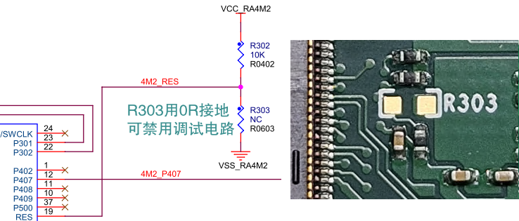
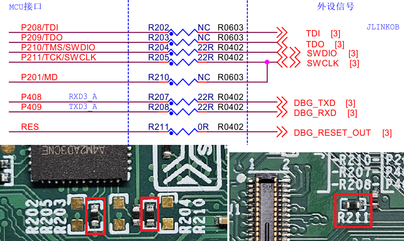

## 2.54mm间距的通孔扩展接口

在所有的CPK核心板都配备了一些通孔扩展接口。在CPKCOR-RA8D1B上，预留了简易的扩展口。

### 4针的通信调试扩展口-J901和J902。

两个4针的扩展接口，主要实现调试口和串口的扩展。

J901主要是实现通信功能扩展，在缺省的BSP配置中配置为UART，如需使用其他功能，请在FSP配置中进行修改。

| J901 | GPIO |    UART    |  I2C   | CAN-FD | GPT Timer |
| :--: | :--: | :--------: | :----: | :----: | :-------: |
|  1   | VSS  |            |        |        |           |
|  2   | P414 | **RXD4_B** | SCL4_B |  CRX1  |  GTIOC0B  |
|  3   | P415 | **TXD4_B** | SDA4_B |  CTX1  |  GTIOC0A  |
|  4   | VCC  |            |        |        |           |

P414、P415管脚使用VCC供电，如果需要为其他设备提供电源，请确认使用VCC以保证信号电平的一致性。参考地电平使用VSS（在CPKCOR-RA8D1B上直连GND）。

如需评估CAN-FD，需要外接CAN-FD收发器。外接收发器板上需要有5V电源供CAN-FD收发器使用。

J902为外接调试接口，RA8 MCU复位后，P210和P211端口会被自动设置成SWD调试接口。

| J902 | GPIO |   Debug   |
| :--: | :--: | :-------: |
|  1   | VSS  |           |
|  2   | P210 | **SWDIO** |
|  3   | P211 | **SWCLK** |
|  4   | VCC  |           |

板上的J904提供复位信号连接，外接SWD调试器时，请同时连上复位信号，以保证可以稳定建立连接。

CPKHMI-RA8D1B板载Jlink-OB，在用户有需要外接调试器时，可以使用J902。使用外接调试器时，需要禁用板载Jlink-OB的调试功能，有以下两种方法可以实现。

- 禁用RA4M2 Jlink-OB主控MCU，R303贴装0欧姆电阻可将RA4M2保持在复位状态，端口均为高阻状态，不影响外部调试器的连接。R303在PCB底面J1中间右边位置，0603封装（1.6mm x 0.8mm）。此时Jlink-OB的USB转串口功能也无法使用。
  
 

 - 将Jlink-OB的调试信号与RA8 MCU断开，取下板上的R204，R205（位于PCB顶面RA4M2 MCU下方）和R211（位于PCB底面J1顶部右边）。此时如果调试PC连接JDBG，Jlink-OB的USB转串口功能仍可以使用（连接RA8的串口3）。
  
  

**不建议**使用以下方式来禁用Jlink-OB调试功能

- JDBG接口仅供电，不使用USB通信功能（例如仅使用USB电源转换器供电）
- 仅使用JDBG接口以外的电源输入供电，如JUSB接口或JD接口

Jlink-OB的主控MCU RA4M2使用板上的3.3V电源供电，即使没有USB通信，RA4M2也在运行中（等待通信建立或其他状态），RA4M2和RA8 MCU连接的端口可能对外接的其他调试器造成影响。

更具体的调试相关内容请查看[RA8的调试接口](06_debug.md)章节。

[返回目录](01_overview.md)             [下一篇：CPKHMI-RA8D1B 板对板扩展接口](05_btb_expansion.md)
