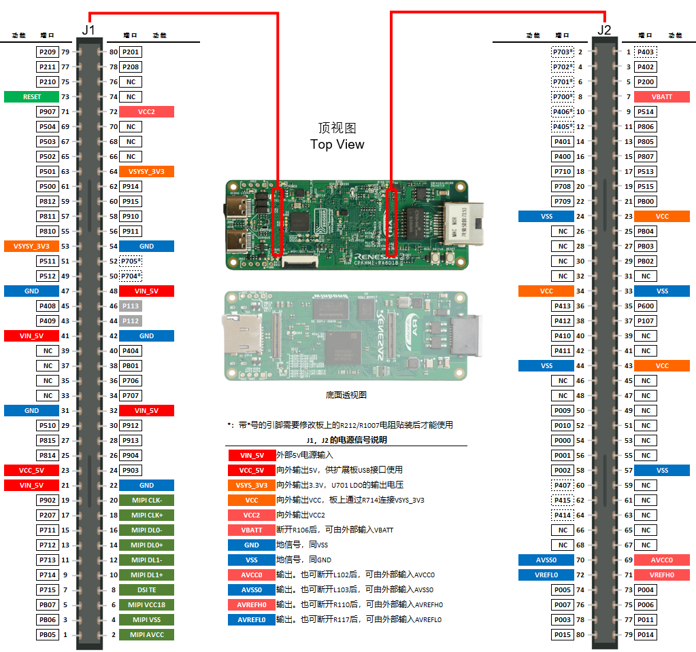
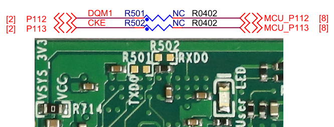
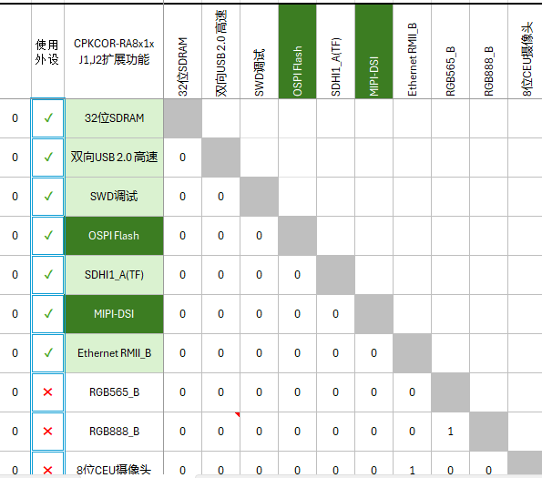
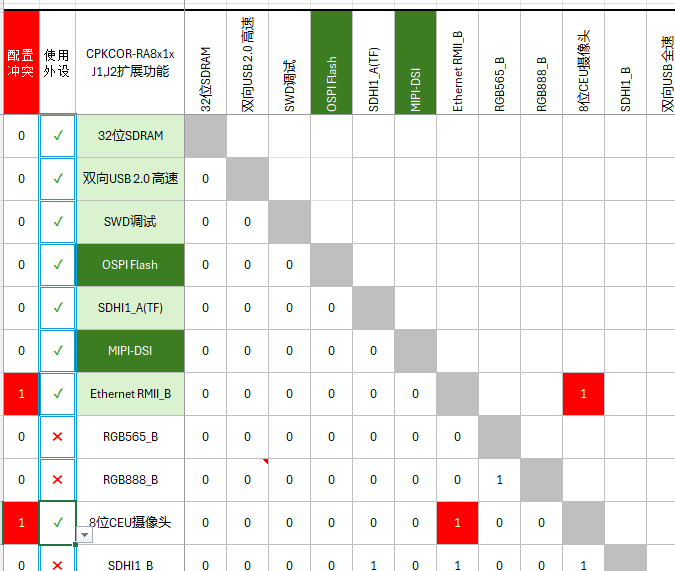
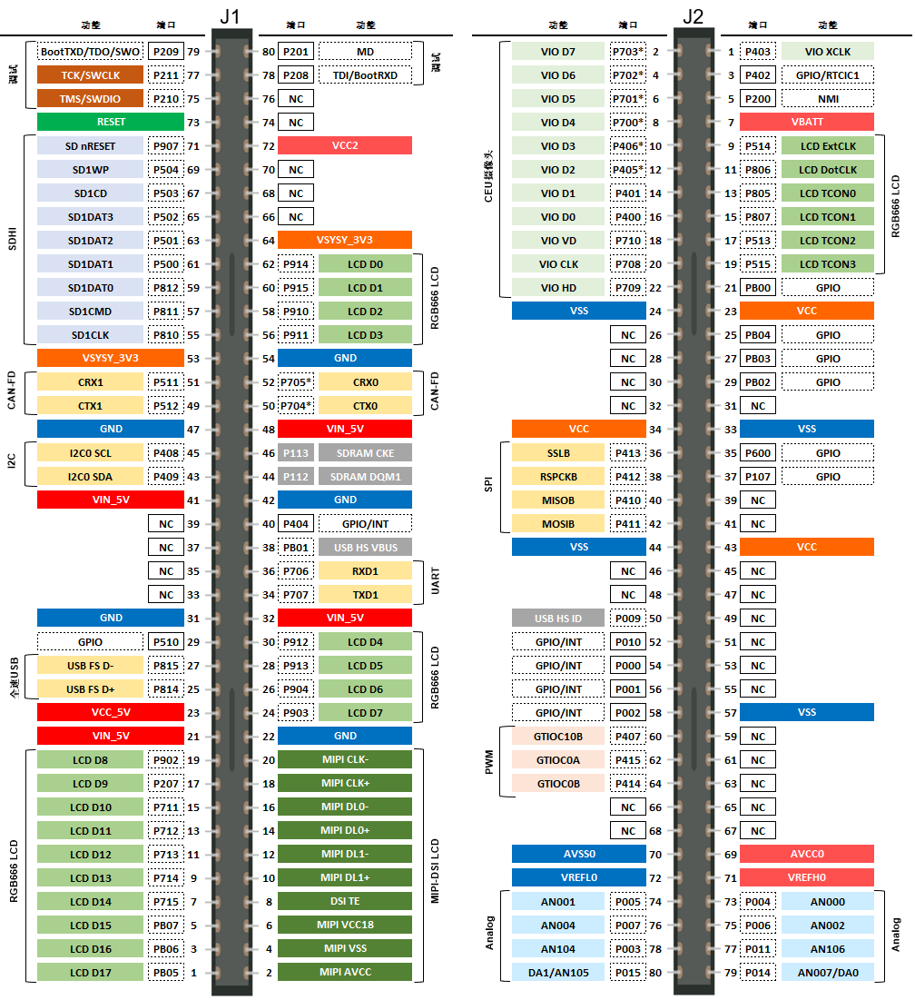
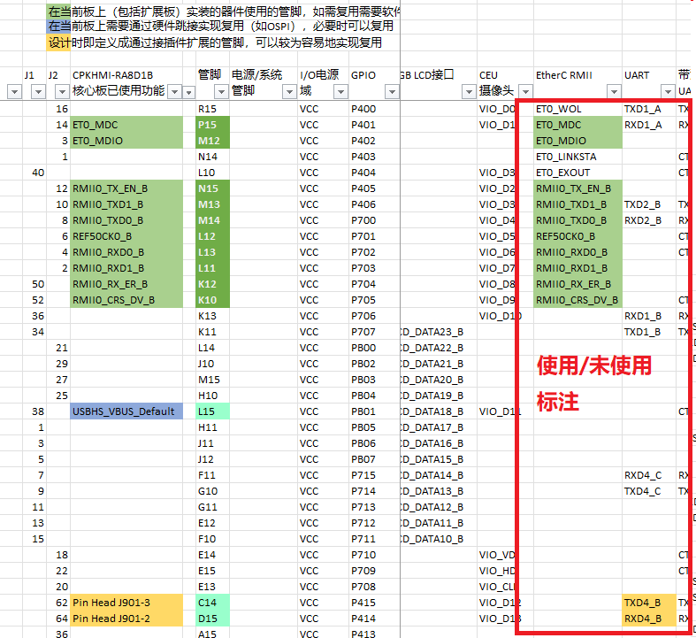
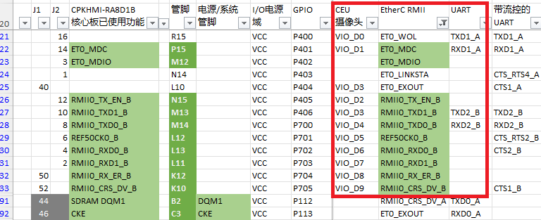
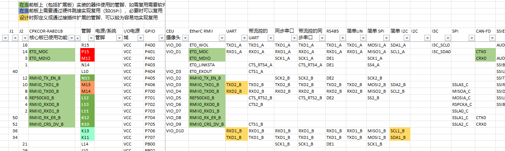

## 板对板扩展接口

板对板接口使用J1和J2两个80pin高密度高速接口，提供丰富的扩展功能。

### 电源和专用管脚

核心板可以通过J1、J2为扩展板提供多种电源，具体电源信号和位置见下图。

需要特别注意的几点
- VIN_5V的一般作用是由扩展板向核心板供5V电源，在实际应用中，必要时也可以用这个电源为扩展板提供5V电压（如CAN-FD收发器），核心板上的VIN_5V有2A限流，使用时请注意。
- VCC_5V是USB供电端通过二极管后的电源，没有限流，主要目的是为扩展板上的全速USB主机接口提供电源（USB FS主机需要设计电源开关和限流）。

核心板的设计上可以通过J1、J2实现部分外部电源输入，此时需要修改一些跳接电阻，具体内容请参考[CPKHMI-RA8D1B的电源设计](09_powerdesign.md)章节。

RA8D1B MCU带有MIPI-DSI接口，这部分管脚是专用的，分布在CPKCOR-RA8D1B的J1管脚上。其中DSI TE信号可以和GPIO复用，但一般的MIPI LCD屏驱动芯片都需要使用TE信号，所以在此作标注为专用管脚。

带*号标注的管脚，在核心板上已经用于连接以太网PHY，如果需要在扩展板上使用（如用于CEU），则需要在核心板上改动跳接电阻

J1的44和46脚以灰色标注，这两个管脚在核心板上缺省是连接到SDRAM的（DQM1和CKE），放在扩展口上是为了提供SCI0的通信管脚。SCI0的所有可用管脚都与SDRAM管脚冲突，设计时选取了两个时序要求没那么严格的信号管脚，通过跳线电阻实现SCI0的UART功能（TXD0_A和RXD0_A）及I2C功能（SDA0_A和SCL0_A）。

R501和R502在核心板正面，User LED左上方，由于不需要经常去安装/拆除这两个电阻，板上使用的是0402封装（1.0mm x 0.5mm）。

### 芯片外设功能扩展

CPKHMI-RA8D1B核心板上已经有32位SDRAM，USB 2.0 高速接口，MicroSD（TF）卡槽，OSPI Flash。在这些功能以外，J1，J2上还可以扩展出RA8D1B MCU的其他功能，罗列如下：

- 显示输入/输出： MIPI-DSI，RGB565或RGB888 LCD输出, CEU摄像头接口
- 音频接口：I2S x2
- 通信接口：RMII以太网接口，全速USB，I2C x2，I3C x1，SPI x2，多功能串口 x5（0~4,9）
- 定时器输入/输出接口：GPT，AGT，ULPT，RTC
- 模拟接口：高速比较器，ADC，DAC
- 调试接口：SWD，SWO跟踪调试接口，JTAG

外设使用的MCU管脚有复用，使用时会有管脚冲突的情况。J1，J2可以支持的外设复用请使用[此Excel表格](CPKHMI_RA8D1B_Exp_Peripherals_chs_protected.xlsx)进行初步的配置。具体的管脚配置以FSP配置为准。

1. 在表格的B列通过下拉框选择是否使用某个外设功能，绿色底色的功能是核心板上已经贴装器件的，缺省使用。如有必要，可以手动禁用某些核心板功能（如前面提到的SDRAM和UART0冲突，需要禁用SDRAM才能使用J1上的UART0管脚）
   
   

2. 如果有管脚冲突，那在A列会显示哪些功能冲突，您需要调整所选功能。
   1. 无法同时使用的功能，以红色表示，例如CEU摄像头和以太网不能同时使用
   
   
   
   2. CAN-FD有多组管脚可进行灵活配置，如其中某一组管脚与其他功能冲突时，会以蓝色显示，此时需要再FSP管脚配置中选择不冲突的管脚。串口的选择更灵活，就没有放在这个表格里，请使用下面文档里的设计辅助工具来查看是否有功能冲突。
   
   
   
3. 一个较为特殊的管脚需要留意（Excel文件中有注释）
   USB 2.0 HS的VBUS（RA8作为USB设备时，用于检测USB是否插入）引脚在核心板上缺省是PB01端口，PB01也是RGB888 LCD接口上的D18，以及多功能串口上的控制管脚，如果同时使用USBHS_VBUS和其他任何一个功能，则需要修改核心板上的跳线电阻R402/R403，详见[RA8 USB 2.0 高速接口](07_usbhs.md)章节。

灵活的功能组合可以实现各种评估所需的配置，配置确定后，即可快速设计一个扩展板，满足实际评估甚至是原型系统的需求。

### 外设功能扩展的设计辅助工具

瑞萨设计了一个样例配置，使用的功能定义如下。

瑞萨提供一个用于查看具体扩展管脚配置的Excel表格，请[在此下载](CPKHMI_RA8D1B_BTB_Signal_Protected.xlsm)。这是个带有宏定义的表格，如果您允许宏运行，那么可以通过颜色高亮看到管脚设置冲突。但不运行宏也能手动查看是否有管脚冲突。

基本的用法是通过第20行的过滤选择按钮，选择查看您想使用的功能，此时就可以看到该功能管脚是否和其他管脚冲突。如下图，当选择以太网RMII口的信号时，即可看到RMII接口使用的I/O和CEU摄像头接口，以及串口1_A,2_B有冲突，只能选其中一个功能使用。

您也可以通过单元格底色直接来标注是否使用了某个功能。在开启宏的情况下，T列（管脚）会自动标注出是否有功能冲突。
- 红底白字为有功能冲突，
- 绿底白字为使用了单一功能（如调试口）
- 淡蓝色底色黑字为仅使用了接插件或可拆器件（如TF卡槽）
- 淡红色底色黑字为同时使用了单一功能和接插件，有可能造成冲突（如CEU接口和以太网，在CEU没有接摄像头时，以太网可以正常使用，但这两个无法同时使用）

如何标注请见EXCEL表格的16到18行的解释，下面是一个标注的例子。
- 以太网口和CAN-FD0所选的管脚有冲突，无法同时使用。
- 串口2所选的管脚和以太网也有冲突，但由于串口2使用了接插件，在不实际连接时不会和以太网冲突（例如串口2仅作为Boot时的升级口）
- 串口1也是个接插件，可以实现串口和I2C功能。

### 扩展板的硬件设计

核心板使用的是两个HRS [DF40C-80DP-0.4V(51)](https://item.szlcsc.com/279578.html) 80脚接插件，在设计扩展板时，对应的接插件有多种合高可以选用，1.5/2.0/3.0/3.5/4.0mm，例如:

- 1.5mm合高的型号[DF40C-80DS-0.4V(51)](https://item.szlcsc.com/295540.html)
- 4.0mm合高的型号[DF40HC(4.0)-80DS-0.4V(51)](https://item.szlcsc.com/5973570.html)

注意：核心板背面有MicroSD（TF）卡插槽，卡槽的高度是2.0mm，在设计扩展底板时，请注意核心板投影范围内的器件限高。如果您使用合高1.5mm的接插件，在扩展底板上需要将TF卡槽对应的部分挖空。

J1，J2接插件，TF卡槽以及安装孔的位置信息请查看机械尺寸文件[顶面](CPKHMI_RA8D1B_MEC_top.dxf) / [底面](CPKHMI_RA8D1B_MEC_bot.dxf) 。

接插件管脚电流限制为300mA，在设计扩展底板时请注意电源管脚的供电能力。如果底板需要较大的工作电流，建议底板上有单独的电源，此时，核心板也可以由底板供电，详见[CPKHMI-RA8D1B的电源设计](09_powerdesign.md)章节。

[返回目录](01_overview.md)             [下一篇：RA8的调试和烧录接口](06_debug.md)
