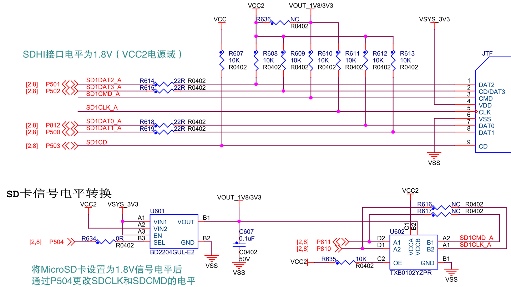

## RA8的外接存储扩展

RA8x1 MCU片内集成大容量Flash和SRAM，具体分配如下
- 最大2M字节的片内Flash（RA8D1有1M字节和2M字节Flash两个版本）
- 12KB的Data Flash （64字节擦除块大小，至少保证125000次擦写周期，85度以下30年数据存储寿命）
- 1M字节的SRAM，包含
  - 64KB ITCM + 64K DTCM （480MHz;支持ECC SEC-DED, ITCM 64+8位, DTCM 32+7位）
  - 384KB ECC RAM （SRAM0；120MHz以下零等待；SEC-DED单比特纠错，双比特检错, 64+8位）
  - 512KB 带校验的RAM（SRAM1；120MHz以下零等待；偶校验，8位数据+1位校验）
  - 1KB 待机用SRAM （120MHz以下零等待；在深度软件待机模式1(DSTBY1)下可以保持数据；偶校验，8位数据+1位校验）

RA8x1的Cortex-M85内核里还集成了16KB的指令Cache（2-way set-associative）和16KB的数据Cache（4-way set-associative），Cache容量不计入MCU的存储容量。

为了扩展存储容量，RA8D1支持多种外部存储接口，以224BGA封装为例，主要包含：
- 32位外部并行总线扩展（CS扩展），支持数据地址分离模式和复用模式，8个片选区域，16M字节 x 8 共128M字节寻址范围，内部工作时钟（BCLK）最高120MHz，输出时钟（EBCLK）最高60MHz。
- 32位SDRAM扩展（和并行总线复用管脚），128M字节寻址空间，时钟（SDCLK）最高120MHz。
- OSPI接口，支持JEDEC标准的xSPI接口（100MHz时钟输出）
  - 2个片选空间，每个片选空间256M字节寻址范围
  - JESD251，Profile 1.0 - Octa-SPI, Profile 2.0 - HyperBus™ （HyperRAM™ 和 HyperFlash™ ） 
  - JESD251-1.01（QSPI）
  - JESD252.01 （In-Band RESET时序）
- SD/MMC接口
  - 2个SD卡/SDIO接口，时钟输出最高50MHz，4位数据模式和标准单线模式
  - 兼容SD、SDHC和SDXC格式
  - 支持Default Speed、High Speed、SDR12和SDR25传输模式
- USB 2.0高速主机接口，可以扩展外接USB存储。

如果同时使用CS扩展和SDRAM扩展，那BCLK和SDCLK一定要设置为相同的频率。
OSPI接口所在的I/O端口使用VCC2电源供电，可以独立设置，支持1.65V~3.6V供电，可以支持1.8V电压的存储芯片。

### SDRAM扩展

CPKHMI-RA8D1B上使用了32位SDRAM扩展数据存储，板载SDRAM型号是华邦的W9812G2KB-6I，16M字节（128Mbit）容量。
地址范围从0x6800_0000到0x68FF_FFFF。
SDRAM设计也兼容其他型号，例如ISSI IS42S32800等。

核心板面积较小，SDRAM的走线进行了阻抗匹配，没有使用串联电阻。

### OSPI Memory扩展

核心板上缺省贴装了华邦的Octa NOR Flash - W35T51NW 扩展存储空间，容量位64M字节（512Mbit）。OSPI NOR Flash使用的是OPSI接口上的CS1寻址空间，地址从0x9000_0000开始至0x93FF_FFFF。

W35T51NW 为1.8V供电，需要将VCC2配置为1.8V，详见[CPKCOR-RA8D1B的电源设计](09_powerdesign.md)章节。

CPKHMI板的OSPI Memory设计兼容华邦的Octa NAND Flash 和 HyperRAM，在原理图中有标注电阻的贴装选项，以便切换使用不同的Octa Memory。
目前瑞萨的FSP还不知持Octa NAND的文件系统和 HyperRAM的使用，如您有这方面的使用需求，请联系瑞萨进行进一步讨论。

核心板上没有再引出OSPI接口到J2。  

### MicroSD存储卡（TF卡）

核心板底面已经设计了TF卡槽，连接到RA8 MCU的SDHI1的A组I/O口，采用四线数据连接，最高支持每秒25M字节的数据传输速率。

TF卡使用3.3V供电，供电管脚连接VSYS_3V3，即3.3V LDO的输出电压。核心板上没有对TF卡槽的供电进行开关控制，不支持热插拔TF卡，请 ${\color{red}{\text{务必在断电状态下进行TF卡的插拔}}}$。
- 此外，核心板主要是作为开发和评估使用，在TF卡的数据线上只串接了22欧姆的电阻，并没有进行ESD保护，所以请务必注意 ${\color{red}{\text{不要带电插拔TF卡}}}$。

#### TF卡低电压工作注意事项

SDHI1的A组I/O口由VCC2供电，和Octa SPI接口是同一个电源域，CPKHMI-RA8D1B上VCC2=1.8V。在SDHI接口上的SDCLK和SDCMD设置了电平转换电路。
- 在系统上电后，TF卡缺省的I/O电平是3.3V，需要控制P504将电平转换芯片（TXB0102）的VCCB设置成3.3V。
- 此时可以通过SDCLK和SDCMD和TF卡建立通信，使用ACMD41命令切换TF卡的工作电压到1.8V（SDR模式）
- 电压切换完成后，需要再通过P504来，切换电平转芯片的VCCB至1.8V，然后RA8即可用1.8V信号电平与TF卡正常通信。

${\color{red}{\text{注意：}}}$ TF卡的电平切换到1.8V以后就会一直保持1.8V，直到TF卡重新上电才会恢复到3.3V信号电平。由于核心板上没有控制TF卡的电源，调试程序时，如果不重新对TF卡上电，而仅复位RA8 MCU，此时无法和TF卡建立通信（ACMD41命令无效）。建议需要调试带TF卡功能的程序时，每次都将核心板重新断电再重新上电连接，不建议热插拔TF卡。在实际产品设计中，建议为TF卡加入电源控制，并按实际需求考虑ESD防护。瑞萨会在下一代产品的硬件设计中进行改进。

目前瑞萨FSP对SDR模式的支持还不完整，初始化TF卡时会有个较长的延时。如果您有这方面的应用需求，请与瑞萨联系进一步讨论。

如果将VCC2设置为3.3V，则可以不贴装电平转换芯片（U602 - TXB0102），通过R616和R617将SDCLK和SDCMD直连到TF卡座。

### 通过高速USB 2.0扩展存储

核心板上的JUSB Type-C 2.0接口可以作为DFP端口，实现USB主机功能，连接USB存储设备。需要注意的是核心板对USB的供电能力限制。核心板上使用了2A的电流限制器来实现对JUSB口的供电，电流限制器的输入是VIN_5V。
- 如果使用JDBG供电，VIN_5V本身已经是被限制在2A供电，这个2A需要为核心板电路和USB HOST同时供电，此时要注意JUSB口的供电是否会造成系统超负荷。
- 如果从JD接口或J1由外部输入VIN_5V，请确保VIN_5V可以为JUSB提供足够的电流。
  - J1接插件每个端口的电流限制为300mA，VIN_5V共有3个端口，900mA电流。在需要使用USB主机功能时，请仔细评估是否可以仅使用J1端口获取5V供电。

[返回目录](01_overview.md)             [下一篇：CPKHMI-RA8D1B的电源设计](09_powerdesign.md)
