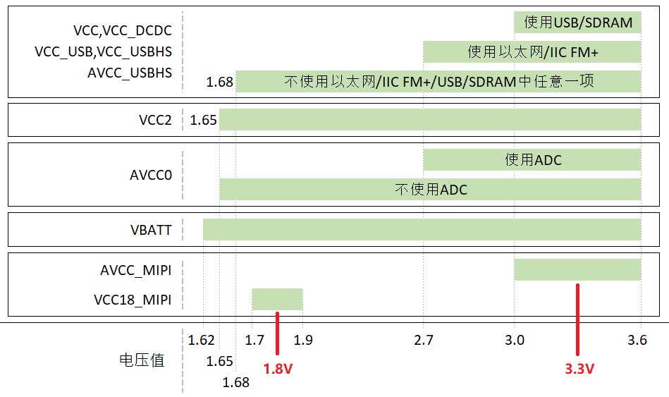
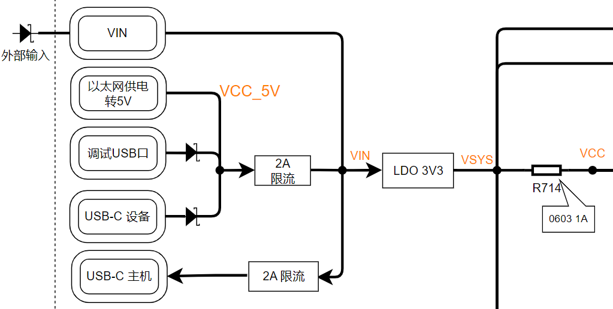
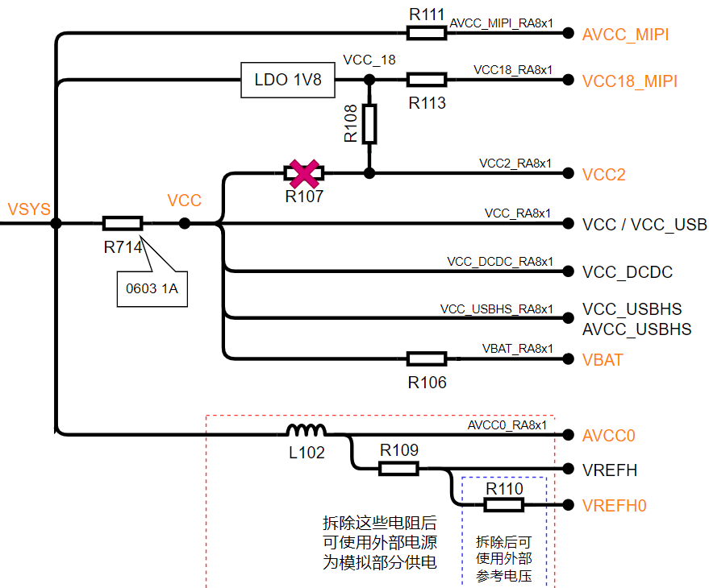
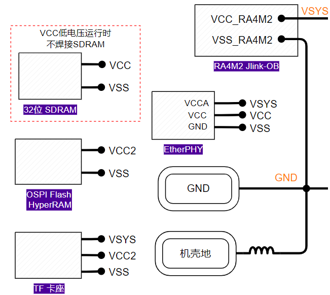
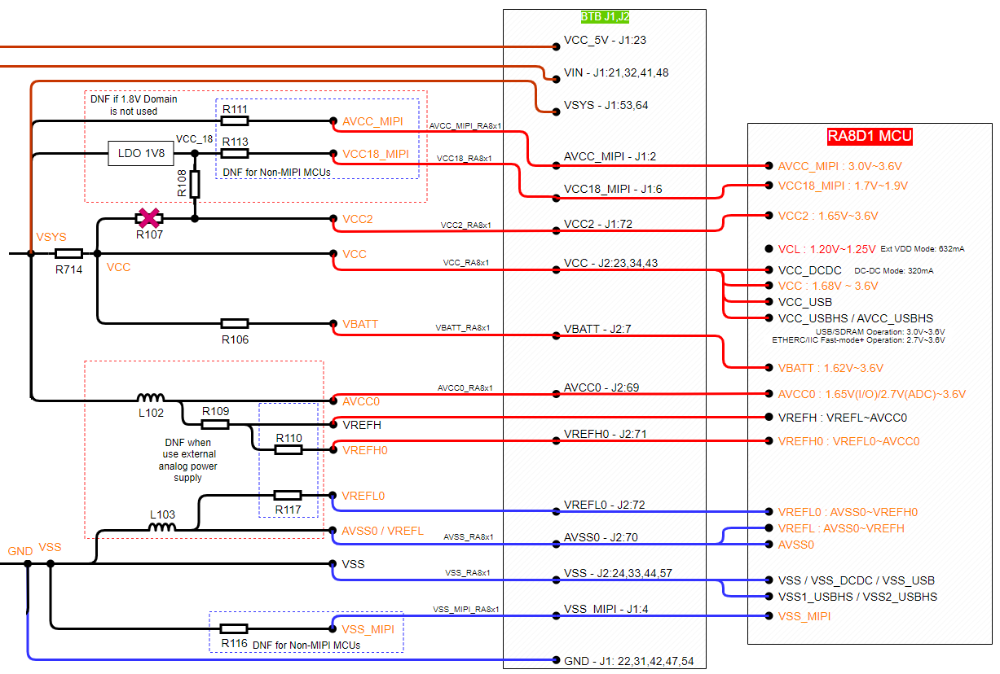
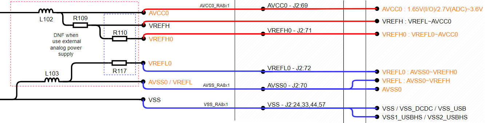

## CPKHMI-RA8D1B的电源设计

### RA8 MCU的电源需求

RA8D1/M1/T1 MCU可以支持多I/O电源域，此外，MCU内部还集成了DC-DC电路为内核供电，简化外部电源设计。

RA8D1B MCU的电源构成和电压范围如下图所示，多种电压输入可以满足不同的应用需求。

最简单的应用需求下，RA8D1B只需要一个3.3V为MCU系统供电，同时有个1.8V为MIPI接口供电。瑞萨官方的EK-RA8D1评估板采用的就是这个设计。
- 如果不使用MIPI-DSI接口，只使用RGB接口的LCD，那可以选用RA8D1A芯片，省去MIPI部分的供电，只用单个3.3V供电
- 各个电源的电流需求请参考MCU硬件手册60.2.5章节-工作和待机电流

### CPKHMI-RA8D1B的电源输入

核心板有两个USB Type-C 2.0接口，其中JDBG接口只做UFP，主机可以通过USB-C口或USB-A口对JDBG提供5V电源。另一个JUSB做了简化的双向设计，作为设备时，主机只能通过USB-A口（或USB-C经过C转A转接器）为JUSB供电，USB接口上都有防反向二极管。

核心板支持以太网供电（PoE），以太网电源通过DC-DC芯片（RAA211820GNP，支持4.5V到75V输入电压）输出5V电源，供电能力2A。

USB和以太网供电的5V都会经过2A限流后为核心板提供5V电源。

扩展接插件J1上也有VIN信号，可以由外部向核心板提供5V电源，使用VIN时请注意在外部扩展板上做好防反灌措施，同时注意J1上的VIN输入最高只支持900mA电流。

5V电源通过LDO ISL80102IRAJZ（2A）后为核心板提供3.3V电压。核心板上区分VSYS_3V3和VCC，VCC为RA8 MCU系统的电源。当断开R714时，可以通过J2为核心板提供VCC电源，实现电压工作。但如电压范围要求所示，低电压工作时很多外设无法使用，也需要从外部接入调试电路（板载Jlink只能使用3.3V I/O,不支持电压转换）。

核心板的RA8电源设计采用了电阻硬件跳线方式，缺省的配置是VCC直接连接到AVCC_MIPI, VBATT和模拟电源（AVCC0，VREFH，VREFH0）。LDO ISL80505IRAJZ为VCC2和MIPI-DSI接口提供1.8V电源，如下图所示：

在设计上预留了R107，如果不贴装板上的Octa Memory，可以将VCC2连接到3.3V进行评估。如存储章节所述，TF卡接口上预留了3.3V I/O直连的选项。

### 核心板上其他器件的电源

供电情况如下
- SDRAM由VCC供电，3.3V。如果需要使用低电压VCC，则不贴装SDRAM（SDRAM工作电压为3.0V ~ 3.6V）
- JLink-OB MCU RA4M2由VSYS供电，3.3V。
- 板载OSPI Memory由VCC2供电，1.8V。如果修改了VCC2电压到3.3V，则不能贴装1.8V的OSPI Memory，可以贴装3.3V的OSPI NOR Flash，管脚兼容的。
- MicroSD（TF）卡槽由VSYS供电，3.3V。存储卡使用的SDHI接口是VCC2电源域的，信号上拉电阻上拉到VCC2。详见[RA8外接存储器](08_storage.md)章节。
- 以太网PHY的VCCA接VSYS，3.3V。VCC是I/O电平，接板上的VCC。

### 扩展板供电选项

如前所述，RA8D1B MCU有多个电源管脚，可以分别设置供电电压。在核心板设计上，预留了通过扩展板进行供电的能力，配合修改核心板上的供电电阻，即可实现灵活的电压配置。

VIN可以实现双向供电。
- 当核心板不使用USB供电时，扩展板可通过VIN为核心板提供5V电源，在搭建快速原型系统时较为实用，注意J1的VIN有900mA的限流。
- 当核心板由USB口供电时，可通过J1,J2的VIN管脚向扩展板限流的5V电源。

VCC_5V是通过J1向扩展板提供完整的全速USB接口，VCC_5V提供全速USB HOST的电源。由于J1管脚的电流限制，载流能力只有300mA。扩展板上全速USB HOST无法为外设提供大的电流，在外设电流要求不高（如HID设备）时，可以用VCC_5V这个脚上的供电。如果全速USB所连接的外设有大电流需求，则需要在扩展板上有独立的供电电路。

#### 由核心板向扩展板提供电源

缺省状态下，核心板通过USB口供电时，可通过J1,J2向扩展板提供各种电源。

VSYS，VCC，VBATT，AVCC0，VREFH，VREFH0都是3.3V。VCC2缺省是1.8V，可以改为3.3V。

MIPI电源的三个管脚可以向扩展板提供电源，但主要的作用是核心板的兼容设计，在使用RA8D1A，RA8M1和RA8T1时，断开相关的电阻即可

#### 由扩展板向核心板上的RA8 MCU提供电源

在评估某些配置时，需要为RA8 MCU提供不同的电压，此时可以配合扩展板和跳线电阻实现外部电源输入。

断开R106后，可由扩展板为核心板提供VBATT电源，进行VBATT相关的评估。

尽管核心板上已经提供了可将VCC2连到3.3V的选项，您也可以断开R107和R108，由J1接口提供VCC2电源。

如果需要外接模拟电源和参考源实现高精度模拟采样，则有多个层级的选择。
- ADC单元0的模拟参考可以通过断开R110和/或R117后，通过J2外部输入模拟参考电压
- 断开L102和L103，整个模拟部分的供电和参考电平都由J2从外部输入
  

综上所述，核心板作为独立的开发板工作时，使用USB供电，通过LDO为RA8 MCU的VCC系统提供3.3V供电，同时另一个LDO为RA8的VCC2和MIPI-DSI提供1.8V供电。配合扩展板工作时，可为扩展板提供5V，3.3V和1.8V电源和模拟参考电源，也可以配合跳线电阻，由扩展板反向为核心板提供某些电源，满足不同的评估和原型系统的需求。

[返回目录](01_overview.md)             [下一篇：CPKHMI-RA8D1B的以太网](10_ether.md)     